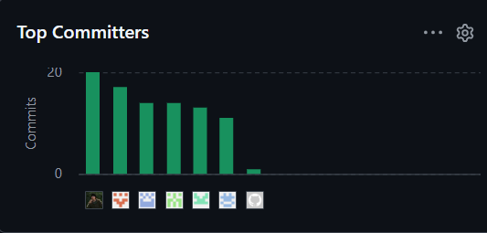

    
  <h2>Informe de Trabajo Final</h2>
  
<strong>Universidad:</strong> Universidad Peruana de Ciencias Aplicadas

  
<strong>Ciclo:</strong> 2026-10

  
<strong>Curso:</strong> 1ASI0730-2610- Aplicaciones Web

  
<strong>Sección:</strong> 12206

  
<strong>Profesor:</strong> Angel Augusto Velasquez Nuñez

<h2 align="center">Relación de Integrantes:</h2>

  <table>
    <tr>
      <th><strong>Código</strong></th>
      <th><strong>Apellidos y Nombres</strong></th>
    </tr>
    <tr>
      <td>u20241c630</td>
      <td>Asto Jacome Jose Gustavo</td>
    </tr>
    <tr>
      <td>u202312566</td>
      <td>Milenko Rubén Cayanchi Avila</td>
    </tr>
    <tr>
      <td>u202316353</td>
      <td>Mathias Andree Cardenas Huaman</td>
    </tr>
    <tr>
      <td>u20231b842</td>
      <td>Enrique Manuel Mantilla Maldonado</td>
    </tr>
        <tr>
      <td>u20231a257</td>
      <td>Brayan Alexis Corvacho Damian</td>
    </tr>
  </table>

<strong>Mes y Año:</strong> Abril 2026

## Registro de Versiones del Informe

<table border>
  <thead>
    <tr>
      <th><b>Versión</b></th>
      <th><b>Fecha</b></th>
      <th><b>Autores</b></th>
      <th><b>Descripción de modificación</b></th>
    </tr>
  </thead>
  <tbody>
    <tr>
      <td>1.0.0</td>
      <td>13/04/2025</td>
      <td>- Asto Jacome Jose Gustavo</td>
      <td>Se redactó todo el apartado de Solution Profile en el capítulo 1, marcando los antecedentes y la problemática. Además, se elaboró el Lean UX Process para hallar los assumptions de nuestros usuarios y elaborar nuestras hipótesis. Finalmente se unió todo lo recopilado en el Lean UX Canvas.</td>
    </tr>
    <tr>
      <td>1.0.2</td>
      <td>13/04/2025</td>
      <td>- Milenko Rubén Cayanchi Avila</td>
      <td>Se investigó sobre los competidores de nuestra startup FullTank y se redactó en el capítulo 2. Para desarrollar el análisis se hizo un análisis competitivo para poder comparar a los competidores con nuestra startup. Además, se planearon estrategias frente a nuestros competidores.</td>
    </tr>
    <tr>
      <td>1.0.3</td>
      <td>14/04/2025</td>
      <td>- Enrique Manuel Mantilla Maldonado</td>
      <td>Se planteó el User Task Matrix y el User Journey Mapping en el capítulo 2. En este proceso, se examina los comportamientos de nuestros User Persona. Estos datos nos permiten desarrollar el Journey Mapping que nos permitirá visualizar cómo nuestros usuarios interactuarán con nuestra plataforma.</td>
    </tr>
    <tr>
      <td>1.0.4</td>
      <td>15/04/2025</td>
      <td>- Mathias Andree Cardenas Huaman</td>
      <td>Se detalló el análisis de las entrevistas y elaboró el User Persona del capítulo 2. Se analizó las entrevistas que nos permitirán recopilar información valiosa para el desarrollo de nuestra plataforma. Además en base a nuestros entrevistados se elaboró el User Persona.</td>
    </tr>
    <tr>
      <td>1.0.5</td>
      <td>15/04/2025</td>
      <td>- Brayan Alexis Corvacho Damian</td>
      <td>Se redactó el Event Storming y el Ubiquitous Language en el capítulo 2. El equipo realizó un Event Storming para verificar los procesos realizados por una compañía de entrega de combustible. Además, se incluyó la terminología que puede ser complicada para los usuarios.</td>
    </tr>
    <tr>
      <td>1.1.0</td>
      <td>18/04/2025</td>
      <td>- Asto Jacome Jose Gustavo (DhudsQ) - Enrique Manuel Mantilla Maldonado (enrique-mantilla)</td>
      <td>Se añadieron assets al capítulo 1, se documentaron las User Stories en el capítulo 3 con correcciones de formato y gramática, y se agregaron los reportes de colaboración e historial de versiones en la introducción.</td>
    </tr>
    <tr>
      <td>1.2.0</td>
      <td>19/04/2025</td>
      <td>- Enrique Manuel Mantilla Maldonado (enrique-mantilla)</td>
      <td>Se completó el capítulo 2 con el registro de entrevistas, enlaces al video completo, resúmenes de entrevistas y conclusiones del análisis.</td>
    </tr>
    <tr>
      <td>1.3.0</td>
      <td>21/04/2025</td>
      <td>- Milenko Rubén Cayanchi Avila (MaxghZZ)</td>
      <td>Se inició la documentación del capítulo 4, cubriendo Style Guidelines (general y web), Information Architecture (Organization Systems, SEO Tags, Searching Systems), Software Architecture (Context, Container y Components Diagrams), Class Diagrams y Database Diagrams.</td>
    </tr>
    <tr>
      <td>1.3.1</td>
      <td>21/04/2025</td>
      <td>- Brayan Alexis Corvacho Damian (BralexCD) - Mathias Andree Cardenas Huaman (Usuario353)</td>
      <td>Se añadieron los User Flow Diagrams (User Goals 1 al 5) con sus imágenes correspondientes, wireframes web y móviles, y wireflows en el capítulo 4.</td>
    </tr>
    <tr>
      <td>1.3.2</td>
      <td>23/04/2025</td>
      <td>- Enrique Manuel Mantilla Maldonado (enrique-mantilla)</td>
      <td>Se añadieron los wireframes web (secciones 9–12 y 18–21) y la documentación de Web Applications Mock-ups en el capítulo 4.</td>
    </tr>
    <tr>
      <td>1.4.0</td>
      <td>26/04/2025</td>
      <td>- Asto Jacome Jose Gustavo (DhudsQ)</td>
      <td>Se completó el capítulo 5, se actualizó la introducción con los Student Outcomes, y se realizaron correcciones menores de gramática en los capítulos 3 y 4.</td>
    </tr>
  </tbody>
</table>

## Project Report Collaboration Insights

**Link del repositorio del informe:**  https://github.com/TechnoSAC/FullTank-Documents

**Link del repositorio de la Landing Page:**  
https://github.com/TechnoSAC/Landing_Page

**Link del repositorio del fronted:**  
https://github.com/TechnoSAC/frontend

**Link del repositorio del backend:**  
https://github.com/TechnoSAC/backend

**Link de los repositorios de la organización:**  https://github.com/TechnoSAC

**Link del figma:** https://www.figma.com/design/ZMHB35H60u2eUhctevkVKc/Fullank-Completo?node-id=0-1&t=I3nr2x0tcAinM7gE-1

Este informe ha sido desarrollado de forma colaborativa mediante GitHub, empleando GitFlow y Conventional Commits. Cada miembro del equipo ha contribuido con commits y ramas durante el desarrollo del proyecto.

**Reporte de colaboración de la entrega del AV1**

En nuestro primer avance de la elaboración del informe, el grupo de FullTank se encargó de desarrollar las principales características iniciales del proyecto. Cada integrante intervino activamente en la elaboración de la documentación, organizándose y distribuyendo el trabajo por secciones clave, lo que permitió abordar de manera ordenada el desarrollo de la propuesta tecnológica.

**Asto Jacome Jose Gustavo**

Jose Asto se encargó de la elaboración del Lean UX Process (capítulo 1), el cual permitió hallar las suposiciones de los usuarios y elaborar las hipótesis. Además, recopiló todo ello en un Lean UX Canvas. Para la entrega actual, añadió los assets del capítulo 1, realizó correcciones de gramática en los capítulos 3 y 4, actualizó la introducción con los Student Outcomes y completó la documentación del capítulo 5.

**Milenko Rubén Cayanchi Avila**

Milenko realizó la investigación a los competidores de la startup y realizó un Análisis Competitivo (capítulo 2), el objetivo es comparar nuestra startup con los competidores y realizar estrategias. Para la entrega actual, se encargó de documentar las secciones de Style Guidelines, Information Architecture (Organization Systems, SEO Tags y Searching Systems), Software Architecture (Context, Container y Components Diagrams), Class Diagrams y Database Diagrams en el capítulo 4.

**Mathias Andree Cardenas Huaman**

Mathias analizó las entrevistas (capítulo 2) y filtró el contenido más relevante para nuestra startup. Con esos datos averiguamos qué es lo que buscan nuestros clientes. Para la entrega actual, contribuyó al capítulo 4 añadiendo los wireframes de la versión móvil y las imágenes de los User Flow Diagrams correspondientes a los Goals 4 y 5.

**Enrique Manuel Mantilla Maldonado**

Enrique elaboró el User Task Matrix (capítulo 2), donde elaboró los hábitos que deberían tener nuestros User Persona. Además, se encargó de elaborar el User Journey Mapping (capítulo 2), el cual nos permite analizar cómo los usuarios ideales deberían interactuar con nuestra plataforma. Para la entrega actual, completó el registro de entrevistas y sus conclusiones en el capítulo 2, documentó los wireframes web (secciones 9–12 y 18–21) y la sección de Web Applications Mock-ups en el capítulo 4, y añadió el reporte de colaboración e historial de versiones en la introducción.

**Brayan Alexis Corvacho Damian**

Brayan realizó una revisión y transcripción del Event Storming (capítulo 2). Luego de que el equipo hiciera el Event Storming, se pasó a documentar y redactar sobre los procesos que haría una compañía de entrega de combustible. Para la entrega actual, se encargó de documentar los User Flow Diagrams (User Goals 1, 2, 3, 4 y 5), los wireframes web de login, creación de cuenta y pantallas 5 al 12, y los wireflows en el capítulo 4.

**Participación por miembro**

A continuación, se muestra un gráfico de barras con la cantidad de commits realizados por cada integrante del equipo:

**Evolución temporal de commits**

El siguiente gráfico muestra una línea de tiempo con la evolución semanal de los commits realizados por todos los miembros:

## Contenido

- [Capítulo I: Introducción](#capítulo-i-introducción)
  - [1.1 Startup Profile](#11-startup-profile)
    - [1.1.1 Descripción de la Startup](#111-descripción-de-la-startup)
    - [1.1.2 Perfiles de integrantes del equipo](#112-perfiles-de-integrantes-del-equipo)
  - [1.2 Solution Profile](#12-solution-profile)
    - [1.2.1 Antecedentes y problemática](#121-antecedentes-y-problemática)
    - [1.2.2 Lean UX Process](#122-lean-ux-process)
      - [1.2.2.1 Lean UX Problem Statements](#1221-lean-ux-problem-statements)
      - [1.2.2.2 Lean UX Assumptions](#1222-lean-ux-assumptions)
      - [1.2.2.3 Lean UX Hypothesis Statements](#1223-lean-ux-hypothesis-statements)
      - [1.2.2.4 Lean UX Canvas](#1224-lean-ux-canvas)
  - [1.3 Segmentos objetivos](#13-segmentos-objetivos)
- [Capítulo II: Requirements Elicitation \& Analysis](#capítulo-ii-requirements-elicitation--analysis)
  - [2.1. Competidores.](#21-competidores)
    - [2.1.1. Análisis competitivo.](#211-análisis-competitivo)
    - [2.1.2. Estrategias y tácticas frente a competidores.](#212-estrategias-y-tácticas-frente-a-competidores)
      - [a. Diferenciación a través de especialización](#a-diferenciación-a-través-de-especialización)
      - [b. Innovación en la interfaz de usuario y experiencia](#b-innovación-en-la-interfaz-de-usuario-y-experiencia)
      - [c. Flexibilidad en precios y modelo SaaS escalable](#c-flexibilidad-en-precios-y-modelo-saas-escalable)
      - [d. Aprovechamiento de la digitalización en la logística](#d-aprovechamiento-de-la-digitalización-en-la-logística)
      - [e. Expansión hacia mercados internacionales](#e-expansión-hacia-mercados-internacionales)
  - [2.2. Entrevistas.](#22-entrevistas)
    - [2.2.1. Diseño de entrevistas.](#221-diseño-de-entrevistas)
    - [2.2.2 Registro de entrevistas](#222-registro-de-entrevistas)
    - [2.2.3 Análisis de entrevistas](#223-análisis-de-entrevistas)
  - [2.3 Needfinding](#23-needfinding)
    - [2.3.1 User Personas](#231-user-personas)
    - [2.3.2 User Task Matrix](#232-user-task-matrix)
    - [2.3.3 User Journey Mapping](#233-user-journey-mapping)
    - [2.3.4 Empathy Mapping](#234-empathy-mapping)
  - [2.4 Big Picture Event Storming](#24-big-picture-event-storming)
  - [2.5 Ubiquitous Language](#25-ubiquitous-language)
- [Capítulo III: Requirements Specification](#capítulo-iii-requirements-specification)
  - [3.1 User Stories](#31-user-stories)
  - [3.2 Impact Mapping](#32-impact-mapping)
- [Capítulo IV: Product Design](#capítulo-iv-product-design)
  - [4.1 Style Guidelines](#41-style-guidelines)
    - [4.1.1 General Style Guidelines](#411-general-style-guidelines)
    - [4.1.2 Web Style Guidelines](#412-web-style-guidelines)
  - [4.2 Information Architecture](#42-information-architecture)
    - [4.2.1 Organization Systems](#421-organization-systems)
    - [4.2.2 Labeling Systems](#422-labeling-systems)
    - [4.2.3 SEO Tags and Meta Tags](#423-seo-tags-and-meta-tags)
    - [4.2.4 Searching Systems](#424-searching-systems)
    - [4.2.5 Navigation Systems](#425-navigation-systems)
  - [4.3 Landing Page UI Design](#43-landing-page-ui-design)
    - [4.3.1 Landing Page Wireframe](#431-landing-page-wireframe)
    - [4.3.2 Landing Page Mock-up](#432-landing-page-mock-up)
  - [4.4 Web Applications UX/UI Design](#44-web-applications-uxui-design)
    - [4.4.1 Web Applications Wireframes](#441-web-applications-wireframes)
    - [4.4.2 Web Applications Wireflow Diagrams](#442-web-applications-wireflow-diagrams)
    - [4.4.3 Web Applications Mock-ups](#443-web-applications-mock-ups)
    - [4.4.4 Web Applications User Flow Diagrams](#444-web-applications-user-flow-diagrams)
  - [4.5 Web Applications Prototyping](#45-web-applications-prototyping)
  - [4.6 Domain-Driven Software Architecture](#46-domain-driven-software-architecture)
    - [4.6.1 Design-Level Event Storming](#461-design-level-event-storming)
    - [4.6.2 Software Architecture Context Diagram](#462-software-architecture-context-diagram)
    - [4.6.3 Software Architecture Container Diagrams](#463-software-architecture-container-diagrams)
    - [4.6.4 Software Architecture Components Diagrams](#464-software-architecture-components-diagrams)
  - [4.7 Software Object-Oriented Design](#47-software-object-oriented-design)
    - [4.7.1 Class Diagrams](#471-class-diagrams)
  - [4.8 Database Design](#48-database-design)
    - [4.8.1 Database Diagrams](#481-database-diagrams)

## Student Outcome

El curso contribuye al cumplimiento del Student Outcome ABET:
ABET – EAC - Student Outcome 5
Criterio: La capacidad de funcionar efectivamente en un equipo cuyos miembros
juntos proporcionan liderazgo, crean un entorno de colaboración e inclusivo,
establecen objetivos, planifican tareas y cumplen objetivos.
En el siguiente cuadro se describe las acciones realizadas y enunciados de
conclusiones por parte del grupo, que permiten sustentar el haber alcanzado el logro
del ABET – EAC - Student Outcome 5.

<table border>
  <thead>
    <tr>
      <th width="25%"><b>Criterio Específico</b></th>
      <th><b>Acciones Realizadas</b></th>
      <th><b>Conclusiones</b></th>
    </tr>
  </thead>
  <tbody>
    <tr>
      <td width="25%"><b>Trabaja en equipo para 
                        proporcionar liderazgo en 
                        forma conjunta </b></td>
      <td>
        <b>Jose Asto Jacome</b> 
        AV1: Lideró la elaboración del Lean UX Process y el Lean UX Canvas, coordinando con el equipo para validar los assumptions e hipótesis planteadas. 
        <b>Milenko Rubén Cayanchi Avila</b> 
        AV1: Dirigió el análisis competitivo de la startup, orientando al equipo en la definición de estrategias frente a los competidores identificados. 
        <b>Brayan Alexis Corvacho Damian</b> 
        AV1: Lideró la sesión de Event Storming junto al equipo, coordinando la documentación de los procesos del negocio y el Ubiquitous Language. 
        <b>Enrique Manuel Mantilla Maldonado</b> 
        AV1: Guió al equipo en la construcción del User Task Matrix y el User Journey Mapping, promoviendo el análisis conjunto del comportamiento de los usuarios. 
        <b>Mathias Andree Cardenas Huaman</b> 
        AV1: Lideró el análisis de entrevistas y la elaboración del User Persona, sintetizando los hallazgos para orientar las decisiones del equipo.
      </td>
      <td>
        El trabajo en equipo permitió que todos los integrantes asumieran un rol activo y colaboraran de manera coordinada. Gracias a este liderazgo conjunto, se logró una mejor organización, el cual permitió mayor eficiencia en el desarrollo del proyecto. Como resultado, se alcanzaron los objetivos planteados, y también se fortaleció la confianza y la cooperación en el equipo.
      </td>
    </tr>
    <tr>
      <td width="25%"><b>Crea un entorno colaborativo e 
                inclusivo, establece metas, 
                planifica tareas y cumple objetivos. </b></td>
      <td>
        <b>Jose Asto Jacome</b> 
        AV1: Planificó y organizó las secciones del capítulo 1 relacionadas al Solution Profile, estableciendo metas claras para la entrega y asegurando su cumplimiento dentro del plazo acordado. 
        <b>Milenko Rubén Cayanchi Avila</b> 
        AV1: Estableció un plan de investigación colaborativo para el análisis de competidores, distribuyendo subtareas entre los miembros e integrando los aportes en un documento unificado. 
        <b>Brayan Alexis Corvacho Damian</b> 
        AV1: Fomentó un ambiente inclusivo durante el Event Storming, asegurando que todos los integrantes participaran en la identificación de eventos y procesos clave del negocio. 
        <b>Enrique Manuel Mantilla Maldonado</b> 
        AV1: Organizó las tareas del Needfinding junto al equipo, estableciendo objetivos concretos para el User Task Matrix y el User Journey Mapping y verificando su cumplimiento. 
        <b>Mathias Andree Cardenas Huaman</b> 
        AV1: Contribuyó a un entorno colaborativo al compartir los hallazgos del análisis de entrevistas con el equipo, permitiendo que todos comprendieran las necesidades del usuario y alinearan sus secciones en consecuencia.
      </td>
      <td>
        El equipo logró crear un entorno colaborativo e inclusivo, donde cada integrante pudo participar activamente y aportar sus ideas. Además, se establecieron metas claras para mantener una organización efectiva que permitió cumplir los objetivos propuestos. Como resultado, se fortaleció el trabajo en equipo, la comunicación y el compromiso de todos los miembros.
      </td>
    </tr>
  </tbody>
</table>

 
