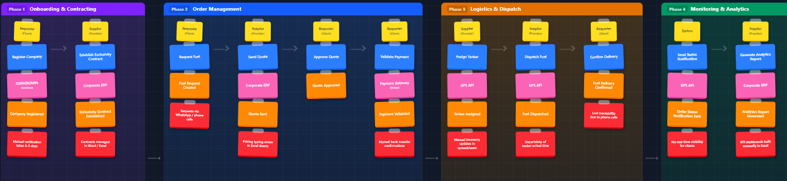

# Capítulo II: Requirements Elicitation & Analysis

## 2.1. Competidores

En el mercado existen diversas soluciones digitales enfocadas en la gestión de combustible y flotas que compiten de manera directa o indirecta con lo propuesto. Entre ellas destaca **Zavgar**, una plataforma SaaS que ayuda a las empresas con flotas vehiculares a optimizar costos y controlar el consumo de combustible. Otro competidor importante es **FuelCloud**, que ofrece una solución integrada de hardware y software para garantizar seguridad y precisión en el despacho de combustible, principalmente en empresas con tanques propios. Finalmente, **Wialon** se presenta como una plataforma internacional de gestión de flotas que combina monitoreo GPS, análisis operativos y control de combustible, dirigida a compañías logísticas y de transporte.

### 2.1.1. Análisis competitivo.

<table border="2">
  <tr>
    <th colspan="6" style="text-align:left">Competitive Analysis Landscape</th>
  </tr>
  <tr>
    <td colspan="1"><strong>¿Por qué llevar a cabo este análisis?</strong></td>
    <td colspan="5">Este análisis se está llevando a cabo porque queremos conocer las ventajas y desventajas de nuestra aplicación frente a la competencia, y cómo nos diferenciamos de ellas.</td>
  </tr>
  <tr>
    <td colspan="2"><strong></strong></td>
    <td><strong>FullTank</strong> </td>
    <td><strong>Zavgar</strong> </td>
    <td><strong>FuelCloud</strong> </td>
    <td><strong>Wialon</strong> </td>
  </tr>

  <tr>
    <th rowspan="3">Perfil</th>
    <td><strong>Visión general</strong></td>
    <td>Plataforma web que digitaliza y estructura el proceso completo de pedido de combustible entre empresas y proveedores.</td>
    <td>SaaS para la gestión de consumo de combustible de flotas, con enfoque en eficiencia, monitoreo y costos.</td>
    <td>Solución con hardware/software para el control físico del despacho de combustible.</td>
    <td>Plataforma de gestión de flotas con control de combustible, GPS y reportes operativos.</td>
  </tr>
  <tr>
    <td><strong>Ventaja competitiva</strong></td>
    <td>Especialización en el flujo completo de pedido, despacho y análisis; integración de pagos y logística; UI intuitiva.</td>
    <td>No requiere hardware; ofrece métricas, control de gastos y reportes sobre consumo.</td>
    <td>Control físico preciso del combustible, monitoreo en tiempo real.</td>
    <td>Seguimiento en tiempo real, visualización de rutas, integración con sensores de combustible.</td>
  </tr>
  <tr>
    <td><strong>¿Qué valor ofrece al cliente?</strong></td>
    <td>Trazabilidad total, eficiencia operativa, reportes de consumo y validación segura de pedidos.</td>
    <td>Optimización de costos y control sobre el uso de combustible en flotas.</td>
    <td>Seguridad y precisión operativa en el control de combustible.</td>
    <td>Trazabilidad de flotas, alertas automáticas, análisis de rutas y consumo de combustible.</td>
  </tr>
  <tr>
    <th rowspan="2">Perfil de Marketing</th>
    <td><strong>Mercado objetivo</strong></td>
    <td>Empresas que solicitan combustible a proveedores.</td>
    <td>Empresas con flotas vehiculares que desean monitorear y reducir el consumo de combustible.</td>
    <td>Empresas con tanques de combustible propios.</td>
    <td>Empresas logísticas, distribuidoras y de transporte de combustible.</td>
  </tr>
  <tr>
    <td><strong>Estrategias de marketing</strong></td>
    <td>Alianzas con proveedores, demostraciones de ahorro, marketing de contenido enfocado en eficiencia.</td>
    <td>Enfoque digital, contenido técnico, integración con proveedores de tarjetas de combustible.</td>
    <td>Ferias industriales, distribuidores, venta consultiva entre empresas.</td>
    <td>Alianzas con distribuidores de GPS, marketing técnico, ferias de transporte.</td>
  </tr>
  <tr>
    <th rowspan="3">Perfil de Producto</th>
    <td><strong>Productos & Servicios</strong></td>
    <td>Plataforma para gestión completa de pedidos, seguimiento, reportes, validación y alertas.</td>
    <td>Plataforma web con módulo de abastecimiento, reportes de consumo, integración GPS y tarjetas.</td>
    <td>Hardware IoT y software para gestión, y control de combustible.</td>
    <td>Plataforma SaaS + app móvil con monitoreo, alertas, mapas y módulos personalizables.</td>
  </tr>
  <tr>
    <td><strong>Precios & Costos</strong></td>
    <td>Modelo SaaS con suscripción escalable según volumen y servicios.</td>
    <td>SaaS con modelos por flota activa o vehículos monitoreados.</td>
    <td>Venta e instalación de hardware + licencias de software.</td>
    <td>Modelo SaaS modular, basado en vehículos activos y funcionalidades activadas.</td>
  </tr>
  <tr>
    <td><strong>Canales de distribución</strong></td>
    <td>Web app responsive, potencial app móvil futura.</td>
    <td>Web app, marketing digital y comunidad de flotas.</td>
    <td>Plataforma web + hardware instalado en sitio.</td>
    <td>Red de partners global, distribuidores locales e integradores de sistemas GPS.</td>
  </tr>
  <tr>
    <th rowspan="4">Análisis SWOT</th>
    <td><strong>Fortalezas</strong></td>
    <td>Enfoque especializado, experiencia de usuario optimizada, integraciones clave, análisis avanzado de consumo.</td>
    <td>Implementación ágil, sin hardware, fácil adopción en empresas medianas.</td>
    <td>Control físico riguroso, solución probada en industrias exigentes.</td>
    <td>Plataforma robusta, cobertura internacional, integración con más de 2,400 dispositivos GPS.</td>
  </tr>
  <tr>
    <td><strong>Debilidades</strong></td>
    <td>Nueva en el mercado, menor reconocimiento de marca, necesita consolidar confianza.</td>
    <td>No gestiona el flujo completo del pedido, enfoque parcial en flotas.</td>
    <td>Alto costo, dependencia de hardware, menor adaptabilidad en mercados emergentes.</td>
    <td>No gestiona pedidos entre proveedor y solicitante, requiere configuración técnica inicial.</td>
  </tr>
  <tr>
    <td><strong>Oportunidades</strong></td>
    <td>Alta informalidad en el sector, digitalización creciente en logística, necesidad de trazabilidad y control.</td>
    <td>Mayor conciencia en eficiencia de flotas y digitalización de costos operativos.</td>
    <td>Nuevos mercados industriales con enfoque en seguridad y control.</td>
    <td>Creciente necesidad de control logístico y monitoreo de distribución en países en desarrollo.</td>
  </tr>
  <tr>
    <td><strong>Amenazas</strong></td>
    <td>Aparición de soluciones similares, resistencia al cambio en empresas tradicionales, competencia ERP.</td>
    <td>SaaS especializados con mayor cobertura funcional (ERP, proveedores, logística).</td>
    <td>SaaS ágiles y sin hardware físico, que ofrecen soluciones más accesibles.</td>
    <td>SaaS más específicos y ligeros, enfocados exclusivamente en la trazabilidad de entregas.</td>
  </tr>
</table>

### 2.1.2. Estrategias y tácticas frente a competidores.

**FullTank** aplicará diversas estrategias para afrontar la competencia y aprovechar las oportunidades que ofrece el sector.

#### a. Diferenciación a través de especialización
Una de las principales estrategias de **FullTank** es la **especialización en el flujo completo de pedido de combustible**. A diferencia de soluciones como **Zavgar**, que están orientadas principalmente al control y análisis del consumo de combustible en flotas, nuestra plataforma se enfoca en las **interacciones B2B** entre empresas solicitantes y proveedores. Esto nos permite ofrecer un control dedicado del pedido, gestión de la logística, y reportes detallados de consumo y entregas, lo cual no está presente en la mayoría de las plataformas competidoras.

- **Táctica**: Desarrollar funcionalidades para la validación automática de pagos, gestión de stock en tiempo real y la optimización del transporte logrando la automatización de procesos que solo eran logrados de forma manual. Esto crea una ventaja frente a competidores como **FuelCloud**, que se centran más en el control físico del combustible y menos en la administración a nivel operativo.

#### b. Innovación en la interfaz de usuario y experiencia

El sistema de **FullTank** está diseñado para ofrecer una **experiencia de usuario optimizada**, algo que **Wialon**, **FuelCloud** y la propia **OSINERGMIN** no abordan en sus plataformas. Al ser una solución especializada y dirigida a una tarea específica, podemos dedicar más recursos en crear una interfaz intuitiva y procesos bien definidos brindando comodidad y seguridad a nuestros usuarios.

- **Táctica**: Diseñar una **interfaz intuitiva y consistente** que permita a los usuarios acceder a reportes de consumo, validar pedidos y coordinar logística con facilidad. Además, ofrecer **soporte y formación continua** para asegurar que los usuarios aprovechen al máximo todas las funcionalidades del sistema.

#### c. Flexibilidad en precios y modelo SaaS escalable
El modelo de precios de **FullTank** ofrece **planes escalables basados en suscripción**, lo que hace que sea más accesible para medianas y grandes empresas. Esto es más competitivo frente a **Wialon**, que puede no ser una opción viable para empresas que solo requieren una solución de pedidos de combustible. También es más asequible que **FuelCloud**, que requiere una inversión considerable en hardware, instalación y mantenimiento.

- **Táctica**: Ofrecer un modelo de suscripción flexible y **precios competitivos**, con **múltiples niveles de suscripción** adaptados a las necesidades de diferentes empresas. Esto permitirá que empresas de menor tamaño puedan acceder a la plataforma sin comprometer su presupuesto, a la vez que se asegura el crecimiento a largo plazo a medida que la empresa crece.

#### d. Aprovechamiento de la digitalización en la logística
El sector de la logística está experimentando una transformación digital acelerada. **FullTank** se aprovechará de esta tendencia buscando la integración de la plataforma con otras soluciones logísticas (como los sistemas de gestión de vehículos o flotas). De esta forma podemos ofrecer una solución más completa y eficiente.

- **Táctica**: Colaborar con empresas de **gestión de flotas** para optimizar el proceso de asignación de vehículos, cisternas y choferes. También se considerará la posibilidad de integrar **sensores IoT** en los camiones de reparto para un control más preciso sobre el combustible transportado y la entrega.

#### e. Expansión hacia mercados internacionales
Si bien **FullTank** está inicialmente orientada a empresas locales, el modelo de negocio y la flexibilidad de la plataforma la hacen ideal para expandirse a **mercados internacionales**. Competidores como **Wialon** ya tienen presencia en mercados globales, pero su enfoque en empresas grandes y sus altos costos de implementación pueden ser una barrera para empresas de menor tamaño, limitando su alcance.

- **Táctica**: Iniciar la expansión en mercados emergentes donde la digitalización en la logística es una necesidad creciente. Esto incluirá la **localización de la plataforma** (idioma, moneda, regulaciones locales) para facilitar la adaptabilidad de los nuevos mercados.

## 2.2. Entrevistas

Para comprender en profundidad las necesidades, frustraciones y comportamientos de los segmentos objetivo (empresas solicitantes y proveedores de combustible), se realizó un proceso de investigación cualitativa mediante entrevistas estructuradas. Esta sección documenta el diseño de las preguntas, el registro de 7 entrevistas (3 con empresas solicitantes, 4 con proveedores), y el análisis de las características demográficas y psicográficas identificadas en cada segmento.

### 2.2.1. Diseño de entrevistas.

**A. Proveedores de Combustible**

**Preguntas:**

1. ¿Cuál es su cargo dentro de la empresa proveedora?
2. ¿Qué tipos de clientes atienden principalmente (logística, construcción, minería, agroindustria)?
3. ¿Qué volumen de operaciones realizan mensualmente?
4. ¿Cómo gestionan actualmente los pedidos y contratos de sus clientes?
5. ¿Qué problemas han experimentado con los métodos tradicionales (llamadas, correos, planillas)?
6. ¿Utilizan algún software especializado para ventas o logística? 
7. ¿Qué características valoraría más en una plataforma digital para gestionar pedidos?
8. ¿Considera que una solución que centralice cotizaciones, contratos y entregas sería útil para su empresa?
9. ¿Qué tan importante es para ustedes tener reportes históricos y comparativos de ventas?
10. ¿Qué estrategias usan actualmente para fidelizar clientes, y cómo cree que una plataforma como NombredelaStartup podría apoyarlos?

---

**B. Empresas Solicitantes**

**Preguntas:**

1. ¿Cuál es su cargo en la empresa? 
2. ¿Hace cuánto tiempo trabaja en el sector energético/logístico? 
3. ¿Qué volumen de combustible gestionan aproximadamente al mes? 
4. ¿Cómo gestionan actualmente la compra y control de combustible? 
5. ¿Qué herramientas usan (Excel, llamadas, correos, sistemas propios)? 
6. ¿Cuáles son los principales problemas que enfrentan con su sistema actual?
7. ¿Qué tan importante es para usted contar con trazabilidad en tiempo real? 
8. ¿Qué dispositivos utilizan para gestionar pedidos (PC, móvil, tablet)? 
9. ¿Qué información considera más valiosa al momento de comprar combustible (precio, tiempo de entrega, historial de proveedor, etc.)? 
10. ¿Cómo afecta la falta de transparencia en los precios a sus decisiones de compra? 
11. ¿Le interesaría recibir notificaciones en tiempo real sobre cambios de precio o estado de sus pedidos? 
12. ¿Qué barreras considera que dificultarían implementar una solución digital como NombredelaStartup en su empresa?

### 2.2.2 Registro de entrevistas
## 1. Segmento 1: Empresas solicitantes de combustible

### - Entrevista 1:

| Campo                   | Detalle                                                                                                                                                                                                                                                                                                                                                                                                                                                                                                                                                                                                                                                                                                                                                                                                                                                                                                                                                                                                                                                                                                                                                                                                                                                                                                                                                                                                                                                                                                                                                                                                                       |
| ----------------------- | ----------------------------------------------------------------------------------------------------------------------------------------------------------------------------------------------------------------------------------------------------------------------------------------------------------------------------------------------------------------------------------------------------------------------------------------------------------------------------------------------------------------------------------------------------------------------------------------------------------------------------------------------------------------------------------------------------------------------------------------------------------------------------------------------------------------------------------------------------------------------------------------------------------------------------------------------------------------------------------------------------------------------------------------------------------------------------------------------------------------------------------------------------------------------------------------------------------------------------------------------------------------------------------------------------------------------------------------------------------------------------------------------------------------------------------------------------------------------------------------------------------------------------------------------------------------------------------------------------------------------------- |
| **Nombre entrevistado** | Kevyn Anthony Asto Jacome                                                                                                                                                                                                                                                                                                                                                                                                                                                                                                                                                                                                                                                                                                                                                                                                                                                                                                                                                                                                                                                                                                                                                                                                                                                                                                                                                                                                                                                                                                                                                                                                     |
| **Edad**                | 32                                                                                                                                                                                                                                                                                                                                                                                                                                                                                                                                                                                                                                                                                                                                                                                                                                                                                                                                                                                                                                                                                                                                                                                                                                                                                                                                                                                                                                                                                                                                                                                                                            |
| **Departamento**        | Lima                                                                                                                                                                                                                                                                                                                                                                                                                                                                                                                                                                                                                                                                                                                                                                                                                                                                                                                                                                                                                                                                                                                                                                                                                                                                                                                                                                                                                                                                                                                                                                                                                          |
| **Inicio del video**    | 00:04                                                                                                                                                                                                                                                                                                                                                                                                                                                                                                                                                                                                                                                                                                                                                                                                                                                                                                                                                                                                                                                                                                                                                                                                                                                                                                                                                                                                                                                                                                                                                                                                                         |
| **Fin del video**       | 07:02                                                                                                                                                                                                                                                                                                                                                                                                                                                                                                                                                                                                                                                                                                                                                                                                                                                                                                                                                                                                                                                                                                                                                                                                                                                                                                                                                                                                                                                                                                                                                                                                                         |
| **Link del video**      | https://shorturl.at/WWcXM                                                                                                                                                                                                                                                                                                                                                                                                                                                                                                                                                                                                                                                                                                                                                                                                                                                                                                                                                                                                                                                                                                                                                                                                                                                                                                                                                                                                                                                                                                                                                                                                     |
| **Foto entrevista**     |                                                                                                                                                                                                                                                                                                                                                                                                                                                                                                                                                                                                                                                                                                                                                                                                                                                                                                                                                                                                                                                                                                                                                                                                                                                                                                                                                                                                                                                                                                                                                                         |
| **Resumen**             | 
El señor Kevyn Anthony Asto Jacome se desempeña como analista senior en <strong>Goodyear</strong>. Se define a sí mismo como un profesional <strong>analítico, metódico y proactivo, abierto a la digitalización</strong> para optimizar tiempos. Su gestión está influenciada por las políticas corporativas de Goodyear y estándares internacionales de eficiencia logística.

En cuanto al consumo, la empresa registra un uso mensual aproximado de entre 20,000 y 21,000 metros cúbicos de combustible, prefiriendo marcas de confianza como <strong>Primax y Repsol</strong>. Para sus tareas tecnológicas diarias, Kevyn interactúa usando una <strong>computadora portátil Lenovo ThinkPad (Windows 11) y un smartphone Samsung Galaxy</strong>, utilizando principalmente <strong>Google Chrome</strong> como su browser preferido. Los canales de interacción que emplea son el <strong>correo electrónico corporativo (Outlook) y llamadas telefónicas tradicionales</strong>.

Respecto a los criterios de compra, destaca que los aspectos más relevantes son el tiempo de entrega y el cumplimiento por parte del proveedor. El factor precio influye bastante en sus decisiones, por lo que evalúan un cambio de proveedor ante costos elevados. Manifiesta un alto interés en contar con trazabilidad y visibilidad en tiempo real del estado de los pedidos y tiempos de llegada. Finalmente, indica que no existirían barreras complejas de infraestructura o capacitación para implementar la solución de FullTank en su compañía, mostrando una actitud muy favorable al cambio digital.
 |

### - Entrevista 2:

| Campo                   | Detalle                                                                                                                                                                                                                                                                                                                                                                                                                                                                                                                                                                                                                                                                                                                                                                                                                                                                                                                                                                                                                                                                                                                                                                                                                                                                                                                                                                                                                                                                                                                                                              |
| ----------------------- | -------------------------------------------------------------------------------------------------------------------------------------------------------------------------------------------------------------------------------------------------------------------------------------------------------------------------------------------------------------------------------------------------------------------------------------------------------------------------------------------------------------------------------------------------------------------------------------------------------------------------------------------------------------------------------------------------------------------------------------------------------------------------------------------------------------------------------------------------------------------------------------------------------------------------------------------------------------------------------------------------------------------------------------------------------------------------------------------------------------------------------------------------------------------------------------------------------------------------------------------------------------------------------------------------------------------------------------------------------------------------------------------------------------------------------------------------------------------------------------------------------------------------------------------------------------------- |
| **Nombre entrevistado** | Alessando Daniel Bravo Castillo                                                                                                                                                                                                                                                                                                                                                                                                                                                                                                                                                                                                                                                                                                                                                                                                                                                                                                                                                                                                                                                                                                                                                                                                                                                                                                                                                                                                                                                                                                                                      |
| **Edad**                | 24                                                                                                                                                                                                                                                                                                                                                                                                                                                                                                                                                                                                                                                                                                                                                                                                                                                                                                                                                                                                                                                                                                                                                                                                                                                                                                                                                                                                                                                                                                                                                                   |
| **Departamento**        | Lima                                                                                                                                                                                                                                                                                                                                                                                                                                                                                                                                                                                                                                                                                                                                                                                                                                                                                                                                                                                                                                                                                                                                                                                                                                                                                                                                                                                                                                                                                                                                                                 |
| **Inicio del video**    | 07:03                                                                                                                                                                                                                                                                                                                                                                                                                                                                                                                                                                                                                                                                                                                                                                                                                                                                                                                                                                                                                                                                                                                                                                                                                                                                                                                                                                                                                                                                                                                                                                |
| **Fin del video**       | 11:15                                                                                                                                                                                                                                                                                                                                                                                                                                                                                                                                                                                                                                                                                                                                                                                                                                                                                                                                                                                                                                                                                                                                                                                                                                                                                                                                                                                                                                                                                                                                                                |
| **Link del video**      | https://shorturl.at/WWcXM                                                                                                                                                                                                                                                                                                                                                                                                                                                                                                                                                                                                                                                                                                                                                                                                                                                                                                                                                                                                                                                                                                                                                                                                                                                                                                                                                                                                                                                                                                                                            |
| **Foto entrevista**     |                                                                                                                                                                                                                                                                                                                                                                                                                                                                                                                                                                                                                                                                                                                                                                                                                                                                                                                                                                                                                                                                                                                                                                                                                                                                                                                                                                                                                                                                                                           |
| **Resumen**             | 
El señor Alessandro Daniel Bravo Castillo se desempeña como analista en el área de logística de su empresa. Su perfil de personalidad destaca por ser <strong>dinámico, tecnológico y orientado a resultados</strong>, sintiéndose muy cómodo con herramientas interactivas. Es influenciado constantemente por tendencias logísticas de redes profesionales como <strong>LinkedIn y publicaciones de la Asociación Peruana de Profesionales en Logística (Approlog)</strong>.

Indica que la gestión de compras se apoya fuertemente en hojas de cálculo de <strong>Microsoft Excel</strong> y reportes internos. En su día a día, utiliza una <strong>computadora de escritorio Dell y un smartphone iPhone</strong>, empleando de manera prioritaria el navegador <strong>Safari y Google Chrome</strong>. Sus canales de comunicación predilectos son el <strong>correo electrónico institucional y WhatsApp Web</strong> para coordinaciones de respuesta rápida.

En la operativa actual, describe serios problemas de trazabilidad, errores de tipeo al registrar datos manualmente y dificultades para comparar los precios de los proveedores, lo que genera incertidumbre logística y financiera. Destaca que sus criterios de decisión principales son el precio competitivo, disponibilidad inmediata y confiabilidad del proveedor. Considera que una plataforma digital sería sumamente valiosa para agilizar la toma de decisiones, aunque prevé desafíos como la resistencia al cambio del personal operario acostumbrado al papel.
 |

### - Entrevista 3:

| Campo                   | Detalle                                                                                                                                                                                                                                                                                                                                                                                                                                                                                                                                                                                                                                                                                                                                                                                                                                                                                                                                                                                                                                                                                                                                                                                                                                                                                                                                                                                                                                                                                                                                     |
| ----------------------- | ------------------------------------------------------------------------------------------------------------------------------------------------------------------------------------------------------------------------------------------------------------------------------------------------------------------------------------------------------------------------------------------------------------------------------------------------------------------------------------------------------------------------------------------------------------------------------------------------------------------------------------------------------------------------------------------------------------------------------------------------------------------------------------------------------------------------------------------------------------------------------------------------------------------------------------------------------------------------------------------------------------------------------------------------------------------------------------------------------------------------------------------------------------------------------------------------------------------------------------------------------------------------------------------------------------------------------------------------------------------------------------------------------------------------------------------------------------------------------------------------------------------------------------------- |
| **Nombre entrevistado** | Betsabe Maldonado Estrella                                                                                                                                                                                                                                                                                                                                                                                                                                                                                                                                                                                                                                                                                                                                                                                                                                                                                                                                                                                                                                                                                                                                                                                                                                                                                                                                                                                                                                                                                                                  |
| **Edad**                | 52                                                                                                                                                                                                                                                                                                                                                                                                                                                                                                                                                                                                                                                                                                                                                                                                                                                                                                                                                                                                                                                                                                                                                                                                                                                                                                                                                                                                                                                                                                                                          |
| **Departamento**        | Lima                                                                                                                                                                                                                                                                                                                                                                                                                                                                                                                                                                                                                                                                                                                                                                                                                                                                                                                                                                                                                                                                                                                                                                                                                                                                                                                                                                                                                                                                                                                                        |
| **Inicio del video**    | 11:16                                                                                                                                                                                                                                                                                                                                                                                                                                                                                                                                                                                                                                                                                                                                                                                                                                                                                                                                                                                                                                                                                                                                                                                                                                                                                                                                                                                                                                                                                                                                       |
| **Fin del video**       | 15:01                                                                                                                                                                                                                                                                                                                                                                                                                                                                                                                                                                                                                                                                                                                                                                                                                                                                                                                                                                                                                                                                                                                                                                                                                                                                                                                                                                                                                                                                                                                                       |
| **Link del video**      | https://shorturl.at/WWcXM                                                                                                                                                                                                                                                                                                                                                                                                                                                                                                                                                                                                                                                                                                                                                                                                                                                                                                                                                                                                                                                                                                                                                                                                                                                                                                                                                                                                                                                                                                                   |
| **Foto entrevista**     |                                                                                                                                                                                                                                                                                                                                                                                                                                                                                                                                                                                                                                                                                                                                                                                                                                                                                                                                                                                                                                                                                                                                                                                                                                                                                                                                                                                                                                                                                     |
| **Resumen**             | 
La señora Betsabe Maldonado Estrella se desempeña como parte del área de logística y abastecimiento de la empresa. Su personalidad se caracteriza por ser <strong>organizada, cautelosa y enfocada en la seguridad operativa</strong>, valorando mucho la consistencia en los procesos. En su toma de decisiones influyen de manera directa las regulaciones vigentes del sector y los reportes de entidades supervisoras como <strong>Osinergmin</strong>.

La coordinación actual con los proveedores la realiza a través de <strong>llamadas de voz por teléfono celular y correos electrónicos tradicionales</strong>. Sus actividades operativas las realiza a través de una <strong>computadora de escritorio de torre HP</strong>, recurriendo de manera constante al navegador <strong>Microsoft Edge</strong> y herramientas de <strong>Office (Excel y Word)</strong>.

En la operativa actual, Betsabe señala deficiencias críticas por la falta de trazabilidad en los procesos de despacho de los proveedores, lo que le genera desconfianza y le imposibilita predecir con exactitud los abastecimientos del día. Cree que una planificación digital óptima reduciría la incertidumbre actual. Finalmente, resalta que los factores determinantes para seleccionar un proveedor son el cumplimiento de tiempos, el precio justo y la confiabilidad del servicio, mostrando un gran interés en una solución integral que automatice el tracking de pedidos y centralice la información histórica de consumos.
 |

---

## 2. Segmento 2: Proveedores de combustible

### - Entrevista 1:

| Campo                   | Detalle                                                                                                                                                                                                                                                                                                                                                                                                                                                                                                                                                                                                                                                                                                                                                                                                                                                                                                                                                                                                                                                                                                                                                                                                                                                                                                                                               |
| ----------------------- | ----------------------------------------------------------------------------------------------------------------------------------------------------------------------------------------------------------------------------------------------------------------------------------------------------------------------------------------------------------------------------------------------------------------------------------------------------------------------------------------------------------------------------------------------------------------------------------------------------------------------------------------------------------------------------------------------------------------------------------------------------------------------------------------------------------------------------------------------------------------------------------------------------------------------------------------------------------------------------------------------------------------------------------------------------------------------------------------------------------------------------------------------------------------------------------------------------------------------------------------------------------------------------------------------------------------------------------------------------- |
| **Nombre entrevistado** | Francesco LLerenas                                                                                                                                                                                                                                                                                                                                                                                                                                                                                                                                                                                                                                                                                                                                                                                                                                                                                                                                                                                                                                                                                                                                                                                                                                                                                                                                    |
| **Edad**                | 20                                                                                                                                                                                                                                                                                                                                                                                                                                                                                                                                                                                                                                                                                                                                                                                                                                                                                                                                                                                                                                                                                                                                                                                                                                                                                                                                                    |
| **Departamento**        | Lima                                                                                                                                                                                                                                                                                                                                                                                                                                                                                                                                                                                                                                                                                                                                                                                                                                                                                                                                                                                                                                                                                                                                                                                                                                                                                                                                                  |
| **Inicio del video**    | 15:05                                                                                                                                                                                                                                                                                                                                                                                                                                                                                                                                                                                                                                                                                                                                                                                                                                                                                                                                                                                                                                                                                                                                                                                                                                                                                                                                                 |
| **Fin del video**       | 20:52                                                                                                                                                                                                                                                                                                                                                                                                                                                                                                                                                                                                                                                                                                                                                                                                                                                                                                                                                                                                                                                                                                                                                                                                                                                                                                                                                 |
| **Link del video**      | https://shorturl.at/WWcXM                                                                                                                                                                                                                                                                                                                                                                                                                                                                                                                                                                                                                                                                                                                                                                                                                                                                                                                                                                                                                                                                                                                                                                                                                                                                                                                             |
| **Foto entrevista**     |                                                                                                                                                                                                                                                                                                                                                                                                                                                                                                                                                                                                                                                                                                                                                                                                                                                                                                                                                                                                                                                                                                                                                                                                                                                                                             |
| **Resumen**             | 
El señor Francesco Llerenas Alva se desempeña como asistente comercial en la empresa. Se define como un profesional <strong>joven, muy receptivo a la innovación y altamente orientado a la tecnología</strong>. Su gestión está influenciada por las tendencias de automatización comercial en redes profesionales como <strong>LinkedIn</strong>.

En el desarrollo de sus funciones cotidianas, indica que la comunicación con los clientes se realiza principalmente a través de <strong>WhatsApp Web y correo electrónico</strong>, registrando y controlando la información mediante hojas de cálculo en <strong>Microsoft Excel</strong>. Para estas actividades, hace uso de una <strong>computadora portátil ASUS ROG y un dispositivo móvil Xiaomi</strong>, empleando prioritariamente el navegador <strong>Google Chrome</strong>.

En cuanto a la operativa actual, señala que se presentan errores constantes debido a información incompleta, problemas de trazabilidad y falta de claridad en las entregas, afectando el orden general. Considera que una aplicación centralizada e intuitiva que muestre el estado de los pedidos en tiempo real mejoraría drásticamente la eficiencia. Finalmente, resalta la importancia de disponer de datos históricos para proyectar adecuadamente la demanda de los clientes.
 |

### - Entrevista 2:

| Campo                   | Detalle                                                                                                                                                                                                                                                                                                                                                                                                                                                                                                                                                                                                                                                                                                                                                                                                                                                                                                                                                                                                                                                                                                                                                                                                                                              |
| ----------------------- | ---------------------------------------------------------------------------------------------------------------------------------------------------------------------------------------------------------------------------------------------------------------------------------------------------------------------------------------------------------------------------------------------------------------------------------------------------------------------------------------------------------------------------------------------------------------------------------------------------------------------------------------------------------------------------------------------------------------------------------------------------------------------------------------------------------------------------------------------------------------------------------------------------------------------------------------------------------------------------------------------------------------------------------------------------------------------------------------------------------------------------------------------------------------------------------------------------------------------------------------------------- |
| **Nombre entrevistado** | Samuel Roca Rey                                                                                                                                                                                                                                                                                                                                                                                                                                                                                                                                                                                                                                                                                                                                                                                                                                                                                                                                                                                                                                                                                                                                                                                                                                      |
| **Edad**                | 48                                                                                                                                                                                                                                                                                                                                                                                                                                                                                                                                                                                                                                                                                                                                                                                                                                                                                                                                                                                                                                                                                                                                                                                                                                                   |
| **Departamento**        | Lima                                                                                                                                                                                                                                                                                                                                                                                                                                                                                                                                                                                                                                                                                                                                                                                                                                                                                                                                                                                                                                                                                                                                                                                                                                                 |
| **Inicio del video**    | 20:54                                                                                                                                                                                                                                                                                                                                                                                                                                                                                                                                                                                                                                                                                                                                                                                                                                                                                                                                                                                                                                                                                                                                                                                                                                                |
| **Fin del video**       | 28:28                                                                                                                                                                                                                                                                                                                                                                                                                                                                                                                                                                                                                                                                                                                                                                                                                                                                                                                                                                                                                                                                                                                                                                                                                                                |
| **Link del video**      | https://shorturl.at/WWcXM                                                                                                                                                                                                                                                                                                                                                                                                                                                                                                                                                                                                                                                                                                                                                                                                                                                                                                                                                                                                                                                                                                                                                                                                                            |
| **Foto entrevista**     |                                                                                                                                                                                                                                                                                                                                                                                                                                                                                                                                                                                                                                                                                                                                                                                                                                                                                                                                                                                                                                                                                                                                                                                               |
| **Resumen**             | 
El señor Samuel Roca Rey se desempeña como supervisor de logística y operaciones en la empresa. Cuenta con un perfil de personalidad <strong>metódico, pragmático y muy enfocado en la seguridad operativa</strong>. Su gestión diaria está fuertemente influenciada por las normas de seguridad de <strong>OSINERGMIN</strong> y buenas prácticas en distribución.

Indica que la comunicación operativa con los choferes y clientes se efectúa a través de <strong>llamadas de voz por teléfono celular y correo electrónico (Outlook)</strong>, usando <strong>Microsoft Excel</strong> para sus registros. Desarrolla su trabajo mediante una <strong>computadora de escritorio Lenovo y un teléfono móvil Motorola</strong>, navegando a través de <strong>Microsoft Edge</strong>.

Samuel describe problemas recurrentes de trazabilidad física del combustible y errores de tipeo manual que alteran la precisión. Señala la urgencia de implementar una solución digital que centralice todos los datos en un solo lugar seguro y accesible. Para finalizar, remarca que contar con el historial completo de transacciones en la plataforma es clave para optimizar la planificación de rutas y el control de inventarios.
 |

### - Entrevista 3:

| Campo                   | Detalle                                                                                                                                                                                                                                                                                                                                                                                                                                                                                                                                                                                                                                                                                                                                                                                                                                                                                                                                                                                                                                                                                                                                                                                                                                   |
| ----------------------- | ----------------------------------------------------------------------------------------------------------------------------------------------------------------------------------------------------------------------------------------------------------------------------------------------------------------------------------------------------------------------------------------------------------------------------------------------------------------------------------------------------------------------------------------------------------------------------------------------------------------------------------------------------------------------------------------------------------------------------------------------------------------------------------------------------------------------------------------------------------------------------------------------------------------------------------------------------------------------------------------------------------------------------------------------------------------------------------------------------------------------------------------------------------------------------------------------------------------------------------------- |
| **Nombre entrevistado** | Carlos Mendoza                                                                                                                                                                                                                                                                                                                                                                                                                                                                                                                                                                                                                                                                                                                                                                                                                                                                                                                                                                                                                                                                                                                                                                                                                            |
| **Edad**                | 50                                                                                                                                                                                                                                                                                                                                                                                                                                                                                                                                                                                                                                                                                                                                                                                                                                                                                                                                                                                                                                                                                                                                                                                                                                        |
| **Departamento**        | Lima                                                                                                                                                                                                                                                                                                                                                                                                                                                                                                                                                                                                                                                                                                                                                                                                                                                                                                                                                                                                                                                                                                                                                                                                                                      |
| **Inicio del video**    | 28:30                                                                                                                                                                                                                                                                                                                                                                                                                                                                                                                                                                                                                                                                                                                                                                                                                                                                                                                                                                                                                                                                                                                                                                                                                                     |
| **Fin del video**       | 33:10                                                                                                                                                                                                                                                                                                                                                                                                                                                                                                                                                                                                                                                                                                                                                                                                                                                                                                                                                                                                                                                                                                                                                                                                                                     |
| **Link del video**      | https://shorturl.at/WWcXM                                                                                                                                                                                                                                                                                                                                                                                                                                                                                                                                                                                                                                                                                                                                                                                                                                                                                                                                                                                                                                                                                                                                                                                                                 |
| **Foto entrevista**     |                                                                                                                                                                                                                                                                                                                                                                                                                                                                                                                                                                                                                                                                                                                                                                                                                                                                                                                                                                                                                                                                                                                                                                          |
| **Resumen**             | 
El señor Carlos Mendoza se desempeña como jefe de logística y operaciones comerciales en la empresa. Es un profesional <strong>analítico, de carácter gerencial y orientado a la rentabilidad y optimización B2B</strong>. Sigue de cerca las tendencias logísticas y es influenciado por sistemas de gestión empresarial robustos como <strong>SAP y Oracle ERP</strong>.

Indica que la gestión comercial y de contratos se realiza vía <strong>correo electrónico</strong>, complementada por el uso de su sistema <strong>ERP corporativo</strong>. Su entorno de trabajo digital diario se compone de una <strong>computadora portátil HP EliteBook y un smartphone Samsung Galaxy</strong>, operando desde el navegador <strong>Google Chrome</strong>.

Carlos enfatiza la falta de trazabilidad en tiempo real y el exceso de burocracia interna que reduce la agilidad. Valora sumamente que FullTank centralice e integre los procesos operativos y envíe alertas automáticas. Cree firmemente que permitir a los clientes realizar un seguimiento directo del combustible despachado elevará la confianza del servicio y que la información histórica será vital para negociaciones estratégicas comerciales.
 |

### - Entrevista 4:

| Campo                   | Detalle                                                                                                                                                                                                                                                                                                                                                                                                                                                                                                                                                                                                                                                                                                                                                                                                                                                                                                                                                                                                                                                                                                                                                                                        |
| ----------------------- | ---------------------------------------------------------------------------------------------------------------------------------------------------------------------------------------------------------------------------------------------------------------------------------------------------------------------------------------------------------------------------------------------------------------------------------------------------------------------------------------------------------------------------------------------------------------------------------------------------------------------------------------------------------------------------------------------------------------------------------------------------------------------------------------------------------------------------------------------------------------------------------------------------------------------------------------------------------------------------------------------------------------------------------------------------------------------------------------------------------------------------------------------------------------------------------------------- |
| **Nombre entrevistado** | Lucia Fernandez                                                                                                                                                                                                                                                                                                                                                                                                                                                                                                                                                                                                                                                                                                                                                                                                                                                                                                                                                                                                                                                                                                                                                                                |
| **Edad**                | 21                                                                                                                                                                                                                                                                                                                                                                                                                                                                                                                                                                                                                                                                                                                                                                                                                                                                                                                                                                                                                                                                                                                                                                                             |
| **Departamento**        | Lima                                                                                                                                                                                                                                                                                                                                                                                                                                                                                                                                                                                                                                                                                                                                                                                                                                                                                                                                                                                                                                                                                                                                                                                           |
| **Inicio del video**    | 33:12                                                                                                                                                                                                                                                                                                                                                                                                                                                                                                                                                                                                                                                                                                                                                                                                                                                                                                                                                                                                                                                                                                                                                                                          |
| **Fin del video**       | 37:56                                                                                                                                                                                                                                                                                                                                                                                                                                                                                                                                                                                                                                                                                                                                                                                                                                                                                                                                                                                                                                                                                                                                                                                          |
| **Link del video**      | https://shorturl.at/WWcXM                                                                                                                                                                                                                                                                                                                                                                                                                                                                                                                                                                                                                                                                                                                                                                                                                                                                                                                                                                                                                                                                                                                                                                      |
| **Foto entrevista**     |                                                                                                                                                                                                                                                                                                                                                                                                                                                                                                                                                                                                                                                                                                                                                                                                                                                                                                                                                                                                                                                                                                                                |
| **Resumen**             | 
La señora Lucia Fernandez se desempeña como gerente de ventas, con responsabilidades añadidas en la facturación y cobranza. Posee una personalidad <strong>comunicativa, altamente organizada y enfocada en el detalle financiero</strong>. En su labor influyen las prácticas modernas de administración comercial para PYMES y análisis de riesgo crediticio.

Actualmente coordina mediante <strong>llamadas telefónicas y correos electrónicos</strong>, controlando la data de pedidos dispersa en hojas de cálculo en <strong>Excel</strong> al no contar con un software propio. Realiza sus operaciones diarias empleando una <strong>Macbook Air de Apple y un iPhone 13</strong>, utilizando <strong>Safari y Google Chrome</strong> indistintamente.

Menciona que los errores de tipeo en las planillas de Excel perjudican la precisión comercial. Necesita con urgencia una plataforma rápida y de interfaz minimalista (de pocos botones) para su uso diario que centralice la información. Finalmente, destaca la utilidad del historial de pedidos para monitorear las líneas de crédito y mejorar la capacidad de negociación con sus clientes recurrentes.
 |

### 2.2.3 Análisis de entrevistas

En esta sección se presenta un análisis de los datos recopilados de las entrevistas. Por cada segmento objetivo, se detallan gráficamente los hallazgos obtenidos 

-Segmento 1: Empresas solicitantes de combustible

El análisis del segmento de empresas solicitantes de combustible revela un ecosistema operativo con una dependencia del 100% en canales de comunicación informal como llamadas y correos, donde el 75% utiliza herramientas no especializadas como Excel para su gestión. Esta precariedad se traduce en que el 50% de los usuarios enfrente problemas críticos de trazabilidad y un 25% sufra errores de registro que ponen en riesgo la continuidad operativa. En el plano subjetivo, existe una demanda unánime (100%) por la centralización de la información y el acceso a reportes históricos para la toma de decisiones, mientras que un 75% considera indispensable la implementación de alertas automáticas y mayor transparencia en los procesos para mitigar la incertidumbre en el suministro.

  
  

-Segmento 2: Proveedores de Combustible

Análisis de Características Objetivas y Subjetivas: Los datos confirman una gestión operativa basada en herramientas no especializadas. El 100% utiliza correos y llamadas como medio principal de coordinación, el 75% complementa la gestión con Excel, el 50% presenta problemas de trazabilidad en el proceso y el 25% menciona dificultades específicas como errores en registros o falta de comunicación con proveedores. Subjetivamente, el 100% considera importante la centralización de la información, el 75% destaca la necesidad de mejoras en la facilidad de uso y seguimiento del sistema, el 75% valora la incorporación de alertas automáticas y el 100% considera relevante el acceso a información histórica para la toma de decisiones. En conjunto, los resultados evidencian una alta dependencia de procesos manuales y una clara demanda por una solución digital integrada que mejore la trazabilidad, el control y la eficiencia operativa.

  
  

#### Análisis Comparativo

La contrastación de ambos segmentos revela una convergencia crítica en la ineficiencia comunicativa, donde el 100% de las interacciones dependen de canales informales, generando en las empresas solicitantes una incertidumbre del 50% sobre la trazabilidad de sus pedidos y en los proveedores un riesgo constante de pérdida de información operativa. Mientras que las empresas demandan transparencia y acceso a historiales para asegurar su continuidad (100%), los proveedores requieren una centralización de cotizaciones que elimine el caos administrativo actual, validando que el valor real de la solución radica en actuar como una fuente única de verdad que resuelva la asimetría de información detectada en las entrevistas. Esta alineación de necesidades demuestra que el éxito de la plataforma depende de ofrecer una trazabilidad bidireccional que transforme la desconfianza del solicitante en eficiencia administrativa para el proveedor.

  

### Conclusiones y Definición de Arquetipos
Basado en el análisis de las entrevistas realizadas, se definen los siguientes perfiles para los User Personas:

User Persona Empresa Solicitante (“El Gestor de Abastecimiento”) 
* Rasgo clave: Busca control, visibilidad y confiabilidad en el proceso de abastecimiento. 
* Sustento: El 100% utiliza correo y llamadas, y la mayoría trabaja con Excel. Existe una alta demanda de centralización y trazabilidad.

User Persona Proveedor (“El Operador Comercial”) 
* Rasgo clave: Necesita orden, eficiencia operativa y mejor gestión de la información comercial. 
* Sustento: El 100% usa herramientas manuales como Excel, correo y teléfono. Se evidencia necesidad de centralización y acceso a datos históricos.

## 2.3 Needfinding
### 2.3.1 User Personas

A partir del análisis de entrevistas y la recolección de información sobre la gestión de pedidos de combustible, se identificaron los principales perfiles de usuarios que interactúan con la solución **FullTank**, desarrollada por la startup **FullTank**, destacando tanto a las empresas solicitantes como a los proveedores, quienes concentran la necesidad de optimizar la solicitud, gestión y seguimiento de pedidos en tiempo real; en este contexto, **FullTank** propone centralizar y digitalizar todo el proceso en una sola plataforma, reduciendo el uso de canales informales, minimizando errores operativos y mejorando la trazabilidad, lo que permite al equipo de desarrollo comprender mejor sus motivaciones y frustraciones para diseñar funcionalidades como formularios digitales, tracking en tiempo real, dashboards y herramientas de comunicación integradas, logrando así una experiencia más eficiente, clara y confiable.

-Segmento 1: Empresas solicitantes de combustible

 

-Segmento 2: Proveedores de Combustible

 

### 2.3.2 User Task Matrix

El User Task Matrix presenta las tareas que realizan los User Persona para cumplir sus objetivos en su día a día, independientemente de si usan nuestro software o no. Se evalúa la frecuencia y la importancia de cada tarea para identificar dónde aportar valor.

<table border="1">
  <thead>
    <tr>
      <th rowspan="2">Tarea (Task)</th>
      <th colspan="2">Carlos (El Gestor de Abastecimiento)</th>
      <th colspan="2">Andrea (El Operador Comercial)</th>
    </tr>
    <tr>
      <th>Frecuencia</th>
      <th>Importancia</th>
      <th>Frecuencia</th>
      <th>Importancia</th>
    </tr>
  </thead>
  <tbody>
    <tr>
      <td>Registrar / recibir pedidos</td>
      <td>Alta</td>
      <td>Alta</td>
      <td>Alta</td>
      <td>Alta</td>
    </tr>
    <tr>
      <td>Validar información del pedido</td>
      <td>Media</td>
      <td>Alta</td>
      <td>Alta</td>
      <td>Alta</td>
    </tr>
    <tr>
      <td>Consultar / actualizar estado del pedido</td>
      <td>Alta</td>
      <td>Alta</td>
      <td>Alta</td>
      <td>Alta</td>
    </tr>
    <tr>
      <td>Modificar pedido</td>
      <td>Media</td>
      <td>Alta</td>
      <td>Baja</td>
      <td>Media</td>
    </tr>
    <tr>
      <td>Programar y planificar entregas</td>
      <td>Baja</td>
      <td>Media</td>
      <td>Alta</td>
      <td>Alta</td>
    </tr>
    <tr>
      <td>Gestionar múltiples pedidos</td>
      <td>Media</td>
      <td>Media</td>
      <td>Alta</td>
      <td>Alta</td>
    </tr>
    <tr>
      <td>Comunicarse entre cliente y proveedor</td>
      <td>Alta</td>
      <td>Alta</td>
      <td>Alta</td>
      <td>Alta</td>
    </tr>
    <tr>
      <td>Recibir / enviar notificaciones</td>
      <td>Alta</td>
      <td>Alta</td>
      <td>Alta</td>
      <td>Alta</td>
    </tr>
    <tr>
      <td>Revisar historial de pedidos</td>
      <td>Media</td>
      <td>Media</td>
      <td>Media</td>
      <td>Media</td>
    </tr>
    <tr>
      <td>Monitorear desempeño / consumo</td>
      <td>Baja</td>
      <td>Media</td>
      <td>Media</td>
      <td>Media</td>
    </tr>
    <tr>
      <td>Generar reportes y métricas</td>
      <td>Baja</td>
      <td>Media</td>
      <td>Media</td>
      <td>Media</td>
    </tr>
  </tbody>
</table>

#### Análisis y Comparación del User Task Matrix
La matriz de tareas revela una clara convergencia y algunas divergencias operativas cruciales entre los dos perfiles principales:

* **Convergencias Críticas:** Tareas como *Registrar/recibir pedidos*, *Consultar/actualizar estado del pedido*, *Comunicarse entre cliente y proveedor* y *Recibir/enviar notificaciones* registran un nivel de **Frecuencia e Importancia Alta** en ambos segmentos. Esto demuestra que la comunicación bidireccional, el tracking de pedidos en tiempo real y el flujo básico transaccional constituyen la columna vertebral del negocio de combustible, siendo el área principal donde **FullTank** debe aportar valor inmediato.
* **Divergencias Clave:** 
  - La *Programación y planificación de entregas* e *implicaciones de logística* es una tarea de **Frecuencia Alta e Importancia Alta** para Andrea (Proveedor), mientras que para Carlos (Empresa Solicitante) es una tarea de **Frecuencia Baja e Importancia Media**, limitándose a ser un receptor del despacho.
  - La *Modificación de pedidos* es de **Frecuencia Media e Importancia Alta** para Carlos debido a los cambios imprevistos en sus obras, mientras que para Andrea es de **Frecuencia Baja e Importancia Media**, ya que prefiere evitar alteraciones una vez planificada la ruta de las cisternas.
  - La *Generación de reportes y métricas de consumo* e *historiales* tiene mayor relevancia y frecuencia para el proveedor (Andrea) con el fin de proyectar su demanda comercial, mientras que el cliente (Carlos) lo ve con frecuencia baja enfocándose en el control de costos puntual de sus facturas mensuales.

### 2.3.3 User Journey Mapping

-Segmento 1: Empresas solicitantes de combustible

El User Journey Mapping de Carlos representa el recorrido actual que experimenta como responsable en una empresa constructora, en la gestión del abastecimiento de combustible necesario para la operación de maquinaria pesada. El mapa ilustra el proceso end-to-end, desde la identificación de la necesidad de combustible hasta la evaluación de la entrega y desempeño del proveedor.

En la situación As-Is, Carlos enfrenta un flujo de trabajo manual y poco estructurado: detecta necesidades sin apoyo de alertas, busca proveedores de manera informal, realiza pedidos mediante canales como WhatsApp o correo y da seguimiento a través de llamadas constantes. Esto genera desorden en la información, falta de trazabilidad, retrasos y una alta dependencia de la comunicación manual.

El Journey busca evidenciar los puntos críticos de su experiencia actual, identificando emociones, tareas, fricciones y oportunidades de mejora a lo largo de cada etapa (Awareness, Data Collection, Daily Management, Communication, Reporting y Evaluation). Este análisis servirá como base para diseñar una solución que centralice la información, automatice el registro de pedidos y permita el seguimiento en tiempo real.

 

-Segmento 2: Proveedores de Combustible

El User Journey Mapping de Andrea representa el recorrido actual que experimenta como coordinadora en una empresa distribuidora de combustible, encargada de gestionar múltiples pedidos, coordinar entregas y asegurar el cumplimiento logístico. El mapa ilustra el proceso end-to-end, desde la recepción de pedidos hasta la evaluación del desempeño operativo.

En la situación As-Is, Andrea enfrenta un flujo de trabajo altamente demandante y fragmentado: recibe pedidos por diversos canales, valida información manualmente, organiza rutas sin herramientas automatizadas y mantiene comunicación constante con clientes mediante llamadas y mensajes. Esto genera sobrecarga operativa, errores en la planificación, saturación en la comunicación y limitada visibilidad de métricas clave.

El Journey busca evidenciar los puntos críticos de su experiencia actual, identificando emociones, tareas, fricciones y oportunidades de mejora a lo largo de cada etapa (Awareness, Data Collection, Daily Management, Communication, Reporting y Evaluation). Este análisis servirá como base para diseñar una solución tecnológica que centralice pedidos, automatice la planificación logística y mejore la visibilidad operativa mediante indicadores y dashboards.

 

### 2.3.4 Empathy Mapping

Para la elaboración de los Empathy Maps, el equipo partió del conocimiento y observaciones recolectadas durante el análisis de los User Persona. Se colocó al centro de cada mapa al usuario correspondiente (Carlos y Andrea) y se respondieron las preguntas claves sobre su entorno, emociones, comportamientos y necesidades.

- Segmento 1: Empresas solicitantes de combustible

 

- Segmento 2: Proveedores de Combustible

 

## 2.4 Big Picture Event Storming

Para comprender a profundidad el dominio del negocio de **FullTank** y alinear la visión tecnológica con las operaciones reales de compraventa y distribución de combustible, el equipo llevó a cabo una sesión de **Event Storming**. Esta técnica colaborativa nos permitió identificar los hitos clave del sistema sin adelantarnos a detalles técnicos.

### Step 1 – Free Exploration (Exploración Libre)

En esta primera etapa, el equipo realizó una lluvia de ideas desestructurada para capturar todos los **Eventos de Dominio** relevantes de la operativa logística y comercial. Utilizando notas de color naranja (*post-its*), registramos hechos que ya ocurrieron en el negocio, redactados estrictamente en tiempo pasado (ej. *Fuel request created*, *Fuel dispatched*). 

El objetivo principal fue plasmar sobre el lienzo la realidad del negocio, desde el registro de usuarios hasta el despacho físico en las cisternas, priorizando la cantidad de eventos sobre el orden cronológico o la jerarquía.

  
  
<em>Figura X: Step 1 - Exploración libre de eventos de dominio.</em>

### Step 2 – Structured Organization (Líneas de Tiempo)

Tras listar los eventos de dominio, procedimos a organizar el caos inicial estructurando los *post-its* en un flujo lógico de negocio de izquierda a derecha. Agrupamos los eventos en cuatro grandes bloques temporales que reflejan el ciclo de vida real de una operación de abastecimiento de combustible:

1. **Onboarding & Contracting:** Abarca el registro de las empresas y la formalización de los contratos de exclusividad.
2. **Order Management:** Contiene el núcleo transaccional administrativo, desde la creación de la solicitud y envío de cotizaciones, hasta la confirmación y validación financiera.
3. **Logistics & Dispatch:** Refleja la operativa física, incluyendo la asignación de cisternas (*Tanker assigned to order*), actualización de inventarios y la entrega del combustible.
4. **Monitoring & Analytics:** Agrupa los eventos asíncronos de valor agregado, como el envío de notificaciones, alertas de precios y reportes de consumo.

Esta estructura temporal nos ayudó a identificar claramente las áreas críticas donde la digitalización eliminará los actuales cuellos de botella del sector.

  
  
<em>Figura Y: Step 2 - Organización temporal por flujos de negocio.</em>

### Step 3 to 6 – Pain Points, Boundaries, Commands & Actors (Big Picture Final)

Para consolidar el panorama general del negocio, procedimos a escalar el análisis aplicando la sintaxis oficial completa del *Event Storming*. Este proceso iterativo nos permitió no solo mapear el flujo, sino también descubrir la estructura modular de la futura plataforma:

1. **Explicit Pain Points (Step 3):** Incorporamos *post-its* rojos en las áreas donde las entrevistas previas revelaron fricciones reales. Por ejemplo, identificamos problemas críticos como *"Manual verification takes 3-5 days"*, *"Pricing typing errors in Excel"* y *"Lost traceability due to phone calls"*. Esto fundamenta la necesidad técnica y de negocio de nuestra solución.
2. **Pivotal Events & Boundaries (Step 4):** Las cuatro fases temporales se establecieron formalmente como límites de contexto (*Bounded Contexts*), estructurando arquitectónicamente los módulos del sistema (Onboarding, Order Management, Logistics, Monitoring).
3. **Commands, Actors & Systems (Step 5 y 6):** Conectamos cada evento con su desencadenante. Añadimos los *Commands* (Azules), identificamos al *Actor* responsable (Amarillo) ya sea el *Requester (Client)* o el *Supplier (Provider)*, y mapeamos los *Sistemas Externos* (Rosados) como OSINERGMIN, Stripe y APIs de GPS que interactúan en la cadena.

A continuación, se presenta la leyenda oficial empleada y el **Lienzo Completo del Big Picture Event Storming**:

  
  
<em>Figura Z1: Sintaxis y código de colores oficial de Event Storming.</em>

  
  
<em>Figura Z2: Lienzo final de Event Storming (Steps 3 al 6) agrupado por contextos delimitados exponiendo puntos de dolor.</em>

## 2.5 Ubiquitous Language

En este proyecto, cuyo objetivo principal es mejorar la eficiencia, trazabilidad y comunicación en la gestión y distribución de combustible a través de una plataforma web, se ha definido el siguiente lenguaje ubicuo para asegurar claridad y consistencia entre usuarios, desarrolladores y stakeholders:

<table border="1">
  <thead>
    <tr>
      <th>Término </th>
      <th>Definición </th>
    </tr>
  </thead>
  <tbody>
    <tr>
      <td>Fuel Request</td>
      <td>Solicitud de combustible generada por una empresa cliente especificando tipo, cantidad y detalles de entrega.</td>
    </tr>
    <tr>
      <td>Client Company</td>
      <td>Organización que requiere combustible para sus operaciones y utiliza la plataforma para realizar y rastrear pedidos.</td>
    </tr>
    <tr>
      <td>Fuel Supplier</td>
      <td>Empresa responsable de recibir, validar y cumplir con las solicitudes de combustible.</td>
    </tr>
    <tr>
      <td>Order Status</td>
      <td>Etapa actual de una solicitud (por ejemplo: pendiente, validada, programada, en entrega, completada).</td>
    </tr>
    <tr>
      <td>Order Tracking</td>
      <td>Monitoreo en tiempo real del progreso y ubicación de una entrega de combustible.</td>
    </tr>
    <tr>
      <td>Delivery Scheduling</td>
      <td>Proceso de asignación de fecha, hora y recursos logísticos para cumplir una solicitud de combustible.</td>
    </tr>
    <tr>
      <td>Centralized Dashboard</td>
      <td>Interfaz principal donde los usuarios visualizan pedidos, métricas y estado operacional.</td>
    </tr>
    <tr>
      <td>Notification</td>
      <td>Mensaje automatizado que informa a los usuarios sobre actualizaciones o cambios en sus solicitudes de combustible.</td>
    </tr>
    <tr>
      <td>Order History</td>
      <td>Registro de solicitudes de combustible anteriores, incluyendo detalles y resultados.</td>
    </tr>
    <tr>
      <td>Logistics Planning</td>
      <td>Organización y optimización de rutas, entregas y recursos operacionales.</td>
    </tr>
    <tr>
      <td>Validation Process</td>
      <td>Paso en el cual el proveedor confirma disponibilidad, precisión y viabilidad de una solicitud.</td>
    </tr>
    <tr>
      <td>Integrated Communication</td>
      <td>Sistema de chat o mensajería integrado que permite interacción directa entre clientes y proveedores.</td>
    </tr>
    <tr>
      <td>Operational Metrics</td>
      <td>Indicadores como tiempo de entrega, eficiencia y tasas de error utilizados para evaluación de desempeño.</td>
    </tr>
    <tr>
      <td>Report</td>
      <td>Documento o panel generado que resume consumo de combustible, entregas y datos de desempeño.</td>
    </tr>
    <tr>
      <td>Session</td>
      <td>Período autenticado en el cual un usuario accede a la plataforma con credenciales seguras.</td>
    </tr>
    <tr>
      <td>Roles and Permissions</td>
      <td>Controles de acceso que definen qué acciones puede realizar cada tipo de usuario (cliente o proveedor).</td>
    </tr>
    <tr>
      <td>Tanker (Cisterna)</td>
      <td>Vehículo especializado equipado con depósito para el transporte y entrega de combustible líquido.</td>
    </tr>
    <tr>
      <td>Dispatch</td>
      <td>Acción de enviar un tanque cisterna con combustible hacia el destino especificado en la solicitud.</td>
    </tr>
    <tr>
      <td>Fleet Management</td>
      <td>Administración y monitoreo de la flota de vehículos cisternas disponibles para entregas.</td>
    </tr>
    <tr>
      <td>Route Optimization</td>
      <td>Proceso de calcular y asignar la ruta más eficiente para cada entrega minimizando tiempos y costos.</td>
    </tr>
    <tr>
      <td>Inventory</td>
      <td>Stock actual de combustible disponible en las bases de operación del proveedor.</td>
    </tr>
    <tr>
      <td>Contract</td>
      <td>Acuerdo formal entre un cliente y un proveedor que especifica términos de exclusividad, precios y volúmenes.</td>
    </tr>
    <tr>
      <td>Payment Method</td>
      <td>Medio de pago acordado para la transacción (transferencia bancaria, tarjeta, etc.).</td>
    </tr>
    <tr>
      <td>Pricing Quote</td>
      <td>Propuesta de precio ofrecida por el proveedor en respuesta a una solicitud de combustible.</td>
    </tr>
    <tr>
      <td>Delivery Window</td>
      <td>Rango de fecha y hora dentro del cual se garantiza la entrega de la solicitud de combustible.</td>
    </tr>
  </tbody>
</table>

