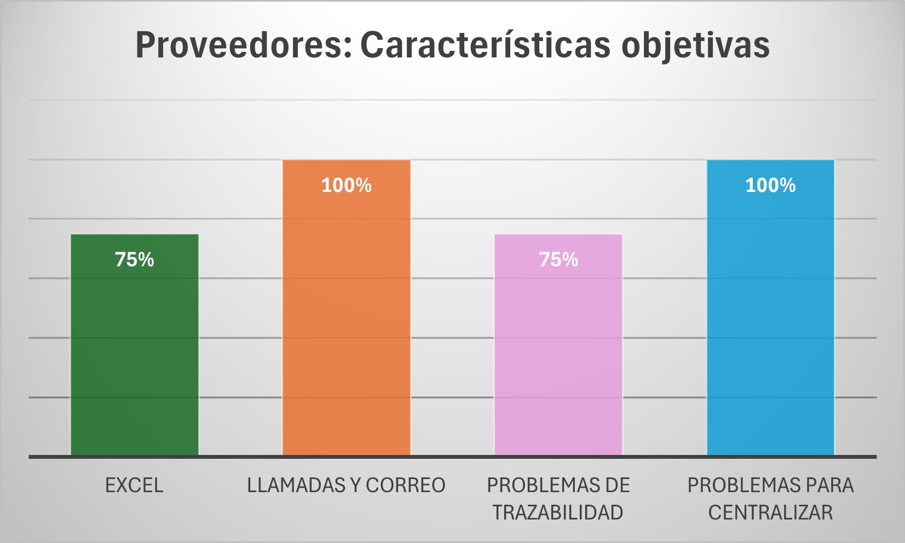
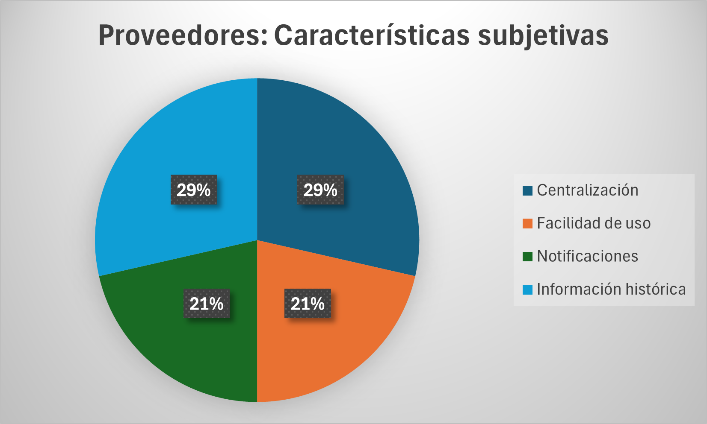
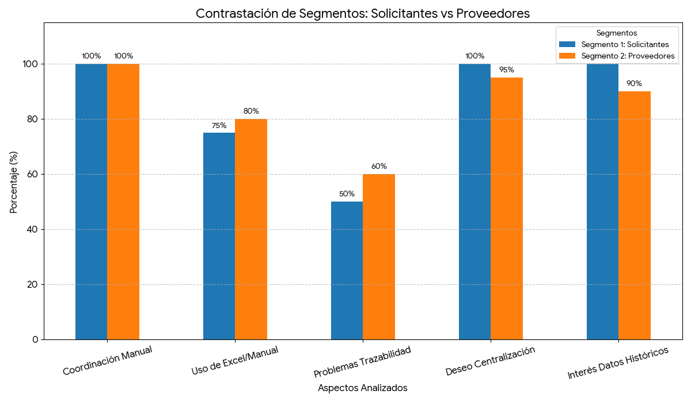
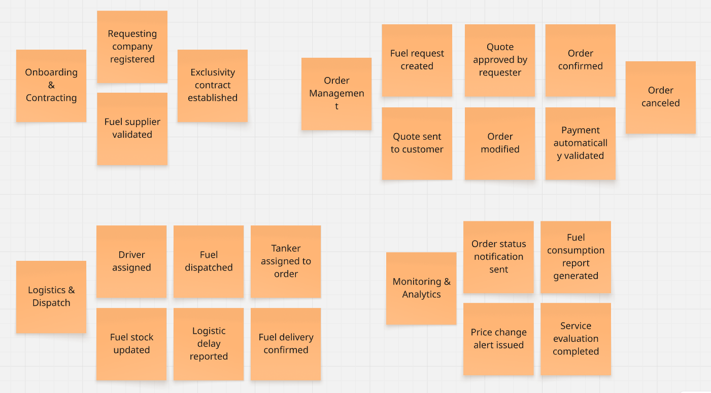

# Capítulo II: Requirements Elicitation & Analysis

## 2.1. Competidores

En el mercado existen diversas soluciones digitales enfocadas en la gestión de combustible y flotas que compiten de manera directa o indirecta con lo propuesto. Entre ellas destaca **Zavgar**, una plataforma SaaS que ayuda a las empresas con flotas vehiculares a optimizar costos y controlar el consumo de combustible. Otro competidor importante es **FuelCloud**, que ofrece una solución integrada de hardware y software para garantizar seguridad y precisión en el despacho de combustible, principalmente en empresas con tanques propios. Finalmente, **Wialon** se presenta como una plataforma internacional de gestión de flotas que combina monitoreo GPS, análisis operativos y control de combustible, dirigida a compañías logísticas y de transporte.

### 2.1.1. Análisis competitivo.

<table border="2">
  <tr>
    <th colspan="6" style="text-align:left">Competitive Analysis Landscape</th>
  </tr>
  <tr>
    <td colspan="1"><strong>¿Por qué llevar a cabo este análisis?</strong></td>
    <td colspan="5">Este análisis se está llevando a cabo porque queremos conocer las ventajas y desventajas de nuestra aplicación frente a la competencia, y cómo nos diferenciamos de ellas.</td>
  </tr>
  <tr>
    <td colspan="2"><strong></strong></td>
    <td><strong>FullTank</strong> </td>
    <td><strong>Zavgar</strong> </td>
    <td><strong>FuelCloud</strong> </td>
    <td><strong>Wialon</strong> </td>
  </tr>

  <tr>
    <th rowspan="3">Perfil</th>
    <td><strong>Visión general</strong></td>
    <td>Plataforma web que digitaliza y estructura el proceso completo de pedido de combustible entre empresas y proveedores.</td>
    <td>SaaS para la gestión de consumo de combustible de flotas, con enfoque en eficiencia, monitoreo y costos.</td>
    <td>Solución con hardware/software para el control físico del despacho de combustible.</td>
    <td>Plataforma de gestión de flotas con control de combustible, GPS y reportes operativos.</td>
  </tr>
  <tr>
    <td><strong>Ventaja competitiva</strong></td>
    <td>Especialización en el flujo completo de pedido, despacho y análisis; integración de pagos y logística; UI intuitiva.</td>
    <td>No requiere hardware; ofrece métricas, control de gastos y reportes sobre consumo.</td>
    <td>Control físico preciso del combustible, monitoreo en tiempo real.</td>
    <td>Seguimiento en tiempo real, visualización de rutas, integración con sensores de combustible.</td>
  </tr>
  <tr>
    <td><strong>¿Qué valor ofrece al cliente?</strong></td>
    <td>Trazabilidad total, eficiencia operativa, reportes de consumo y validación segura de pedidos.</td>
    <td>Optimización de costos y control sobre el uso de combustible en flotas.</td>
    <td>Seguridad y precisión operativa en el control de combustible.</td>
    <td>Trazabilidad de flotas, alertas automáticas, análisis de rutas y consumo de combustible.</td>
  </tr>
  <tr>
    <th rowspan="2">Perfil de Marketing</th>
    <td><strong>Mercado objetivo</strong></td>
    <td>Empresas que solicitan combustible a proveedores.</td>
    <td>Empresas con flotas vehiculares que desean monitorear y reducir el consumo de combustible.</td>
    <td>Empresas con tanques de combustible propios.</td>
    <td>Empresas logísticas, distribuidoras y de transporte de combustible.</td>
  </tr>
  <tr>
    <td><strong>Estrategias de marketing</strong></td>
    <td>Alianzas con proveedores, demostraciones de ahorro, marketing de contenido enfocado en eficiencia.</td>
    <td>Enfoque digital, contenido técnico, integración con proveedores de tarjetas de combustible.</td>
    <td>Ferias industriales, distribuidores, venta consultiva entre empresas.</td>
    <td>Alianzas con distribuidores de GPS, marketing técnico, ferias de transporte.</td>
  </tr>
  <tr>
    <th rowspan="3">Perfil de Producto</th>
    <td><strong>Productos & Servicios</strong></td>
    <td>Plataforma para gestión completa de pedidos, seguimiento, reportes, validación y alertas.</td>
    <td>Plataforma web con módulo de abastecimiento, reportes de consumo, integración GPS y tarjetas.</td>
    <td>Hardware IoT y software para gestión, y control de combustible.</td>
    <td>Plataforma SaaS + app móvil con monitoreo, alertas, mapas y módulos personalizables.</td>
  </tr>
  <tr>
    <td><strong>Precios & Costos</strong></td>
    <td>Modelo SaaS con suscripción escalable según volumen y servicios.</td>
    <td>SaaS con modelos por flota activa o vehículos monitoreados.</td>
    <td>Venta e instalación de hardware + licencias de software.</td>
    <td>Modelo SaaS modular, basado en vehículos activos y funcionalidades activadas.</td>
  </tr>
  <tr>
    <td><strong>Canales de distribución</strong></td>
    <td>Web app responsive, potencial app móvil futura.</td>
    <td>Web app, marketing digital y comunidad de flotas.</td>
    <td>Plataforma web + hardware instalado en sitio.</td>
    <td>Red de partners global, distribuidores locales e integradores de sistemas GPS.</td>
  </tr>
  <tr>
    <th rowspan="4">Análisis SWOT</th>
    <td><strong>Fortalezas</strong></td>
    <td>Enfoque especializado, experiencia de usuario optimizada, integraciones clave, análisis avanzado de consumo.</td>
    <td>Implementación ágil, sin hardware, fácil adopción en empresas medianas.</td>
    <td>Control físico riguroso, solución probada en industrias exigentes.</td>
    <td>Plataforma robusta, cobertura internacional, integración con más de 2,400 dispositivos GPS.</td>
  </tr>
  <tr>
    <td><strong>Debilidades</strong></td>
    <td>Nueva en el mercado, menor reconocimiento de marca, necesita consolidar confianza.</td>
    <td>No gestiona el flujo completo del pedido, enfoque parcial en flotas.</td>
    <td>Alto costo, dependencia de hardware, menor adaptabilidad en mercados emergentes.</td>
    <td>No gestiona pedidos entre proveedor y solicitante, requiere configuración técnica inicial.</td>
  </tr>
  <tr>
    <td><strong>Oportunidades</strong></td>
    <td>Alta informalidad en el sector, digitalización creciente en logística, necesidad de trazabilidad y control.</td>
    <td>Mayor conciencia en eficiencia de flotas y digitalización de costos operativos.</td>
    <td>Nuevos mercados industriales con enfoque en seguridad y control.</td>
    <td>Creciente necesidad de control logístico y monitoreo de distribución en países en desarrollo.</td>
  </tr>
  <tr>
    <td><strong>Amenazas</strong></td>
    <td>Aparición de soluciones similares, resistencia al cambio en empresas tradicionales, competencia ERP.</td>
    <td>SaaS especializados con mayor cobertura funcional (ERP, proveedores, logística).</td>
    <td>SaaS ágiles y sin hardware físico, que ofrecen soluciones más accesibles.</td>
    <td>SaaS más específicos y ligeros, enfocados exclusivamente en la trazabilidad de entregas.</td>
  </tr>
</table>

### 2.1.2. Estrategias y tácticas frente a competidores.

**TechnoSAC** aplicará diversas estrategias para afrontar la competencia y aprovechar las oportunidades que ofrece el sector.

#### a. Diferenciación a través de especialización
Una de las principales estrategias de **TechnoSAC** es la **especialización en el flujo completo de pedido de combustible**. A diferencia de soluciones como **Zavgar**, que están orientadas principalmente al control y análisis del consumo de combustible en flotas, nuestra plataforma se enfoca en las **interacciones B2B** entre empresas solicitantes y proveedores. Esto nos permite ofrecer un control dedicado del pedido, gestión de la logística, y reportes detallados de consumo y entregas, lo cual no está presente en la mayoría de las plataformas competidoras.

- **Táctica**: Desarrollar funcionalidades para la validación automática de pagos, gestión de stock en tiempo real y la optimización del transporte logrando la automatización de procesos que solo eran logrados de forma manual. Esto crea una ventaja frente a competidores como **FuelCloud**, que se centran más en el control físico del combustible y menos en la administración a nivel operativo.

#### b. Innovación en la interfaz de usuario y experiencia

El sistema de **TechnoSAC** está diseñado para ofrecer una **experiencia de usuario optimizada**, algo que **Wialon**, **FuelCloud** y la propia **OSINERGMIN** no abordan en sus plataformas. Al ser una solución especializada y dirigida a una tarea específica, podemos dedicar más recursos en crear una interfaz intuitiva y procesos bien definidos brindando comodidad y seguridad a nuestros usuarios.

- **Táctica**: Diseñar una **interfaz intuitiva y consistente** que permita a los usuarios acceder a reportes de consumo, validar pedidos y coordinar logística con facilidad. Además, ofrecer **soporte y formación continua** para asegurar que los usuarios aprovechen al máximo todas las funcionalidades del sistema.

#### c. Flexibilidad en precios y modelo SaaS escalable
El modelo de precios de **TechnoSAC** ofrece **planes escalables basados en suscripción**, lo que hace que sea más accesible para medianas y grandes empresas. Esto es más competitivo frente a **Wialon**, que puede no ser una opción viable para empresas que solo requieren una solución de pedidos de combustible. También es más asequible que **FuelCloud**, que requiere una inversión considerable en hardware, instalación y mantenimiento.

- **Táctica**: Ofrecer un modelo de suscripción flexible y **precios competitivos**, con **múltiples niveles de suscripción** adaptados a las necesidades de diferentes empresas. Esto permitirá que empresas de menor tamaño puedan acceder a la plataforma sin comprometer su presupuesto, a la vez que se asegura el crecimiento a largo plazo a medida que la empresa crece.

#### d. Aprovechamiento de la digitalización en la logística
El sector de la logística está experimentando una transformación digital acelerada. **TechnoSAC** se aprovechará de esta tendencia buscando la integración de la plataforma con otras soluciones logísticas (como los sistemas de gestión de vehículos o flotas). De esta forma podemos ofrecer una solución más completa y eficiente.

- **Táctica**: Colaborar con empresas de **gestión de flotas** para optimizar el proceso de asignación de vehículos, cisternas y choferes. También se considerará la posibilidad de integrar **sensores IoT** en los camiones de reparto para un control más preciso sobre el combustible transportado y la entrega.

#### e. Expansión hacia mercados internacionales
Si bien **TechnoSAC** está inicialmente orientada a empresas locales, el modelo de negocio y la flexibilidad de la plataforma la hacen ideal para expandirse a **mercados internacionales**. Competidores como **Wialon** ya tienen presencia en mercados globales, pero su enfoque en empresas grandes y sus altos costos de implementación pueden ser una barrera para empresas de menor tamaño, limitando su alcance.

- **Táctica**: Iniciar la expansión en mercados emergentes donde la digitalización en la logística es una necesidad creciente. Esto incluirá la **localización de la plataforma** (idioma, moneda, regulaciones locales) para facilitar la adaptabilidad de los nuevos mercados.

## 2.2. Entrevistas.

### 2.2.1. Diseño de entrevistas.

**A. Proveedores de Combustible**

**Preguntas:**

1. ¿Cuál es su cargo dentro de la empresa proveedora?
2. ¿Qué tipos de clientes atienden principalmente (logística, construcción, minería, agroindustria)?
3. ¿Qué volumen de operaciones realizan mensualmente?
4. ¿Cómo gestionan actualmente los pedidos y contratos de sus clientes?
5. ¿Qué problemas han experimentado con los métodos tradicionales (llamadas, correos, planillas)?
6. ¿Utilizan algún software especializado para ventas o logística? 
7. ¿Qué características valoraría más en una plataforma digital para gestionar pedidos?
8. ¿Considera que una solución que centralice cotizaciones, contratos y entregas sería útil para su empresa?
9. ¿Qué tan importante es para ustedes tener reportes históricos y comparativos de ventas?
10. ¿Qué estrategias usan actualmente para fidelizar clientes, y cómo cree que una plataforma como NombredelaStartup podría apoyarlos?

---

**B. Empresas Solicitantes**

**Preguntas:**

1. ¿Cuál es su cargo en la empresa? 
2. ¿Hace cuánto tiempo trabaja en el sector energético/logístico? 
3. ¿Qué volumen de combustible gestionan aproximadamente al mes? 
4. ¿Cómo gestionan actualmente la compra y control de combustible? 
5. ¿Qué herramientas usan (Excel, llamadas, correos, sistemas propios)? 
6. ¿Cuáles son los principales problemas que enfrentan con su sistema actual?
7. ¿Qué tan importante es para usted contar con trazabilidad en tiempo real? 
8. ¿Qué dispositivos utilizan para gestionar pedidos (PC, móvil, tablet)? 
9. ¿Qué información considera más valiosa al momento de comprar combustible (precio, tiempo de entrega, historial de proveedor, etc.)? 
10. ¿Cómo afecta la falta de transparencia en los precios a sus decisiones de compra? 
11. ¿Le interesaría recibir notificaciones en tiempo real sobre cambios de precio o estado de sus pedidos? 
12. ¿Qué barreras considera que dificultarían implementar una solución digital como NombredelaStartup en su empresa?

### 2.2.2 Registro de entrevistas
## 1. Segmento 1: Empresas solicitantes de combustible

### - Entrevista 1:

| Campo                    | Detalle |
|-------------------------|---------|
| **Nombre entrevistado** | Kevyn Anthony Asto Jacome |
| **Edad**               | 32 |
| **Departamento**       | Lima |
| **Inicio del video**   | 00:04 |
| **Fin del video**      | 07:02 |
| **Link del video**     | https://shorturl.at/iAcdG |
| **Foto entrevista**    |  |
| **Resumen**           | 
El señor Kevyn Anthony Asto Jacome se desempeña como analista senior en Goodyear. Señala que cuenta con 2 años de experiencia en el área logística, mientras que su trayectoria en funciones operativas se remonta al año 2017. En cuanto al consumo, la empresa registra un uso aproximado de entre 20,000 y 21,000 metros cúbicos de combustible de manera mensual.

En relación con las herramientas tecnológicas, actualmente la comunicación con el proveedor se realiza principalmente a través de correos electrónicos y llamadas telefónicas, lo que evidencia un manejo tradicional de la gestión.

Respecto a los criterios de compra, destaca que los aspectos más relevantes son el tiempo de entrega y el cumplimiento por parte del proveedor. Asimismo, el factor precio tiene un peso importante en la toma de decisiones, motivo por el cual se encuentran evaluando un posible cambio de proveedor ante costos que consideran elevados.

En cuanto al producto y la gestión de pedidos, manifiesta interés en contar con visibilidad sobre el estado de los mismos y sus tiempos estimados de llegada. Finalmente, indica que no existirían mayores inconvenientes para la implementación de la solución propuesta, lo que sugiere una disposición favorable hacia la adopción de mejoras en sus procesos.
 |

### - Entrevista 2:

| Campo                    | Detalle |
|-------------------------|---------|
| **Nombre entrevistado** | Alessando Daniel Bravo Castillo |
| **Edad**               | 24 |
| **Departamento**       | Lima |
| **Inicio del video**   | 07:03 |
| **Fin del video**      | 11:15 |
| **Link del video**     | https://shorturl.at/iAcdG |
| **Foto entrevista**    |  |
| **Resumen**           | 
El señor Alessando Daniel Bravo Castillo se desempeña como analista en el área de logística de la empresa. Indica que la gestión de compras se realiza de manera coordinada, apoyándose en reportes elaborados en Excel, mientras que la comunicación con los proveedores se lleva a cabo principalmente a través de correo electrónico.
 
En cuanto a la operativa actual, menciona que existen dificultades para comparar precios entre proveedores, así como errores en los registros y una limitada visibilidad de la información en tiempo real. Estas situaciones generan incertidumbre y complican la selección de la mejor alternativa, impactando en los costos.
 
Respecto a sus necesidades, considera clave contar con mayor trazabilidad en los procesos para agilizar la gestión y mejorar el control. Para sus actividades diarias, utilizan computadoras de escritorio, laptops y dispositivos móviles como soporte para la coordinación.
 
Finalmente, señala que los principales criterios de decisión son el precio, la disponibilidad y la confiabilidad del proveedor. Asimismo, considera que una solución que mejore la visibilidad de la información sería útil para la toma de decisiones, aunque podrían surgir desafíos como la resistencia al cambio del personal y los costos asociados a su implementación.
 |

### - Entrevista 3:

| Campo                    | Detalle |
|-------------------------|---------|
| **Nombre entrevistado** | Betsabe Maldonado Estrella |
| **Edad**               | 52 |
| **Departamento**       | Lima |
| **Inicio del video**   | 11:16 |
| **Fin del video**      | 15:01 |
| **Link del video**     | https://shorturl.at/iAcdG |
| **Foto entrevista**    |  |
| **Resumen**           | 
La señora Betsabe Maldonado Estrella se desempeña como parte del área logística y abastecimiento de la empresa. Señala que la gestión y coordinación con los proveedores se realiza principalmente a través de correos electrónicos y llamadas, complementando el control de la información mediante el uso de hojas de cálculo en Excel.
 
En relación con la operativa actual, indica que existen deficiencias en la comunicación con el proveedor, así como una falta de trazabilidad en los procesos. Esta situación dificulta el seguimiento adecuado de las operaciones y limita la visibilidad de la información.
 
Asimismo, menciona que estas limitaciones generan desconfianza y complican la comparación de precios con otras empresas, lo que impacta en la toma de decisiones. En ese sentido, considera que una mejor planificación permitiría reducir la incertidumbre en la gestión.
 
Para el desarrollo de sus actividades, utiliza equipos como computadoras de escritorio, laptops y dispositivos móviles. Finalmente, destaca que los principales criterios al momento de trabajar con proveedores son la confiabilidad, el precio y el tiempo de entrega, y considera que una solución orientada a mejorar estos aspectos sería de gran utilidad.
 |

---

## 2. Segmento 2: Proveedores de combustible

### - Entrevista 1:

| Campo                    | Detalle |
|-------------------------|---------|
| **Nombre entrevistado** | Francesco LLerenas |
| **Edad**               | 20 |
| **Departamento**       | Lima |
| **Inicio del video**   | 15:05 |
| **Fin del video**      | 20:52 |
| **Link del video**     | https://shorturl.at/iAcdG |
| **Foto entrevista**    |  |
| **Resumen**           | 
El señor Franchesco LLerenas Alva se desempeña como asistente comercial en la empresa. En el desarrollo de sus funciones, indica que la comunicación con los clientes se realiza principalmente a través de WhatsApp y correo electrónico, mientras que el registro y control de la información se gestiona mediante hojas de cálculo en Excel.
 
En cuanto a la operativa actual, señala que se presentan errores derivados de información incompleta o mal registrada, así como dificultades relacionadas con la trazabilidad y la falta de claridad en los procesos de entrega. Estas limitaciones afectan el seguimiento adecuado de las operaciones y generan desorden en la gestión.
 
Respecto a sus necesidades, identifica la importancia de contar con una aplicación que sea fácil de usar, que centralice la información y que permita revisar el estado de los pedidos en tiempo real. Considera que una herramienta con estas características sería de gran utilidad para mejorar el orden, el control y la eficiencia en sus procesos. Asimismo, destaca que su implementación contribuiría a brindar mayor transparencia, optimizar la organización y proyectar una gestión más profesional.
 
Finalmente, menciona que disponer de datos históricos de transacciones permitiría analizar el comportamiento de los clientes y mejorar la planificación comercial, fortaleciendo la toma de decisiones a futuro.
 |

### - Entrevista 2:

| Campo                    | Detalle |
|-------------------------|---------|
| **Nombre entrevistado** | Samuel Roca Rey|
| **Edad**               | 48 |
| **Departamento**       | Lima |
| **Inicio del video**   | 20:54 |
| **Fin del video**      | 28:28 |
| **Link del video**     | https://shorturl.at/iAcdG |
| **Foto entrevista**    |  |
| **Resumen**           | 
El señor Samuel Roca Rey se desempeña como supervisor de logística y operaciones en la empresa, participando en la gestión, coordinación y seguimiento de los procesos operativos. Indica que actualmente la comunicación se realiza principalmente mediante correo electrónico y teléfono, mientras que el registro de información se apoya en hojas de cálculo en Excel.
 
En cuanto a la operativa actual, señala que existen dificultades relacionadas con la falta de trazabilidad y errores de tipeo en el registro de datos. Estas situaciones afectan la precisión de la información y limitan el adecuado seguimiento de los procesos logísticos y operativos.
 
Respecto a sus necesidades, considera relevante la implementación de una aplicación que permita centralizar la información, de manera que todo se encuentre disponible en un solo lugar y sea más fácil de gestionar. Asimismo, destaca la importancia de contar con una solución que mejore el orden, la accesibilidad de los datos y el control operativo.
 
Finalmente, menciona que los datos históricos de transacciones son un aspecto importante, ya que permitirían un mejor análisis de la información y contribuirían a una toma de decisiones más informada, especialmente en la planificación y gestión de operaciones.
 |

### - Entrevista 3:

| Campo                    | Detalle |
|-------------------------|---------|
| **Nombre entrevistado** | Carlos Mendoza |
| **Edad**               | 50 |
| **Departamento**       | Lima |
| **Inicio del video**   | 28:30 |
| **Fin del video**      | 33:10 |
| **Link del video**     | https://shorturl.at/iAcdG |
| **Foto entrevista**    |  |
| **Resumen**           | 
El señor Carlos Mendoza se desempeña como jefe de logística y operaciones comerciales en la empresa. Indica que la gestión de contratos se realiza principalmente a través de correo electrónico y que actualmente utilizan un sistema ERP como soporte para sus operaciones.
 
En cuanto a la situación actual, señala que existen dificultades relacionadas con la falta de trazabilidad y procesos de carácter burocrático dentro de la empresa. Estas condiciones complican la agilidad operativa y el seguimiento adecuado de las actividades.
 
Respecto a sus necesidades, considera importante la implementación de una aplicación que permita la integración de los procesos y la generación de alertas automáticas. Asimismo, destaca que sería valioso que los clientes puedan realizar el seguimiento de sus productos de manera directa, mejorando la visibilidad del proceso.
 
En relación con la gestión de la información, enfatiza que es necesario centralizar los procesos, ya que el seguimiento actual resulta complejo y poco eficiente. Además, menciona que el acceso a datos históricos de transacciones es fundamental, ya que permite conocer el nivel de consumo de los clientes y mejorar la toma de decisiones comerciales y logísticas.
 |

### - Entrevista 4:

| Campo                    | Detalle |
|-------------------------|---------|
| **Nombre entrevistado** | Lucia Fernandez |
| **Edad**               | 21 |
| **Departamento**       | Lima |
| **Inicio del video**   | 33:12 |
| **Fin del video**      | 37:56 |
| **Link del video**     | https://shorturl.at/iAcdG |
| **Foto entrevista**    |  |
| **Resumen**           | 
La señora Lucia Fernandez se desempeña como gerente de ventas, participando también en la revisión de operaciones y procesos de cobranza dentro de la empresa. Indica que actualmente la comunicación se realiza principalmente a través de correo electrónico y teléfono, mientras que la gestión de la información se apoya en hojas de cálculo en Excel, ya que no cuentan con un software propio para la administración de pedidos.
 
En cuanto a la situación actual, menciona que existen errores de tipeo en el manejo de Excel, lo que puede afectar la precisión de los registros y la correcta gestión de la información operativa y comercial.
 
Respecto a sus necesidades, considera importante contar con una solución o aplicación sencilla, rápida y con una interfaz de pocos botones que facilite su uso diario. Asimismo, destaca la necesidad de una herramienta que permita centralizar la información, ya que actualmente los datos se encuentran dispersos entre distintos canales y formatos.
 
Adicionalmente, señala que la empresa trabaja con líneas de crédito, por lo que el control adecuado de la información es relevante para la gestión financiera y comercial. Finalmente, menciona que contar con datos históricos de transacciones es importante, ya que permite mejorar la capacidad de negociación de precios y tomar decisiones más informadas en el ámbito comercial.
 |

### 2.2.3 Análisis de entrevistas

En esta sección se presenta un análisis de los datos recopilados de las entrevistas. Por cada segmento objetivo, se detallan gráficamente los hallazgos obtenidos 

-Segmento 1: Empresas solicitantes de combustible

El análisis del segmento de empresas solicitantes de combustible revela un ecosistema operativo con una dependencia del 100% en canales de comunicación informal como llamadas y correos, donde el 75% utiliza herramientas no especializadas como Excel para su gestión. Esta precariedad se traduce en que el 50% de los usuarios enfrente problemas críticos de trazabilidad y un 25% sufra errores de registro que ponen en riesgo la continuidad operativa. En el plano subjetivo, existe una demanda unánime (100%) por la centralización de la información y el acceso a reportes históricos para la toma de decisiones, mientras que un 75% considera indispensable la implementación de alertas automáticas y mayor transparencia en los procesos para mitigar la incertidumbre en el suministro.

  
  

-Segmento 2: Proveedores de Combustible

Análisis de Características Objetivas y Subjetivas: Los datos confirman una gestión operativa basada en herramientas no especializadas. El 100% utiliza correos y llamadas como medio principal de coordinación, el 75% complementa la gestión con Excel, el 50% presenta problemas de trazabilidad en el proceso y el 25% menciona dificultades específicas como errores en registros o falta de comunicación con proveedores. Subjetivamente, el 100% considera importante la centralización de la información, el 75% destaca la necesidad de mejoras en la facilidad de uso y seguimiento del sistema, el 75% valora la incorporación de alertas automáticas y el 100% considera relevante el acceso a información histórica para la toma de decisiones. En conjunto, los resultados evidencian una alta dependencia de procesos manuales y una clara demanda por una solución digital integrada que mejore la trazabilidad, el control y la eficiencia operativa.

  
  

#### Análisis Comparativo

La contrastación de ambos segmentos revela una convergencia crítica en la ineficiencia comunicativa, donde el 100% de las interacciones dependen de canales informales, generando en las empresas solicitantes una incertidumbre del 50% sobre la trazabilidad de sus pedidos y en los proveedores un riesgo constante de pérdida de información operativa. Mientras que las empresas demandan transparencia y acceso a historiales para asegurar su continuidad (100%), los proveedores requieren una centralización de cotizaciones que elimine el caos administrativo actual, validando que el valor real de la solución radica en actuar como una fuente única de verdad que resuelva la asimetría de información detectada en las entrevistas. Esta alineación de necesidades demuestra que el éxito de la plataforma depende de ofrecer una trazabilidad bidireccional que transforme la desconfianza del solicitante en eficiencia administrativa para el proveedor.

  

### Conclusiones y Definición de Arquetipos
Basado en el análisis de las entrevistas realizadas, se definen los siguientes perfiles para los User Personas:

User Persona Empresa Solicitante (“El Gestor de Abastecimiento”) 
* Rasgo clave: Busca control, visibilidad y confiabilidad en el proceso de abastecimiento. 
* Sustento: El 100% utiliza correo y llamadas, y la mayoría trabaja con Excel. Existe una alta demanda de centralización y trazabilidad.

User Persona Proveedor (“El Operador Comercial”) 
* Rasgo clave: Necesita orden, eficiencia operativa y mejor gestión de la información comercial. 
* Sustento: El 100% usa herramientas manuales como Excel, correo y teléfono. Se evidencia necesidad de centralización y acceso a datos históricos.

## 2.3 Needfinding
### 2.3.1 User Personas

A partir del análisis de entrevistas y la recolección de información sobre la gestión de pedidos de combustible, se identificaron los principales perfiles de usuarios que interactúan con la solución **FullTank**, desarrollada por la startup **TechnoSAC**, destacando tanto a las empresas solicitantes como a los proveedores, quienes concentran la necesidad de optimizar la solicitud, gestión y seguimiento de pedidos en tiempo real; en este contexto, **FullTank** propone centralizar y digitalizar todo el proceso en una sola plataforma, reduciendo el uso de canales informales, minimizando errores operativos y mejorando la trazabilidad, lo que permite al equipo de desarrollo comprender mejor sus motivaciones y frustraciones para diseñar funcionalidades como formularios digitales, tracking en tiempo real, dashboards y herramientas de comunicación integradas, logrando así una experiencia más eficiente, clara y confiable.

-Segmento 1: Empresas solicitantes de combustible

 

-Segmento 2: Proveedores de Combustible

 

### 2.3.2 User Task Matrix

El User Task Matrix presenta las tareas que realizan los User Persona para cumplir sus objetivos en su día a día, independientemente de si usan nuestro software o no. Se evalúa la frecuencia y la importancia de cada tarea para identificar dónde aportar valor.

<table border="1">
  <thead>
    <tr>
      <th rowspan="2">Tarea (Task)</th>
      <th colspan="2">Empresas Solicitantes</th>
      <th colspan="2">Proveedores de Combustible</th>
    </tr>
    <tr>
      <th>Frecuencia</th>
      <th>Importancia</th>
      <th>Frecuencia</th>
      <th>Importancia</th>
    </tr>
  </thead>
  <tbody>
    <tr>
      <td>Registrar / recibir pedidos</td>
      <td>Alta</td>
      <td>Alta</td>
      <td>Alta</td>
      <td>Alta</td>
    </tr>
    <tr>
      <td>Validar información del pedido</td>
      <td>Media</td>
      <td>Alta</td>
      <td>Alta</td>
      <td>Alta</td>
    </tr>
    <tr>
      <td>Consultar / actualizar estado del pedido</td>
      <td>Alta</td>
      <td>Alta</td>
      <td>Alta</td>
      <td>Alta</td>
    </tr>
    <tr>
      <td>Modificar pedido</td>
      <td>Media</td>
      <td>Alta</td>
      <td>Baja</td>
      <td>Media</td>
    </tr>
    <tr>
      <td>Programar y planificar entregas</td>
      <td>Baja</td>
      <td>Media</td>
      <td>Alta</td>
      <td>Alta</td>
    </tr>
    <tr>
      <td>Gestionar múltiples pedidos</td>
      <td>Media</td>
      <td>Media</td>
      <td>Alta</td>
      <td>Alta</td>
    </tr>
    <tr>
      <td>Comunicarse entre cliente y proveedor</td>
      <td>Alta</td>
      <td>Alta</td>
      <td>Alta</td>
      <td>Alta</td>
    </tr>
    <tr>
      <td>Recibir / enviar notificaciones</td>
      <td>Alta</td>
      <td>Alta</td>
      <td>Alta</td>
      <td>Alta</td>
    </tr>
    <tr>
      <td>Revisar historial de pedidos</td>
      <td>Media</td>
      <td>Media</td>
      <td>Media</td>
      <td>Media</td>
    </tr>
    <tr>
      <td>Monitorear desempeño / consumo</td>
      <td>Baja</td>
      <td>Media</td>
      <td>Media</td>
      <td>Media</td>
    </tr>
    <tr>
      <td>Generar reportes y métricas</td>
      <td>Baja</td>
      <td>Media</td>
      <td>Media</td>
      <td>Media</td>
    </tr>
  </tbody>
</table>

### 2.3.3 User Journey Mapping

-Segmento 1: Empresas solicitantes de combustible

El User Journey Mapping de Carlos representa el recorrido actual que experimenta como responsable en una empresa constructora, en la gestión del abastecimiento de combustible necesario para la operación de maquinaria pesada. El mapa ilustra el proceso end-to-end, desde la identificación de la necesidad de combustible hasta la evaluación de la entrega y desempeño del proveedor.

En la situación As-Is, Carlos enfrenta un flujo de trabajo manual y poco estructurado: detecta necesidades sin apoyo de alertas, busca proveedores de manera informal, realiza pedidos mediante canales como WhatsApp o correo y da seguimiento a través de llamadas constantes. Esto genera desorden en la información, falta de trazabilidad, retrasos y una alta dependencia de la comunicación manual.

El Journey busca evidenciar los puntos críticos de su experiencia actual, identificando emociones, tareas, fricciones y oportunidades de mejora a lo largo de cada etapa (Awareness, Data Collection, Daily Management, Communication, Reporting y Evaluation). Este análisis servirá como base para diseñar una solución que centralice la información, automatice el registro de pedidos y permita el seguimiento en tiempo real.

 

-Segmento 2: Proveedores de Combustible

El User Journey Mapping de Andrea representa el recorrido actual que experimenta como coordinadora en una empresa distribuidora de combustible, encargada de gestionar múltiples pedidos, coordinar entregas y asegurar el cumplimiento logístico. El mapa ilustra el proceso end-to-end, desde la recepción de pedidos hasta la evaluación del desempeño operativo.

En la situación As-Is, Andrea enfrenta un flujo de trabajo altamente demandante y fragmentado: recibe pedidos por diversos canales, valida información manualmente, organiza rutas sin herramientas automatizadas y mantiene comunicación constante con clientes mediante llamadas y mensajes. Esto genera sobrecarga operativa, errores en la planificación, saturación en la comunicación y limitada visibilidad de métricas clave.

El Journey busca evidenciar los puntos críticos de su experiencia actual, identificando emociones, tareas, fricciones y oportunidades de mejora a lo largo de cada etapa (Awareness, Data Collection, Daily Management, Communication, Reporting y Evaluation). Este análisis servirá como base para diseñar una solución tecnológica que centralice pedidos, automatice la planificación logística y mejore la visibilidad operativa mediante indicadores y dashboards.

 

### 2.3.4 Empathy Mapping

Para la elaboración de los Empathy Maps, el equipo partió del conocimiento y observaciones recolectadas durante el análisis de los User Persona. Se colocó al centro de cada mapa al usuario correspondiente (Carlos y Andrea) y se respondieron las preguntas claves sobre su entorno, emociones, comportamientos y necesidades.

-Segmento 1: Empresas solicitantes de combustible

 

-Segmento 2: Proveedores de Combustible

 

## 2.4 Big Picture Event Storming

Para comprender a profundidad el dominio del negocio de **TechnoSAC** y alinear la visión tecnológica con las operaciones reales de compraventa y distribución de combustible, el equipo llevó a cabo una sesión de **Event Storming**. Esta técnica colaborativa nos permitió identificar los hitos clave del sistema sin adelantarnos a detalles técnicos.

### Step 1 – Free Exploration (Exploración Libre)

En esta primera etapa, el equipo realizó una lluvia de ideas desestructurada para capturar todos los **Eventos de Dominio** relevantes de la operativa logística y comercial. Utilizando notas de color naranja (*post-its*), registramos hechos que ya ocurrieron en el negocio, redactados estrictamente en tiempo pasado (ej. *Fuel request created*, *Fuel dispatched*). 

El objetivo principal fue plasmar sobre el lienzo la realidad del negocio, desde el registro de usuarios hasta el despacho físico en las cisternas, priorizando la cantidad de eventos sobre el orden cronológico o la jerarquía.

  
  
<em>Figura X: Step 1 - Exploración libre de eventos de dominio.</em>

### Step 2 – Structured Organization (Líneas de Tiempo)

Tras listar los eventos de dominio, procedimos a organizar el caos inicial estructurando los *post-its* en un flujo lógico de negocio de izquierda a derecha. Agrupamos los eventos en cuatro grandes bloques temporales que reflejan el ciclo de vida real de una operación de abastecimiento de combustible:

1. **Onboarding & Contracting:** Abarca el registro de las empresas y la formalización de los contratos de exclusividad.
2. **Order Management:** Contiene el núcleo transaccional administrativo, desde la creación de la solicitud y envío de cotizaciones, hasta la confirmación y validación financiera.
3. **Logistics & Dispatch:** Refleja la operativa física, incluyendo la asignación de cisternas (*Tanker assigned to order*), actualización de inventarios y la entrega del combustible.
4. **Monitoring & Analytics:** Agrupa los eventos asíncronos de valor agregado, como el envío de notificaciones, alertas de precios y reportes de consumo.

Esta estructura temporal nos ayudó a identificar claramente las áreas críticas donde la digitalización eliminará los actuales cuellos de botella del sector.

  
  
<em>Figura Y: Step 2 - Organización temporal por flujos de negocio.</em>

## 2.5 Ubiquitous Language

In this project, whose main objective is to improve efficiency, traceability, and communication in the management and distribution of fuel through a web platform, the following ubiquitous language has been defined to ensure clarity and consistency among users, developers, and stakeholders:

<table border="1">
  <thead>
    <tr>
      <th>Term</th>
      <th>Definition</th>
    </tr>
  </thead>
  <tbody>
    <tr>
      <td>Fuel Request</td>
      <td>Order generated by a client company specifying type, quantity, and delivery details of fuel.</td>
    </tr>
    <tr>
      <td>Client Company</td>
      <td>Organization that requires fuel for its operations and uses the platform to place and track orders.</td>
    </tr>
    <tr>
      <td>Fuel Supplier</td>
      <td>Company responsible for receiving, validating, and fulfilling fuel requests.</td>
    </tr>
    <tr>
      <td>Order Status</td>
      <td>Current stage of a request (e.g., pending, validated, scheduled, in delivery, completed).</td>
    </tr>
    <tr>
      <td>Order Tracking</td>
      <td>Real-time monitoring of the progress and location of a fuel delivery.</td>
    </tr>
    <tr>
      <td>Delivery Scheduling</td>
      <td>Process of assigning date, time, and logistics resources to fulfill a fuel request.</td>
    </tr>
    <tr>
      <td>Centralized Dashboard</td>
      <td>Main interface where users visualize orders, metrics, and operational status.</td>
    </tr>
    <tr>
      <td>Notification</td>
      <td>Automated message informing users about updates or changes in their fuel requests.</td>
    </tr>
    <tr>
      <td>Order History</td>
      <td>Record of past fuel requests, including details and outcomes.</td>
    </tr>
    <tr>
      <td>Logistics Planning</td>
      <td>Organization and optimization of routes, deliveries, and operational resources.</td>
    </tr>
    <tr>
      <td>Validation Process</td>
      <td>Step where the supplier confirms availability, accuracy, and feasibility of a request.</td>
    </tr>
    <tr>
      <td>Integrated Communication</td>
      <td>Built-in chat or messaging system enabling direct interaction between clients and suppliers.</td>
    </tr>
    <tr>
      <td>Operational Metrics</td>
      <td>Indicators such as delivery time, efficiency, and error rates used for performance evaluation.</td>
    </tr>
    <tr>
      <td>Report</td>
      <td>Generated document or dashboard summarizing fuel consumption, deliveries, and performance data.</td>
    </tr>
    <tr>
      <td>Session</td>
      <td>Authenticated period in which a user accesses the platform with secure credentials.</td>
    </tr>
    <tr>
      <td>Roles and Permissions</td>
      <td>Access controls that define what actions each type of user (client or supplier) can perform.</td>
    </tr>
  </tbody>
</table>

