# Capítulo IV: Product Design

## 4.1 Style Guidelines
En esta sección el equipo presenta la Guía de Estilos de Full-Tank.
### 4.1.1 General Style Guidelines
En esta sección se definen los aspectos visuales y comunicativos que garantizan una experiencia consistente en todos los puntos de contacto de la solución Full-Tank. Nuestras decisiones de diseño se basan en los principios de Material Design, adaptándolos para transmitir confianza, eficiencia y modernidad en el sector energético.

**Branding**

El logotipo de Full-Tank es el eje central de nuestra identidad.

- **Concepto:** La integración de las iniciales "FT" con un indicador circular (que evoca tanto un reloj como un manómetro de combustible) simboliza los dos pilares de nuestra propuesta de valor: precisión operativa y trazabilidad en tiempo real.
  
- **Identidad Visual:** El diseño utiliza líneas geométricas sólidas para transmitir robustez y confiabilidad, características esenciales para un sistema que gestiona recursos críticos en sectores como minería y construcción.
  

  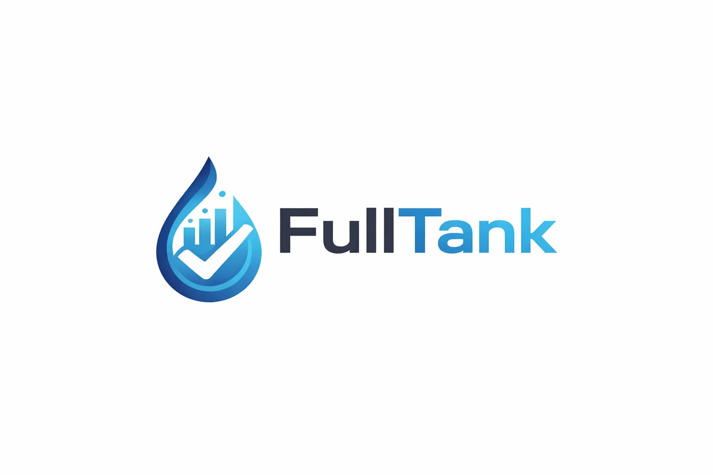

**Typography**

Se ha seleccionado la familia tipográfica Inter para toda la plataforma.

- **Sustento:** Inter es una fuente sans-serif diseñada específicamente para pantallas de computadoras. Su alta legibilidad en tamaños pequeños es crucial para los tableros de control (dashboards) donde los usuarios deben leer cifras y estados de pedidos rápidamente sin fatiga visual.

- **Jerarquía Tipográfica:** 
  - **Headlines (Inter Bold):** Se utiliza para títulos de sección y métricas clave (KPIs), estableciendo una jerarquía visual clara.
  - **Body (Inter Regular):** Para descripciones, tablas de datos e información general.
  - **Labels (Inter Medium):** Para etiquetas de formularios y metadatos, diferenciándose sutilmente del texto de cuerpo.

**Colors**

Nuestra paleta de colores equilibra el profesionalismo corporativo con la identidad del sector energético:

- **Primary (#1E3A8A):** Un azul profundo que transmite seguridad, confianza y autoridad. Es el color base para la navegación y acciones principales, alineado al perfil B2B de la startup.
- **Secondary (#6D7698):** Un tono pizarra que aporta estabilidad visual y se utiliza en elementos de soporte para no saturar al usuario.
- **Tertiary/Accent (#F59E0B):** El color del "combustible" y la energía. Se utiliza estratégicamente para botones de acción (Call to Action), alertas críticas y estados que requieren atención inmediata.
- **Neutral (#475569):** Utilizado para textos secundarios y fondos, garantizando un contraste adecuado para la accesibilidad.
  

**Estilos**

  

**Spacing**

Siguiendo los lineamientos de Material Design, implementamos un sistema de rejilla basado en una unidad base de 8dp.

- **Decisión:** Todos los márgenes, rellenos (padding) y dimensiones de componentes son múltiplos de 8. Esto asegura que la interfaz sea adaptable (responsive) y que los elementos tengan "aire" suficiente, reduciendo la carga cognitiva de los operadores logísticos que manejan múltiples pedidos simultáneamente.
  

**Tone of Voice and Language**

Dado que interactuamos con gerentes de logística y proveedores industriales, el tono de Full-Tank se define en las siguientes dimensiones:

- **Serio:** El manejo de combustibles implica altos costos y riesgos; la comunicación debe ser precisa y técnica.
- **Formal:** Mantenemos un estándar corporativo para generar respeto y profesionalismo entre empresas (B2B).
- **Respetuoso:** Las notificaciones y mensajes de error son constructivos y amables, evitando tecnicismos innecesarios que confundan al usuario.
- **Sereno:** Buscamos transmitir calma y control, especialmente en situaciones de retrasos logísticos, mediante interfaces limpias y mensajes directos.

### 4.1.2 Web Style Guidelines
Esta sección detalla los estándares de diseño de interfaz y comportamiento de interacción para la plataforma web de Full-Tank, asegurando una experiencia fluida tanto en navegadores de escritorio como en dispositivos móviles.

**1. Grid and Breakpoints**
  - Para garantizar que la interfaz sea responsive, adoptamos el sistema de rejilla de Material Design basado en columnas:

  - **Desktop (1200px)**: Layout de 12 columnas con márgenes laterales de 24dp.

  - **Mobile (360px - 599px)**: Layout de 4 columnas, donde los elementos se apilan verticalmente para facilitar el scroll con una sola mano.

  - **Spacing**: Se mantiene la unidad base de 8dp para todos los componentes, asegurando consistencia visual en cualquier resolución.
  
**2. UI Components (Angular Material)**

Se utiliza la biblioteca de componentes de Angular Material para estandarizar la interacción:

- **Buttons:** Los botones principales (como Create Order) utilizan el estilo mat-raised-button con nuestro color primario (#1E3A8A). Los botones de advertencia o acciones secundarias utilizan mat-stroked-button.

- **Form Fields:** Los campos de entrada de datos emplean el estilo "Outline" para mejorar la legibilidad en entornos industriales, incluyendo iconos descriptivos para guiar al usuario.

- **Cards:** La información de los pedidos se organiza en mat-card para separar visualmente cada transacción y permitir una lectura rápida.

**3. Interaction States and Feedback**

Los estándares de interacción definen cómo responde el sistema a las acciones del usuario:

- **Hover States:** En la versión Desktop, los elementos interactuables (botones, filas de tabla) cambian su elevación o tono de color ligeramente al pasar el cursor, indicando que son clickeables.

- **Active/Focus States:** Siguiendo las guías de accesibilidad, cada elemento enfocado mediante el teclado tendrá un anillo de enfoque claro.

- **Loading States:** Durante la carga de datos masivos de combustible, se utilizarán mat-progress-spinner o skeletons para informar al usuario que el proceso está en curso.

**4. Responsive Navigation**

- **Desktop:** Se utiliza un Sidebar (menú lateral) fijo para acceso rápido a Dashboard, Orders, e History.

- **Mobile:** El Sidebar se oculta automáticamente y es accesible a través de un "hamburger menu" en la parte superior izquierda, maximizando el espacio para la visualización de datos críticos.

## 4.2 Information Architecture

Esta sección describe los aspectos clave de la estructura y el etiquetado del aplicativo.

### 4.2.1 Organization Systems
En la plataforma Full-Tank, se emplean distintos sistemas de organización del contenido con el objetivo de optimizar la navegación y facilitar la gestión de pedidos de combustible tanto para solicitantes como para proveedores. Estos sistemas permiten estructurar la información de manera clara, asegurando que los usuarios puedan interactuar con la plataforma de forma eficiente. A continuación, se describen los enfoques utilizados:

#### Organización Visual del Contenido

**Jerárquica (Visual Hierarchy):**
La organización jerárquica se aplica en secciones clave como el dashboard, formularios de registro de pedidos y paneles de gestión. Se priorizan visualmente elementos como estados de pedidos, KPIs y botones de acción (por ejemplo, “Registrar pedido” o “Aprobar pedido”), utilizando tamaños de texto, colores y distribución espacial para guiar la atención del usuario hacia las acciones más relevantes.

**Secuencial (Step-by-Step to Accomplish):**
En procesos que requieren múltiples pasos, como el registro de empresas, la creación de pedidos o la asignación logística (vehículo y conductor), se utiliza un flujo secuencial. Esto permite que los usuarios completen cada etapa de forma ordenada, reduciendo errores y asegurando la correcta ejecución de las operaciones dentro del sistema.

#### Esquemas de Categorización de Contenido

**Por Audiencia (Roles de Usuario):**
Full-Tank distingue principalmente entre dos tipos de usuarios: solicitantes y proveedores.

- Los solicitantes tienen acceso a funcionalidades como registro de pedidos, seguimiento de estado, historial y pagos.
- Los proveedores gestionan pedidos, validan pagos, asignan recursos logísticos y generan reportes.

La interfaz y navegación se adaptan según el rol, mostrando únicamente las opciones relevantes para cada tipo de usuario, lo que mejora la usabilidad y reduce la complejidad.

**Por Tópicos:**
El contenido también se organiza por categorías funcionales dentro de la plataforma, tales como:

- Gestión de pedidos
- Logística y despacho
- Reportes y analytics
- Soporte y contacto

Esto permite a los usuarios localizar rápidamente las herramientas o información que necesitan, especialmente en módulos como soporte o reportes.

#### Implementación en la Interfaz

La organización jerárquica y secuencial se refleja en dashboards estructurados, formularios progresivos y vistas detalladas de pedidos, donde la información se presenta de forma clara y priorizada.

Por otro lado, la categorización por audiencia y por tópicos se implementa mediante menús de navegación dinámicos, paneles diferenciados por rol y secciones claramente delimitadas. El uso de componentes visuales como tarjetas, tablas y estados (pendiente, aprobado, despachado, etc.) permite una lectura rápida y eficiente del sistema.

Este enfoque garantiza que la experiencia en Full-Tank sea intuitiva, escalable y alineada con las necesidades operativas de cada tipo de usuario, facilitando tanto la gestión como la toma de decisiones dentro de la plataforma.

### 4.2.2 Labeling Systems
En Full-Tank, el sistema de etiquetado ha sido diseñado priorizando la simplicidad y la reducción de la carga cognitiva de los operadores logísticos y proveedores. Se han seleccionado etiquetas descriptivas de una o dos palabras para evitar confusión y agilizar la navegación.

1. **Landing Page Labels**
Las etiquetas del sitio web estático buscan guiar al visitante rápidamente hacia la propuesta de valor y la conversión:

- **Home**: Representa la página principal y el resumen de la propuesta de valor.

- **About Us**: Agrupa la información sobre la misión, visión y el equipo detrás de Prime Fuel.

- **Frecuency Asked Questions**: Agrupa las preguntas frecuentes sobre el servicio.

- **Pricing**: Agrupa los planes de suscripción y costos del servicio SaaS.

- **Contact Us**: Indica el espacio para canales de comunicación directa (correo, teléfono).
  
2. **Web Application Labels (Dashboard & Navigation)**
Las etiquetas dentro de la aplicación están diseñadas para que perfiles como Carlos o Andrea encuentren las funcionalidades operativas sin esfuerzo:

- **Dashboard**: Representa el panel principal con los KPIs y métricas clave resumidas.

- **Orders**: Etiqueta general que agrupa tanto el historial como la creación de nuevos pedidos de combustible.

- **Fleet / Vehicles**: Agrupa la gestión de las cisternas y conductores asignados para los despachos.

- **Reports**: Asocia las funcionalidades de descarga de documentos en PDF, gráficos de consumo y análisis de ventas.

- **Settings**: Representa las configuraciones de perfil de usuario, seguridad y preferencias de la cuenta.

3. **Status Labels (Estados de Pedido)**
Para evitar confusiones en el seguimiento en tiempo real, se estandarizan las siguientes etiquetas de estado:

- **Pending**: Pedido creado pero aún no revisado/aprobado por el proveedor.

- **Approved**: Pagos validados y pedido aceptado.

- **In Transit**: El vehículo con el combustible ha sido despachado.

- **Completed**: El cliente ha confirmado la recepción satisfactoria del combustible.

### 4.2.3 SEO Tags and Meta Tags
En la plataforma Full-Tank, se implementan etiquetas SEO (Search Engine Optimization) y Meta Tags dentro del < head > del sitio web con el objetivo de mejorar la visibilidad en motores de búsqueda como Google, así como optimizar la presentación de la página en diferentes dispositivos y contextos.

Estas etiquetas permiten describir el contenido del sitio, definir su comportamiento en navegadores y facilitar que los usuarios encuentren la plataforma cuando buscan soluciones relacionadas con la gestión de pedidos de combustible.

A continuación, se describen las principales etiquetas utilizadas:

**Meta Tags Básicas**

- charset="utf-8": Define la codificación de caracteres, asegurando que el contenido se muestre correctamente (incluyendo acentos y caracteres especiales).
- viewport: Permite que la página sea responsive, adaptándose a dispositivos móviles, tablets y desktops.

**SEO Tags**

- title: Define el título de la página que aparece en los resultados de búsqueda. Es clave para atraer la atención del usuario.
- meta description: Proporciona un resumen del contenido del sitio. Influye directamente en el CTR (Click Through Rate).
- meta keywords: Incluye palabras clave relacionadas con el sistema, facilitando su indexación en buscadores.
- meta author: Indica el equipo o autor responsable del desarrollo del sitio.

**Optimización de Recursos**

- Preconnect (Google Fonts): Mejora el rendimiento al establecer conexiones anticipadas con servidores externos.
- CSS e íconos: Se integran librerías como Bootstrap e iconos para mantener consistencia visual.
- Favicon: Representa visualmente la plataforma en pestañas del navegador.

Estructura esperada:

    < head>
    < meta charset="utf-8">
    < meta name="viewport" content="width=device-width, initial-scale=1">

    <title>Full-Tank - Gestión inteligente de pedidos de combustible</title>
    <meta name="description" content="Full-Tank optimiza la gestión de pedidos de combustible entre empresas solicitantes y proveedores. Control, trazabilidad y eficiencia en un solo sistema.">
    <meta name="keywords" content="Full-Tank, combustible, gestión de pedidos, logística, proveedores de combustible, distribución, empresas, pedidos de combustible">
    <meta name="author" content="Equipo Full-Tank">

    <!-- CSS & Icons -->
    <link href="https://cdn.jsdelivr.net/npm/bootstrap@5.3.3/dist/css/bootstrap.min.css" rel="stylesheet">
    <link rel="stylesheet" href="https://cdn.jsdelivr.net/npm/bootstrap-icons@1.11.3/font/bootstrap-icons.min.css">
    
    <!-- Fonts -->
    <link rel="preconnect" href="https://fonts.googleapis.com">
    <link rel="preconnect" href="https://fonts.gstatic.com" crossorigin>
    <link href="https://fonts.googleapis.com/css2?family=Inter&display=swap" rel="stylesheet">
    
    <!-- Custom Styles -->
    <link rel="stylesheet" href="css/style.css">

    <!-- Favicon -->
    <link rel="icon" href="/images/Tanklogo.png">
    < /head>

### 4.2.4 Searching Systems
En la plataforma Full-Tank, se implementa un sistema de búsqueda y filtrado que permite a los usuarios encontrar información relevante de manera rápida y eficiente, evitando la sobrecarga de información dentro del sistema. Este sistema está diseñado considerando los dos tipos de usuarios principales: solicitantes y proveedores, adaptando las opciones de búsqueda a sus necesidades específicas.

**Búsqueda y filtros en gestión de pedidos**

**Solicitantes:**

- Búsqueda por código de pedido: Permite localizar rápidamente un pedido específico ingresando su identificador.
- Filtrar por estado: "Pendiente", "Aprobado", "Despachado", "Entregado", "Rechazado".
- Filtrar por fecha: Permite visualizar pedidos dentro de un rango de tiempo específico.
- Historial de pedidos: Acceso a pedidos anteriores con posibilidad de filtrado por tipo de combustible o estado.

**Proveedores:**

- Filtrar pedidos pendientes: Visualización de pedidos que requieren acción inmediata.
- Filtrar por cliente (empresa): Permite ubicar pedidos asociados a una empresa específica.
- Filtrar por estado del pedido: "Pendiente", "Aprobado", "Despachado", "Finalizado", "Rechazado".
- Filtrar por rango de fechas: Para análisis operativo y generación de reportes.

**Búsqueda en módulos adicionales**

- Gestión de flota: Búsqueda de vehículos por placa. Filtro por disponibilidad.
- Gestión de conductores: Búsqueda por nombre o DNI. Filtro por disponibilidad o asignación.
- Empresas (clientes): Búsqueda por nombre de empresa. Visualización de historial asociado.

**Visualización de resultados**

Los resultados de búsqueda se presentan en forma de listas estructuradas dentro de tablas dinámicas, mostrando información clave como estado del pedido, fechas, cliente asociado y detalles logísticos.

Cada resultado permite acceder a una vista de detalle, donde el usuario puede revisar información completa del elemento seleccionado.

En caso de no existir coincidencias, el sistema muestra mensajes informativos como “No se encontraron resultados”, evitando confusión en el usuario.

**Flujo de búsqueda**

El sistema de búsqueda está integrado dentro de cada módulo relevante mediante barras de búsqueda y filtros visibles. Los usuarios pueden aplicar, combinar o eliminar filtros fácilmente, permitiendo una navegación fluida y eficiente dentro de la plataforma.

### 4.2.5 Navigation Systems

## 4.3 Landing Page UI Design
### 4.3.1 Landing Page Wireframe
En esta sección se presentan los esquemas estructurales (wireframes) de baja fidelidad para la Landing Page de *Full-Tank*, diseñados en Figma. Estos diagramas establecen la jerarquía visual, la distribución de contenido y el comportamiento responsivo antes de aplicar el estilo visual final, asegurando que la interfaz cumpla con nuestros objetivos de negocio.

**Desktop Web Browser Wireframe**

  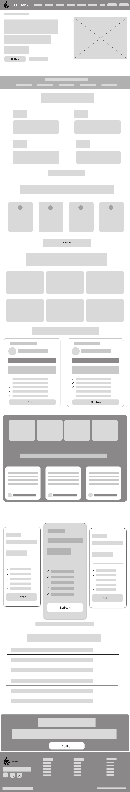

* **Header (Navegación):** Se utiliza una organización horizontal fija con el logotipo a la izquierda, los enlaces de navegación centralizados (*Home, How it works, Benefits, Pricing, Testimonials, Contact) y el botón principal de *Call to Action (*"Request a Demo"*) resaltado a la derecha para incentivar la conversión inmediata.
* **Hero Section (Home):** Ocupa la primera vista con un título de propuesta de valor centrado, un subtítulo descriptivo y un botón primario de "Request a Demo", acompañado de un placeholder (caja gris) para una imagen representativa del dashboard de Full-Tank a la derecha.
* **Body Sections:**
    * **How it works:** Se organiza secuencialmente en 3 o 4 columnas, mostrando los pasos del flujo operativo.
    * **Benefits & Testimonials:** Se estructuran de forma matricial para facilitar la lectura de características clave y generar confianza al mostrar los casos de éxito de otras empresas.
    * **Pricing:** Presentado mediante tablas comparativas para destacar claramente los planes de suscripción.
* **Footer:** Contiene los enlaces legales obligatorios (Términos y Condiciones), información de contacto y enlaces a redes sociales, cumpliendo con la ética y responsabilidad exigida en el proyecto.

### 4.3.2 Landing Page Mock-up

## 4.4 Web Applications UX/UI Design

Los wireframes y mockups aquí presentados muestran la estructura inicial de las vistas principales, priorizando la jerarquía visual, la simplicidad de navegación, la accesibilidad, la escalabilidad futura y la claridad en la presentación de información crítica como rutas, paraderos, notificaciones y configuraciones del usuario.

### 4.4.1 Web Applications Wireframes

Esta sección presenta la propuesta visual y funcional de las aplicaciones que integran la experiencia de FullTank, diseñada para optimizar la interacción entre proveedores y compradores de combustible.

**Wireframe 1 / Inicial**

El primer wireframe representa la Landing Page principal de FullTank, diseñada como una herramienta de conversión masiva para atraer tanto a empresas solicitantes como a proveedores.

En el cuerpo de la página, la información se desglosa siguiendo una secuencia lógica que construye confianza y educación sobre el servicio. Se incluyen secciones dedicadas a la historia de la startup (About Us) y al funcionamiento paso a paso del sistema (How it works), utilizando bloques modulares que permiten un escaneo rápido del contenido. Esta estructura se complementa con una cuadrícula de características que resaltan los beneficios técnicos, como la trazabilidad y la centralización de datos, fundamentales para resolver los dolores detectados en la etapa de investigación.

Hacia el final de la navegación, se presenta una sección de planes y suscripciones que utiliza el principio de jerarquía visual para destacar la opción más equilibrada, facilitando la toma de decisiones del usuario. El diseño concluye con un pie de página (footer) que centraliza los datos de contacto y redes sociales, asegurando que el usuario tenga siempre una vía de comunicación abierta con TechnoSAC. Todo el conjunto ha sido diseñado bajo criterios de diseño inclusivo, empleando dimensiones de botones generosas y una organización de elementos que prioriza la legibilidad y la facilidad de interacción en dispositivos móviles.

  

**Wireframe 2**

El wireframe de Inicio de Sesión y Registro establece un punto de control centralizado diseñado para identificar al usuario y derivarlo de manera eficiente a su panel de control correspondiente. La arquitectura de información prioriza la funcionalidad sobre cualquier otro elemento, disponiendo de forma secuencial los campos de captura de credenciales, el acceso a la recuperación de cuenta y el disparador para la creación de nuevos perfiles. Este esquema garantiza que el usuario recorra el camino mínimo necesario para la autenticación, reduciendo la carga cognitiva al segmentar claramente las acciones primarias de las secundarias.

  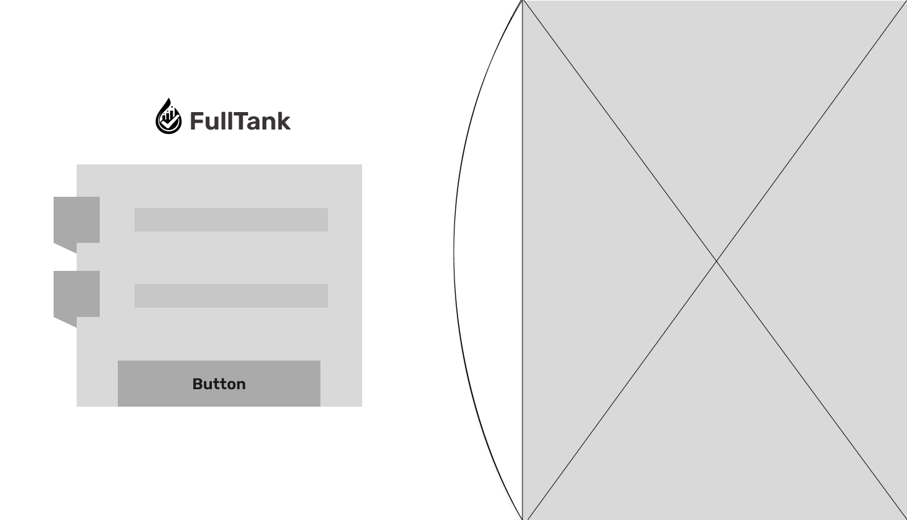

**Wireframe 3**

El primer wireframe para proveedores, denominado Resumen Operativo, establece una arquitectura de información de alta prioridad que condensa la salud del negocio en tres indicadores clave: ventas mensuales, pedidos pendientes y vehículos en ruta.

  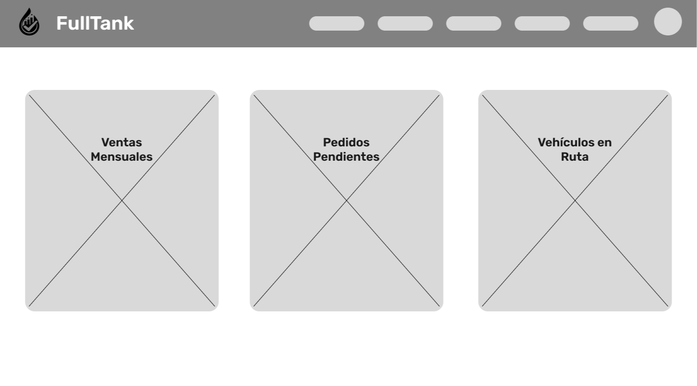

**Wireframe 4**

El wireframe de Gestión de Pedidos Entrantes estructura la información mediante una tabla funcional que centraliza las solicitudes nuevas, permitiendo al proveedor procesar múltiples órdenes desde una sola vista. La arquitectura de información se organiza en columnas que detallan datos críticos como el cliente, el tipo de combustible y la cantidad, situando los botones de acción en el extremo derecho para facilitar una respuesta rápida de aprobación o rechazo.

  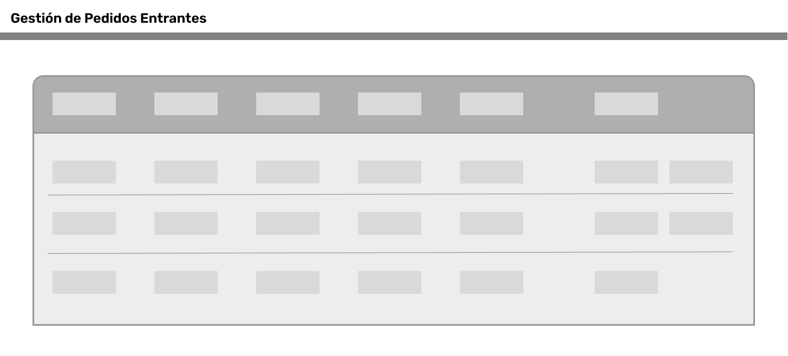

**Wireframe 5**

El wireframe de Directorio de Clientes utiliza un sistema de tarjetas (cards) para organizar el perfil detallado de cada empresa, permitiendo al proveedor acceder a la información de contacto y preferencias de compra de manera individualizada. La arquitectura de información se segmenta visualmente mediante el uso de listas de verificación e iconos, lo que facilita el escaneo rápido de los servicios contratados o requisitos específicos por cliente.

  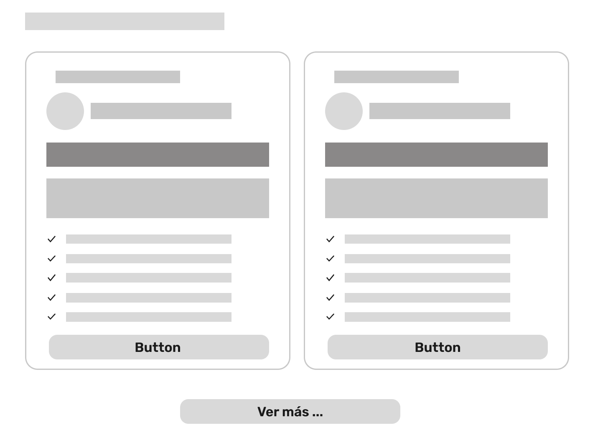

**Wireframe 6**

El wireframe de Asignación de Despacho presenta una arquitectura de información dividida en dos paneles estratégicos para facilitar la coordinación logística del proveedor. El panel izquierdo concentra los campos de entrada para la selección de pedidos y la vinculación de unidades de transporte, incluyendo un contenedor específico para la validación de documentos o firmas digitales, lo que asegura que cada despacho cumpla con los requisitos administrativos.

  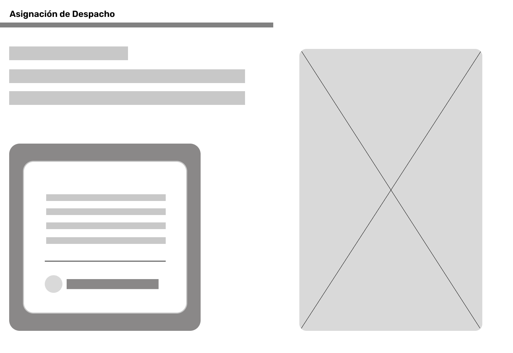

**Wireframe 7**

El wireframe de Reportes y Documentación cierra el panel de proveedores con una arquitectura de información orientada a la auditoría y el control administrativo. La interfaz dispone de un área central de visualización para previsualizar registros operativos, acompañada de un botón de acción principal para la generación y descarga de documentos legales o reportes de ventas.

  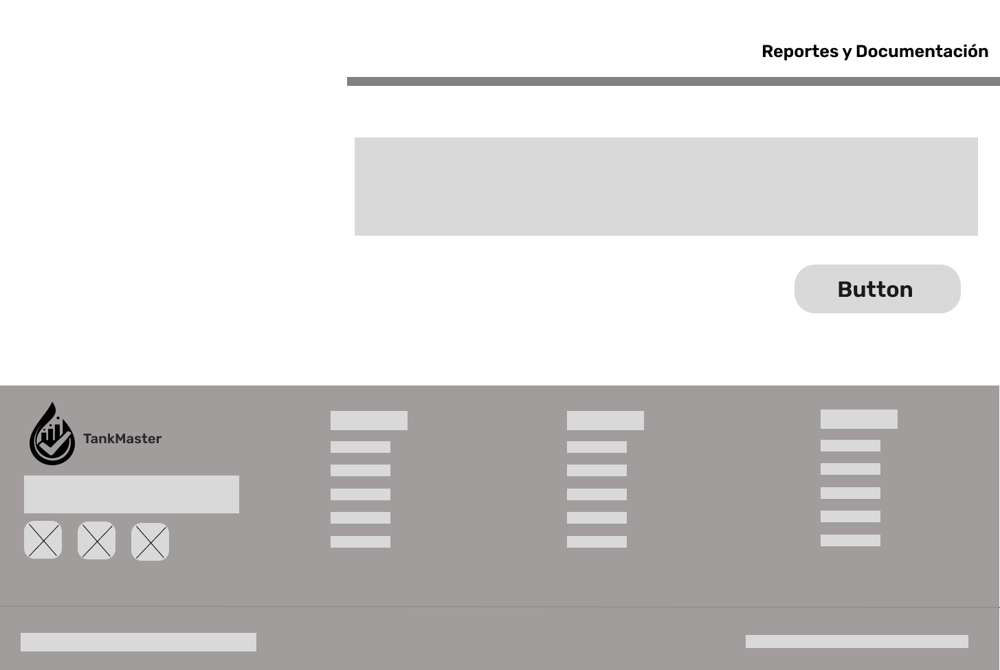

**Wireframe 8**

El primer wireframe del panel de Compradores introduce la vista de Consumo General, diseñada para ofrecer una arquitectura de información centrada en el control financiero y operativo del solicitante. La interfaz utiliza una disposición horizontal de tres tarjetas de métricas que permiten al usuario monitorear, de forma inmediata, su gasto total mensual, el volumen de consumo acumulado y la cantidad de pedidos que se encuentran actualmente en estado pendiente.

  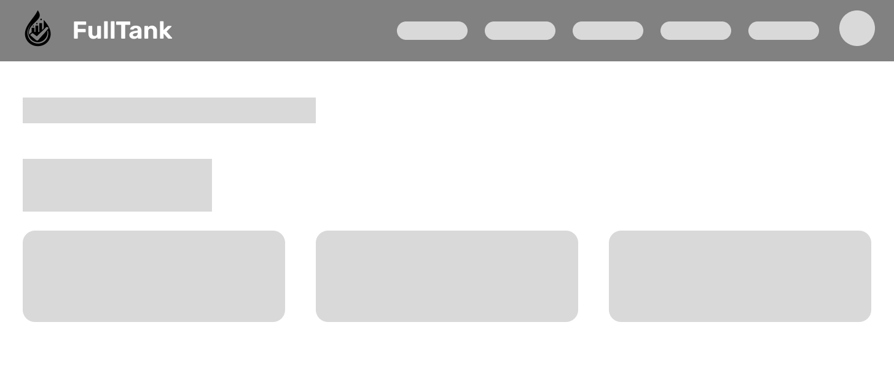

**Wireframe 9**

El wireframe de Solicitud de Combustible y Procedimiento de Pago funciona como una interfaz de formulario estructurada para guiar al comprador a través del registro de una nueva orden. La arquitectura de información divide el proceso en dos bloques lógicos: la especificación técnica del pedido (tipo de combustible y cantidad) y la carga de la evidencia de pago necesaria para la validación del proveedor. Al presentar los campos de manera simétrica y clara dentro de un contenedor enfocado, se minimiza el riesgo de errores en el ingreso de datos, asegurando que el flujo desde la solicitud hasta la confirmación del depósito sea fluido y cumpla con los requisitos operativos del sistema.

  

**Wireframe 10**

El wireframe de Seguimiento del Pedido se centra en proporcionar transparencia y tranquilidad al comprador mediante una arquitectura de información que destaca el progreso del suministro en tiempo real. El elemento principal de esta interfaz es una barra de estado dinámica que permite visualizar de forma gráfica en qué etapa se encuentra el pedido (solicitado, aprobado, en tránsito o entregado), eliminando la incertidumbre del usuario. 

  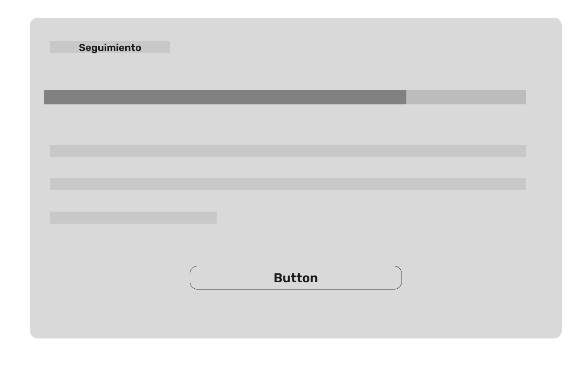

**Wireframe 11**

El wireframe del Historial de Pedidos cierra la experiencia del comprador mediante una arquitectura de información que facilita la consulta de transacciones pasadas para fines de auditoría y control de inventarios. La interfaz organiza los pedidos anteriores en una cuadrícula de tarjetas (cards), donde cada una presenta un resumen de la transacción, incluyendo fechas y volúmenes, acompañada de un botón de acción para acceder a detalles específicos o descargar comprobantes.

  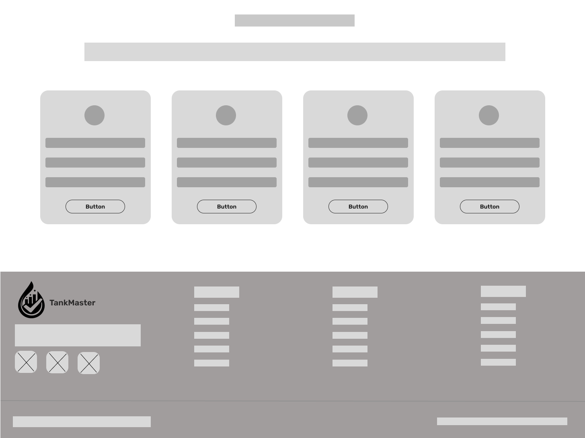

### **Mobile**
**Wireframe 1**

La adaptación móvil de la página principal prioriza la jerarquía vertical para asegurar una navegación fluida en pantallas pequeñas. La arquitectura de información reorganiza el menú en un componente de "hamburguesa" y transforma las tarjetas de planes y beneficios en una disposición de columna única. Los botones de llamado a la acción se han redimensionado para ocupar el ancho de la pantalla, facilitando la interacción táctil y guiando al usuario directamente hacia el registro o inicio de sesión.

  

**Wireframe 2**

Los wireframes de Inicio de Sesión y Recuperación de Contraseña se han simplificado al máximo para evitar la fatiga visual. En la versión móvil, los campos de entrada de datos son los protagonistas absolutos, utilizando etiquetas claras y botones de gran escala. El diseño inclusivo se evidencia en el espaciado entre elementos, optimizado para evitar errores de pulsación y garantizar un acceso rápido incluso para operarios en entornos de alta movilidad.

  

**Wireframe 3**

El wireframe de Compradores Mobile adapta la experiencia web a un formato de scroll vertical infinito, optimizando el espacio mediante el apilamiento de módulos para una gestión eficiente a una sola mano.

  

**Wireframe 4**

Este wireframe adapta el flujo de compra a una secuencia vertical que guía al usuario de manera lineal desde la configuración hasta la liquidación del pedido. La arquitectura de información se organiza en tres secciones clave: un bloque superior con el resumen detallado de la solicitud de combustible, un carrusel central para la selección de la información de proveedores, y un módulo final dedicado al método de pago.

  

**Wireframe 5**

Este wireframe presenta el perfil detallado del socio logístico seleccionado, diseñado para fortalecer la transparencia en la cadena de suministro. La arquitectura de información sitúa en la parte superior los datos institucionales y de contacto del proveedor, seguidos de un componente visual de gran formato que representa la ubicación geográfica de sus sedes o estaciones de servicio.

  

**Wireframe 6**

El wireframe 6 condensa las herramientas de gestión en una interfaz de alto rendimiento diseñada para la operatividad en campo. La arquitectura de información se organiza verticalmente mediante tres bloques modulares: un Resumen Operativo en la parte superior con tarjetas de métricas clave (ventas, pedidos y flota), seguido de una sección de Pedidos Recientes presentada en filas simplificadas para una validación rápida, y finalmente un carrusel horizontal para el Directorio de Clientes.

  

**Wireframe 7**

Este wireframe adapta el proceso de vinculación de recursos a una estructura de stacking vertical, permitiendo que el proveedor coordine el transporte de manera secuencial y ordenada.

  

**Wireframe 8**

Este último wireframe móvil consolida las funciones administrativas de cierre y auditoría en una interfaz simplificada y de fácil navegación. La arquitectura de información mantiene las métricas de resumen en la parte superior para dar contexto antes de proceder a la gestión documental, donde se sitúa un área central de previsualización para los registros de operaciones mensuales.

  

### 4.4.2 Web Applications Wireflow Diagrams

El diagrama de Wireflow presentado a continuación ilustra la navegación lógica y la interacción entre las diversas interfaces de la plataforma FullTank, detallando el recorrido que realizan tanto proveedores como compradores desde el primer contacto hasta la culminación de sus objetivos operativos. 
El flujo inicia en la Landing Page, la cual actúa como el nodo central de información y conversión. Tras el proceso de Inicio de Sesión/Registro se divide en dos ramas: 

* Flujo de Proveedores: Optimizado para la gestión masiva de datos, este recorrido guía al usuario desde una visión estratégica (Resumen Operativo) hacia acciones tácticas secuenciales, que incluyen la validación de pedidos, la consulta del directorio de clientes, la asignación logística de transporte y la generación de reportes administrativos.

* Flujo de Compradores: Diseñado bajo principios de eficiencia y transparencia, este camino permite al solicitante monitorear su consumo mensual, registrar nuevos pedidos mediante la carga de comprobantes de pago, realizar el seguimiento de su suministro en tiempo real y consultar su historial transaccional.

  

### 4.4.3 Web Applications Mock-ups
### 4.4.4 Web Applications User Flow Diagrams

User Goal 1: El usuario registrado desea iniciar sesión para acceder a su cuenta y gestionar sus pedidos.

User Personas: Solicitante / Proveedor.

Happy Path
En esta ruta esperada, el flujo inicia en la "Sección de inicio". El usuario completa su información de cuenta ingresando credenciales válidas (correo corporativo y contraseña). Al presionar "Ingresar", el sistema lo autentica y accede exitosamente a la "Sección Dashboard", donde puede gestionar sus solicitudes.

Unhappy Paths
En esta ruta, el usuario completa su información de cuenta erróneamente. Al presionar "Ingresar", el sistema bloquea el acceso y despliega una alerta visual ("Usuario y/o contraseña incorrectos"). El flujo se interrumpe y el usuario debe introducir correctamente sus credenciales en la misma pantalla para volver a intentarlo.

User Goal 2: El visitante desea crear una cuenta nueva en la plataforma para poder acceder a los servicios como solicitante o proveedor de combustible.

User Personas: Visitante (Futuro Solicitante / Futuro Proveedor).

Happy Path
En esta ruta esperada, el flujo se centra en el proceso de creación de una cuenta nueva. El usuario inicia en la pantalla de "Registro" (a la cual puede llegar desde la página de Inicio o desde la vista de Login). El usuario completa todos los campos requeridos del formulario (por ejemplo: nombre, correo electrónico, contraseña y selección de rol: Solicitante o Proveedor). Al hacer clic en el botón "Registrarse", el sistema valida que los datos sean correctos, crea la cuenta de forma exitosa y redirige al usuario a su respectivo Dashboard de bienvenida (o a la pantalla de Inicio de Sesión para confirmar sus credenciales).

Unhappy Paths
Estas rutas alternas toman en cuenta los escenarios donde el usuario ingresa información que no pasa las verificaciones del sistema o no completa los espacios obligatorios. Los errores más comunes incluyen: intentar registrar un correo electrónico que ya existe en la base de datos, ingresar contraseñas que no coinciden en el campo de confirmación, o dejar campos vitales en blanco. En estos casos, la creación de la cuenta se bloquea y el usuario permanece en la pantalla de Registro, donde el sistema despliega alertas visuales o mensajes de error específicos debajo de cada campo afectado para que pueda corregirlos.

User Goal 3: El usuario registrado desea recuperar el acceso a su cuenta solicitando un enlace para cambiar su contraseña olvidada.

User Personas: Usuario Registrado (Solicitante / Proveedor).

Happy Path
En esta ruta esperada, el flujo inicia cuando el usuario, al no poder acceder a su cuenta, selecciona la opción "¿Olvidaste tu contraseña?" en la pantalla de Inicio de Sesión. Esto lo redirige a la vista de Recuperación, donde debe ingresar el correo electrónico asociado a su cuenta corporativa. Al presionar el botón de "Enviar Código", el sistema valida la existencia del correo y envía un código de verificación numérico . Simultáneamente, la interfaz de la misma página se actualiza dinámicamente, habilitando nuevos campos de entrada. El usuario revisa su correo, obtiene el código y lo escribe en el campo correspondiente en esa misma vista, junto con su nueva contraseña y la confirmación de la misma. Al completar los datos y presionar "Restablecer Contraseña", el sistema verifica la validez del código y la coincidencia de contraseñas, actualiza las credenciales exitosamente y redirige al usuario de vuelta a la vista de Login con un mensaje de confirmación.

Unhappy Paths
Estas rutas alternas contemplan los fallos de validación en dos momentos distintos del proceso. El primer escenario ocurre si el usuario ingresa un correo electrónico que no existe en la base de datos o si deja el campo en blanco; en este caso, el sistema bloquea el envío del correo y muestra un mensaje de error indicando que la cuenta no está registrada. El segundo escenario de error se da en la pantalla de restablecimiento: si el usuario digita una nueva contraseña pero falla al confirmarla (los campos no coinciden) o no cumple con los caracteres mínimos requeridos, el botón de guardado se deshabilita o el sistema arroja una alerta visual solicitando la corrección antes de proceder.

User Goal 4: El usuario desea registrar un nuevo pedido especificando el tipo y la cantidad de combustible para que el proveedor lo procese.

User Persona: Solicitante.

Happy Path
En esta ruta esperada, el flujo representa la funcionalidad principal del sistema. El usuario (Solicitante), habiendo iniciado sesión, se encuentra en su Dashboard o panel principal. Desde allí, selecciona la opción para "Crear Nuevo Pedido". El sistema le presenta un formulario donde ingresa los datos requeridos (tipo de combustible, cantidad en galones, y dirección o tanque de destino). Al completar correctamente la información y hacer clic en "Enviar Pedido" (o "Registrar"), el sistema procesa la solicitud, la guarda en la base de datos con un estado inicial de "Pendiente" y redirige al usuario a una pantalla de confirmación de éxito o al listado de sus pedidos recientes.

Unhappy Paths
Estas rutas alternas ocurren cuando el usuario comete errores al intentar registrar su solicitud de combustible, lo que impide que el pedido se envíe al proveedor. Esto puede suceder si el usuario deja campos obligatorios vacíos (como olvidar seleccionar el tipo de combustible) o si ingresa valores inválidos (por ejemplo, una cantidad de galones igual o menor a cero, o que exceda el límite permitido por el sistema). Al intentar enviar el formulario con estas inconsistencias, el sistema bloquea la acción, permanece en la vista del formulario y resalta los campos afectados con mensajes de advertencia, indicando al usuario que debe corregir las cantidades o completar la información para poder continuar.

User Goal 5: El usuario proveedor desea revisar un pedido pendiente y aprobarlo tras validar que los depósitos realizados a sus cuentas bancarias cubren el monto total.

User Persona: Proveedor.

Happy Path
En esta ruta esperada, el flujo se ejecuta desde la perspectiva de la administración del negocio. El usuario (Proveedor) inicia en su Dashboard y accede a la sección de "Pedidos Pendientes". Selecciona un pedido específico de la lista para acceder a sus detalles completos. Allí, el proveedor verifica que el solicitante haya registrado correctamente la información del pago y que los depósitos cubran el costo total del combustible solicitado. Al validar esta información, el usuario presiona el botón "Aprobar Pedido". El sistema procesa la acción, cambia el estado del pedido a "Aprobado" y muestra una notificación de éxito, devolviendo al usuario al listado actualizado.

Unhappy Paths
Estas rutas alternas se presentan cuando las condiciones financieras del pedido no se cumplen. El proveedor revisa los detalles del pedido, pero identifica que los depósitos registrados por el solicitante son inválidos, inexistentes o el monto ingresado es insuficiente para cubrir la totalidad del pedido. Si el proveedor intenta hacer clic en "Aprobar" bajo estas condiciones (o selecciona una opción explícita de "Rechazar/Observar"), el sistema bloquea el cambio a estado "Aprobado". En su lugar, se despliega una alerta visual o un mensaje de error indicando que el pedido no cuenta con el pago completo, manteniendo el estado en pendiente o pausado hasta que el cliente regularice la situación.

## 4.5 Web Applications Prototyping

## 4.6 Domain-Driven Software Architecture
### 4.6.1 Design-Level Event Storming

Para identificar los eventos de dominio, es recomendable realizar una sesión de Event Storming. Esta técnica permite visualizar y comprender el flujo de eventos dentro del dominio, facilitando la identificación de los Bounded Context.

El desarrollo del proceso del Domain-Driven Design se realizó en la aplicación Miro: https://miro.com/app/board/uXjVGgOzeI4=/?share_link_id=580201872614

  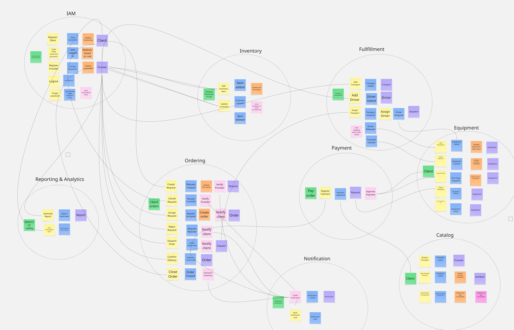

1. Bounded Context IAM
   El bounded context IAM (Identity and Access Management) se encarga de la autenticación, autorización y gestión de credenciales dentro del sistema. Administra procesos como el registro de clientes y proveedores, inicio de sesión, recuperación de contraseñas y asignación de permisos según el rol. Su propósito es garantizar accesos seguros y controlados, asegurando que cada usuario interactúe únicamente con las funcionalidades que le corresponden dentro de la plataforma.

  

2. Bounded Context Catalog
El bounded context Catalog se encarga de la gestión del catálogo de productos e inventario disponible en el sistema. Administra procesos como la creación, actualización y eliminación de ítems, así como la actualización de stock. Su propósito es mantener información precisa y actualizada sobre los recursos disponibles, permitiendo que los proveedores ofrezcan combustible y que los clientes consulten la disponibilidad antes de realizar una solicitud.

  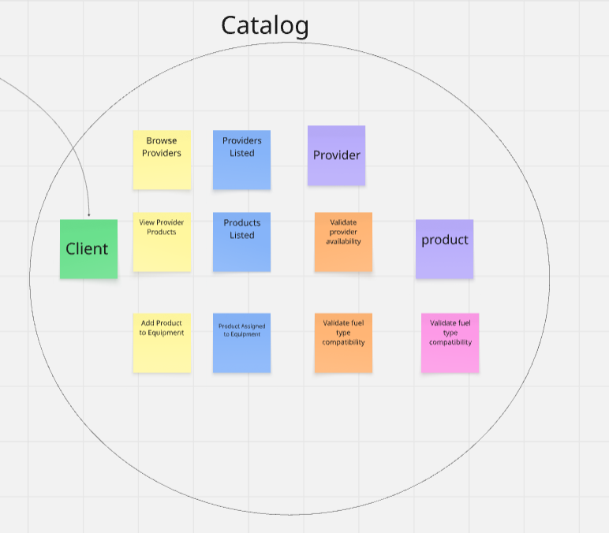

3. Bounded Context Ordering
El bounded context Ordering se encarga de la gestión del ciclo de vida de las solicitudes y órdenes realizadas por los clientes. Administra procesos como la creación de solicitudes, validación, aceptación o rechazo por parte del proveedor, generación de órdenes, despacho, confirmación de entrega y cierre del pedido. Su propósito es orquestar el flujo principal del negocio, asegurando que cada pedido siga un proceso claro, trazable y consistente desde su inicio hasta su finalización.

  

4. Bounded Context Fulfillment
El bounded context Fulfillment se encarga de la gestión logística necesaria para cumplir con las órdenes generadas. Administra procesos como el registro de transportes y conductores, asignación de recursos a pedidos y ejecución del despacho. Su propósito es garantizar que la entrega del combustible se realice de manera eficiente, coordinando los recursos logísticos involucrados en la distribución.

  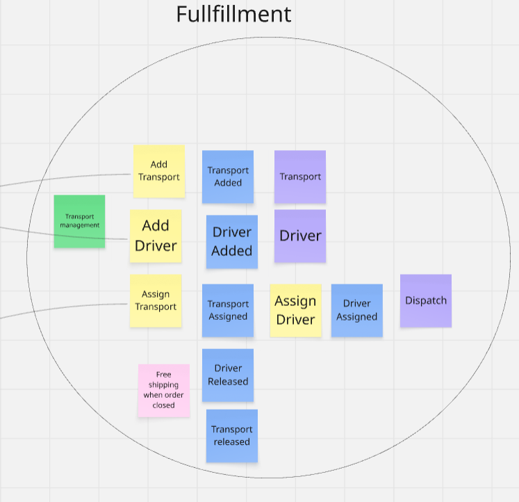

5. Bounded Context Payment
El bounded context Payment se encarga de la gestión de los pagos asociados a las órdenes. Administra procesos como la solicitud de pago, registro de transacciones y aprobación del pago. Su propósito es asegurar que las operaciones económicas se realicen de manera confiable, validando que los pedidos cuenten con el respaldo financiero necesario antes de su ejecución o finalización.

  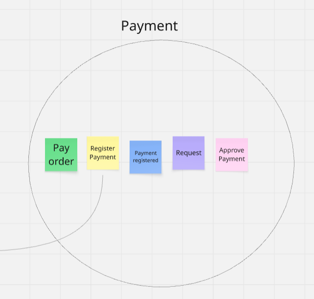

6. Bounded Context Notification
El bounded context Notification se encarga de la generación y gestión de notificaciones dentro del sistema. Administra procesos como la creación de notificaciones y el seguimiento de su estado (leídas o no leídas). Su propósito es mantener informados a los usuarios sobre eventos relevantes, como cambios en el estado de pedidos, pagos o entregas, mejorando la comunicación dentro de la plataforma.

  

7. Bounded Context Reporting & Analytics
El bounded context Reporting & Analytics se encarga de la generación y visualización de reportes basados en la información del sistema. Administra procesos como la elaboración de reportes de ventas, consumo y métricas operativas. Su propósito es proporcionar información clave para la toma de decisiones, permitiendo analizar el comportamiento del negocio y optimizar sus procesos.

  

### 4.6.2 Software Architecture Context Diagram

### 4.6.3 Software Architecture Container Diagrams

### 4.6.4 Software Architecture Components Diagrams

## 4.7 Software Object-Oriented Design
### 4.7.1 Class Diagrams

## 4.8 Database Design
### 4.8.1 Database Diagrams
