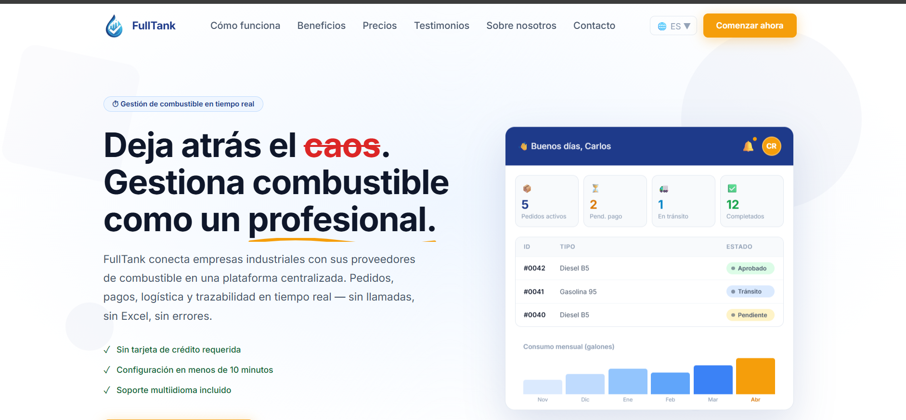
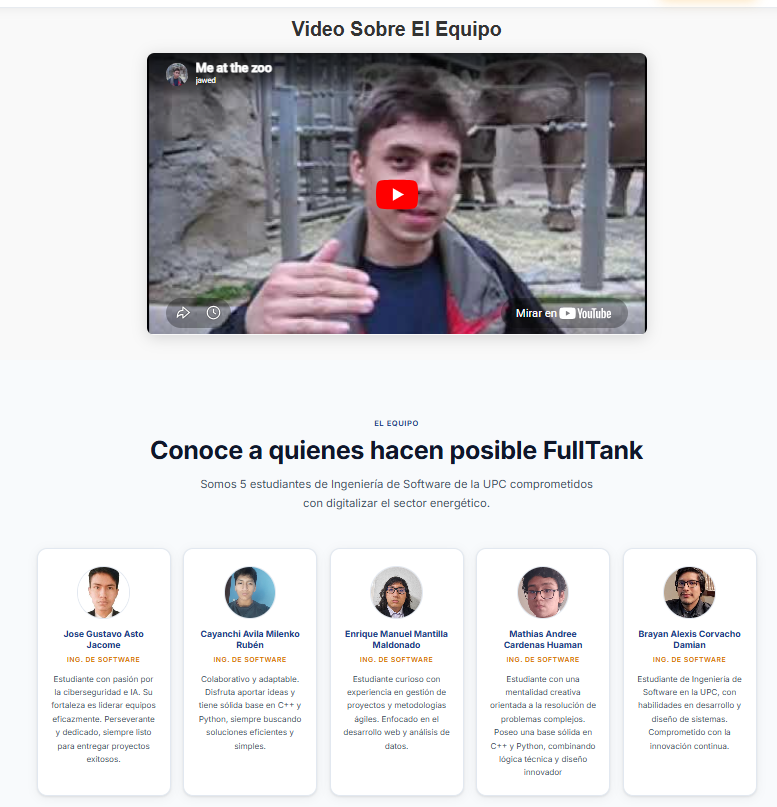
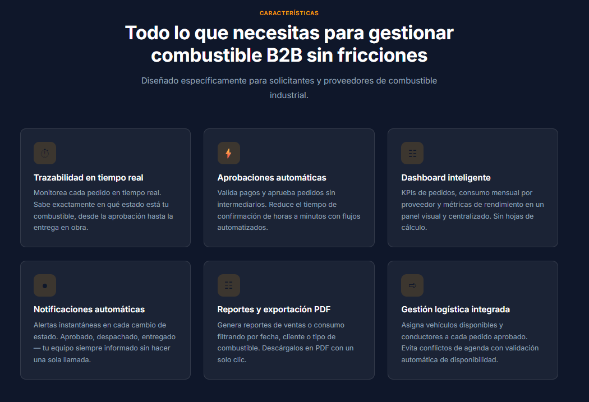
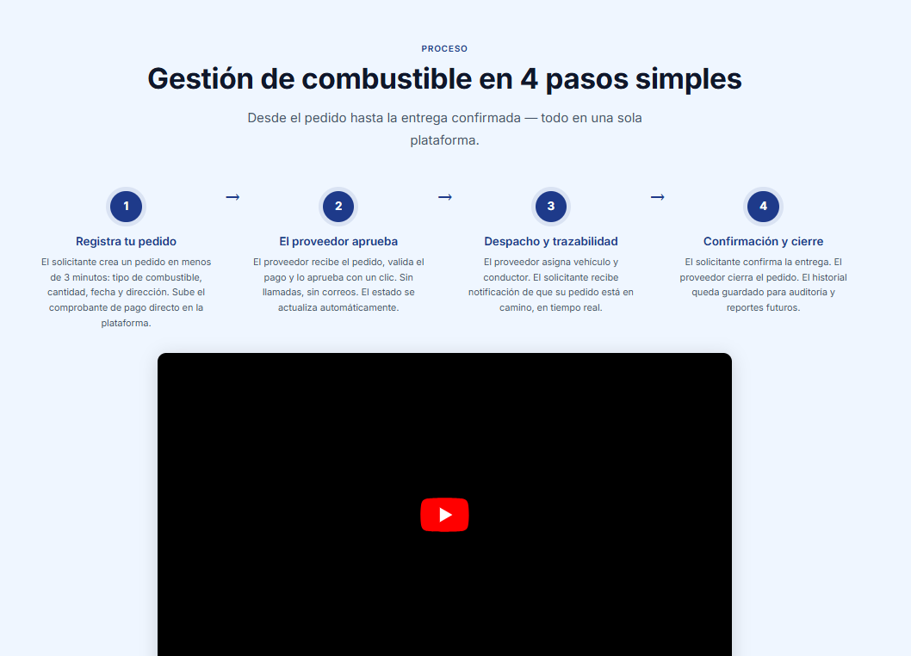
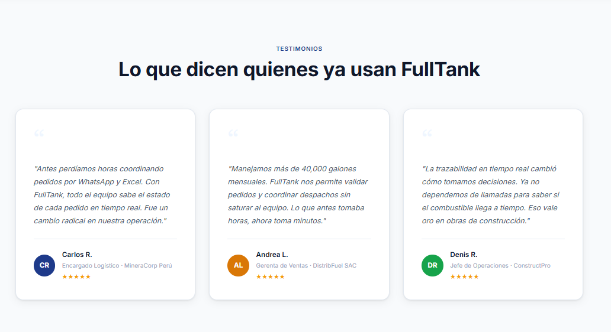
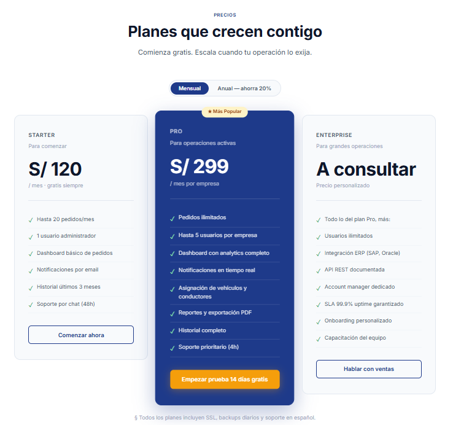
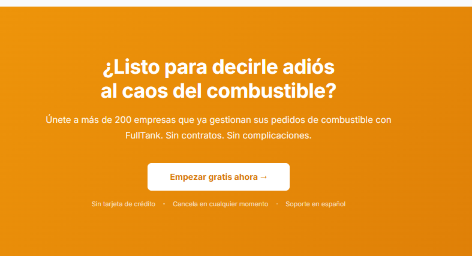
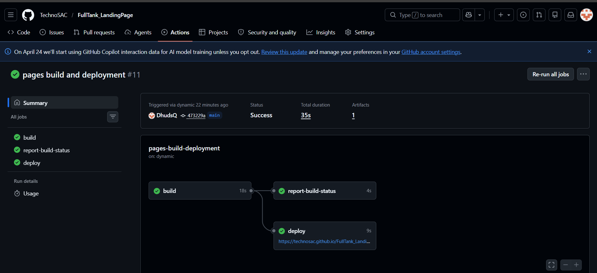
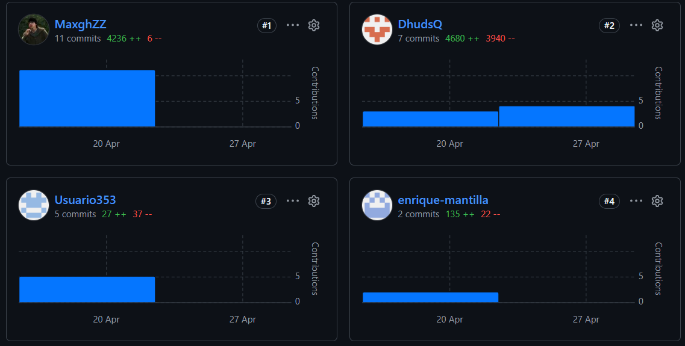

# Capitulo V: Product Implementation, Validation & Deployment.
## 5.1. Software Configuration Management.
### 5.1.1. Software Development Environment Configuration.

### Project Management

- **WhatsApp**: Aplicación de mensajería instantánea que fue utilizada para coordinar tareas del equipo, interca,biar ideas y brindar soporte continuo durante el desarrollo del proyecto.
- **Google Meet**: Herramienta de videoconferencias de Google empleada para mantener una comunicación verbal y directa, permitiendo la planificación colaborativa de actividades y la toma de decisiones en tiempo real.
- **Microsoft 365**: Servicio en la nube que integra herramientas clásicas como Word y Excel, ofreciendo acceso desde cualquier lugar y permitiendo la colaboración en tiempo real. Permitió la supervisión continua de los avances de los miembros.

### Requirements Management

- **UXPressia**: Herramienta utilizada para la elaboración de User Personas, User Journey Maps e Impact Maps, lo que permite comprender mejor las necesidades de los usuarios y definir funcionalidades centradas en ellos.
- **Zoom**: Aplicación de Google empleada para la toma de entrevistas a potenciales usuarios, facilitando la recopilación de información valiosa para la definición y validación de requisitos.

### Product UX/UI Design

- **Figma**: Plataforma colaborativa utilizada para el diseño de wireframes, wireflows, mockups y prototipos interactivos, garantizando una visión clara y alineada de la interfaz del producto.

### Software Development

- **Visual Studio Code**: Editor de código utilizado para la implementación de la Landing Page, gracias a sus extensiones y soporte para diversas tecnologías web.
- **Google Chrome**: Navegador utilizado para la ejecución de pruebas de visualización y funcionalidad de la landing page y el frontend, asegurando su correcto comportamiento en entornos reales.

### Software Deployment

- **Github Pages**: Servicio de hosting utilizado para el despliegue de la landing page del proyecto.

### Software Documentation

- **Structurizr**: Plataforma empleada para la creación de diagramas C4, permitiendo representar visualmente la arquitectura del software en distintos niveles de abstracción.
- **GitHub**: Plataforma utilizada para la gestión de repositorios de código y documentación del proyecto, incluyendo la landing page, el frontend, el backend y los documentos técnicos, facilitando el trabajo colaborativo y el control de versiones.
- **Vertabelo**: Herramienta especializada en el modelado de bases de datos, utilizada para diseñar diagramas entidad-relación (ERD), permitiendo estructurar de manera clara y eficiente la arquitectura de datos del sistema.
- **Trello**: Herramienta de gestión ágil utilizada para la organización del Product Backlog y Sprint Backlog, permitiendo priorizar tareas, hacer seguimiento del progreso y coordinar el trabajo del equipo de manera colaborativa.

### 5.1.2. Source Code Management.

El proyecto utiliza GitHub como repositorio para administrar y estructurar los avances. Implementamos el flujo de trabajo **Gitflow**, siguiendo la metodología propuesta por Vincent Driessen, para mantener versiones estables y trabajo colaborativo ordenado.

**Main branch:** Rama principal donde se almacena el código de producción estable.

**Develop branch:** Rama de integración donde se fusionan las nuevas funcionalidades desarrolladas.

**Chapter branches:** Ramas creadas a partir de `develop` para seccionar los avances del proyecto por capítulo. Cada chapter se trabaja de forma aislada para evitar conflictos.

**Conventional Commits:** Estándar aplicado en los mensajes de commit para mantener un historial de cambios claro, comprensible y trazable, mejorando además la automatización de flujos de despliegue.

### 5.1.3. Source Code Style Guide & Conventions.

**HTML:**

Seguimos las convenciones descritas en la guía oficial HTML Style Guide and Coding Conventions para fomentar una estructura limpia, semántica y predecible:

- Usar nombres de elementos en minúsculas.
- Cerrar todos los elementos HTML, incluso los que son opcionales.
- Usar nombres de atributos en minúsculas.
- Incluir siempre los atributos requeridos en elementos clave, especialmente en imágenes (alt) y formularios (name, id, etc.).
- Evitar líneas de código largas para mejorar la legibilidad.
- Utilizar sintaxis simplificada y estándar para hojas de estilo (link) y scripts externos (script).

**CSS:**

Aplicamos las siguientes convenciones para lograr un estilo consistente, ordenado y fácil de mantener:

- Usar minúsculas y guiones para los nombres de clases y selectores.
- Escribir un espacio después de los dos puntos y cerrar cada declaración con punto y coma.
- Agrupar reglas CSS relacionadas y separarlas con una línea en blanco para mejorar la claridad visual.
- Utilizar nombres de clases descriptivos, que reflejen la función o apariencia del elemento.
- Organizar el CSS por bloques lógicos o módulos.

**JavaScript:**

Definimos las siguientes convenciones para asegurar un código robusto, eficiente y comprensible:

- Declarar las variables al inicio del ámbito correspondiente, evitando la redeclaración innecesaria.
- Preferir el uso de const y let en lugar de var para controlar mejor el ámbito y la mutabilidad de las variables.
- Incluir comentarios descriptivos para explicar la funcionalidad de componentes, servicios, validaciones y lógica compleja.
- Mantener las funciones pequeñas y con una única responsabilidad.
- Aplicar principios de programación funcional y reactiva, así como patrones de diseño adecuados.

### 5.1.4. Software Deployment Configuration.

#### Entorno de Desarrollo

Tecnologías utilizadas:
- HTML5
- CSS3
- Javascript

#### Estrategia de Deployment

- Github Pages
- Repositorio principal en GitHub

Flujo Gitflow:

- main: rama principal de producción
- develop: rama de integración principal
- chapter-n*: desarrollo de los chapters sobre develop
- Pull Requests se realizan desde chapter-n hacia develop

## 5.2. Landing Page, Services & Applications Implementation.

### 5.2.1. Sprint 1

#### 5.2.1.1. Sprint Planning 1.

<table border>
    <tr align="center">
        <td><strong>Sprint #</strong></td>
        <td><strong>Sprint 1</strong></td>
    </tr>
    <tr>
        <td colspan="2" align="center"><strong>Sprint Planning Background</strong></td>
    </tr>
    <tr align="center">
        <td>Date</td>
        <td>09/04/2026</td>
    </tr>
    <tr align="center">
        <td>Time</td>
        <td>15:00 PM</td>
    </tr>
    <tr align="center">
        <td>Location</td>
        <td>Meet</td>
    </tr>
    <tr align="center">
        <td>Prepared by</td>
        <td>Milenko Cayanchi</td>
    </tr>
    <tr align="center">
        <td>Attendess (to planning meeting)</td>
        <td>
          Milenko Rubén Cayanchi Avila - u202312566 
          Jose Gustavo Asto Jacome - u20241c630 
          Alberto Alejandro Ponce Perales - u202320684 
          Diego Fernando Herrera Enriquez - u202319027 
          Brayan Alexis Corvacho Damian - u20231a257
        </td>
    </tr>
    <tr align="center">
        <td>Sprint 0 Review Summary</td>
        <td>No hubo sprint previo</td>
    </tr>
    <tr align="center">
        <td>Sprint 0 Retrospective Summary</td>
        <td>No hubo sprint previo</td>
    </tr>
    <tr>
        <td colspan="2" align="center"><strong>Sprint Goal & User Stories</strong></td>
    </tr>
    <tr>
        <td align="center">Sprint 1 Goal</td>
        <td>Desarrollar una landing page funcional y visualmente clara que comunique efectivamente la propuesta de valor de FullTank a nuestros dos segmentos clave de usuarios: proveedores de combustible y solicitantes de combustible. La página debe incluir secciones estratégicas como: 
        •	Home, con un call to action para captar proveedores interesados. 
        •	Are you a fuel requester?, con un call to action dirigido a potenciales solicitantes. 
        •	Secciones informativas como About Us y How it works?, para explicar el funcionamiento del sistema. 
        •	Secciones de validación social como Main Suppliers y Our Clients, para generar confianza mostrando empresas reales que ya usan el servicio. 
        •	Una sección de contacto directo (Contact Us) para atención inmediata. 
        •	Soporte de idioma bilingüe (español e inglés) para mayor accesibilidad.
        </td>
    </tr>
    <tr align="center">
        <td>Sprint 1 Velocity</td>
        <td>12</td>
    </tr>
    <tr align="center">
        <td>Sum of Story Point</td>
        <td>17</td>
    </tr>
</table>

#### 5.2.1.2. Aspect Leaders and Collaborators.

<table border="1" cellspacing="0" cellpadding="6">
  <thead>
    <tr>
      <th>Team Member</th>
      <th>GitHub Username</th>
      <th>Landing Page</th>
      <th>Documentation</th>
    </tr>
  </thead>
  <tbody>
    <tr>
      <td>Milenko Rubén Cayanchi Avila</td>
      <td>MaxghZZ</td>
      <td>L</td>
      <td>L</td>
    </tr>
    <tr>
      <td>Jose Gustavo Asto Jacome</td>
      <td>DhudsQ</td>
      <td>C</td>
      <td>C</td>
    </tr>
    <tr>
      <td>Diego Fernando Herrera Enriquez</td>
      <td>TheBlackunityrogue</td>
      <td>C</td>
      <td>C</td>
    </tr>
    <tr>
      <td>Alberto Alejandro Ponce Perales</td>
      <td>aponceperales</td>
      <td>C</td>
      <td>C</td>
    </tr>
    <tr>
      <td>Brayan Alexis Corvacho Damian</td>
      <td>BralexCD</td>
      <td>C</td>
      <td>C</td>
    </tr>
  </tbody>
</table>

#### 5.2.1.3. Sprint Backlog 1.

<table border>
    <tr align="center">
        <td colspan="2"><strong>Sprint #</strong></td>
        <td colspan="6"><strong>Sprint 1</strong></td>
    </tr>
    <tr align="center">
        <td colspan="2"><strong>User Story</strong></td>
        <td colspan="6"><strong>Work-Item / Task</strong></td>
    </tr>
    <tr align="center">
        <td><strong>Id</strong></td>
        <td><strong>Title</strong></td>
        <td><strong>Id</strong></td>
        <td><strong>Title</strong></td>
        <td><strong>Description</strong></td>
        <td><strong>Estimation (Hours)</strong></td>
        <td><strong>Assigned to</strong></td>
        <td><strong>Status (To do / In process / To review / Done)</strong></td>
    </tr>
    <tr align="center">
        <td>US-01</td>
        <td>Ver sección Home</td>
        <td>W-01</td>
        <td>Sección Home</td>
        <td>Como visitante (proveedor), quiero ver una sección de inicio que resuma el valor de FullTank para comprender rápidamente el objetivo del sistema</td>
        <td>5 horas</td>
        <td>Ruben Milenko</td>
        <td>Done</td>
    </tr>
    <tr align="center">
        <td>US-02</td>
        <td>Ver sección About Us</td>
        <td>W-02</td>
        <td>Sección About Us</td>
        <td>Como visitante de ambos segmentos, quiero conocer quiénes están detrás de FullTank para confiar en el sistema</td>
        <td>4 horas</td>
        <td>Jose Asto</td>
        <td>Done</td>
    </tr>
    <tr align="center">
        <td>US-03</td>
        <td>Ver sección How it Works?</td>
        <td>W-03</td>
        <td>Sección How it works?</td>
        <td>Como visitante de ambos segmentos, quiero entender cómo funciona FullTank paso a paso para evaluar si se ajusta a mis necesidades</td>
        <td>5 horas</td>
        <td>Mathias Cardenas</td>
        <td>Done</td>
    </tr>
    <tr align="center">
        <td>US-36</td>
        <td>Ver sección Benefits</td>
        <td>W-04</td>
        <td>Sección Beneficios</td>
        <td>Como visitante de ambos segmentos, quiero conocer las principales ventajas con las que puedo contar para evaluar la implementación de la plataforma</td>
        <td>4 horas</td>
        <td>Enrique Mantilla</td>
        <td>Done</td>
    </tr>
    <tr align="center">
        <td>US-37</td>
        <td>Ver sección Testimonios</td>
        <td>W-05</td>
        <td>Sección Testimonios</td>
        <td>Como visitante de ambos segmentos, quiero conocer los testimonios de los usuarios de FullTank para tener confianza en la plataforma</td>
        <td>6 horas</td>
        <td>Brayan Corvacho</td>
        <td>Done</td>
    </tr>
    <tr align="center">
        <td>US-04</td>
        <td>Enviar mensaje de contacto</td>
        <td>W-06</td>
        <td>Contacto</td>
        <td>Como visitante de ambos segmentos, quiero enviar un mensaje desde Contact Us para solicitar más información</td>
        <td>5 horas</td>
        <td>Jose Asto</td>
        <td>In Process</td>
    </tr>
    <tr align="center">
        <td>US-38</td>
        <td>Ver sección Planes y Precios</td>
        <td>W-07</td>
        <td>Sección Planes y Precios</td>
        <td>Como visitante (ambos segmentos), quiero saber que planes se adecuan a mis necesidades</td>
        <td>6 horas</td>
        <td>Ruben Milenko</td>
        <td>Done</td>
    </tr>
    <tr align="center">
        <td>US-39</td>
        <td>Cambiar idioma</td>
        <td>W-08</td>
        <td>Idioma</td>
        <td>Como visitante de ambos segmentos, quiero poder cambiar entre inglés y español</td>
        <td>8 horas</td>
        <td>Mathias Cardenas</td>
        <td>In Process</td>
    </tr>
</table>

#### 5.2.1.4. Development Evidence for Sprint Review.

Durante el Sprint 1, nuestro equipo culminó la implementación de la Landing Page de FullTank, cumpliendo con las User Stories priorizadas. Se trabajó en la maquetación de las secciones principales, implementación de estilos CSS, diseño responsive para diferentes dispositivos y subida de los cambios al repositorio grupal. Los commits fueron realizados en la rama main, cada uno agregando una sección de la Landing Page

<table border>
  <thead>
    <tr>
      <th>Repositorio</th>
      <th>Rama</th>
      <th>ID de Commit</th>
      <th>Mensaje de Commit</th>
      <th>Descripción del Commit</th>
      <th>Fecha de Commit</th>
    </tr>
  </thead>
<tbody>
  <tr>
    <td>TechnoSAC/FullTank_LandingPage</td>
    <td>main</td>
    <td>fe56813</td>
    <td>feat: initialize landing page structure with HTML, CSS, JavaScript</td>
    <td>Autor: Ruben Milenko - Inicialización del proyecto base del landing page</td>
    <td>23/04/2026</td>
  </tr>
  <tr>
    <td>TechnoSAC/FullTank_LandingPage</td>
    <td>main</td>
    <td>12a321b</td>
    <td>feat: create landing page structure with navigation and hero</td>
    <td>Autor: Ruben Milenko - Creación de estructura principal y navegación</td>
    <td>23/04/2026</td>
  </tr>
  <tr>
    <td>TechnoSAC/FullTank_LandingPage</td>
    <td>main</td>
    <td>81e8d95</td>
    <td>feat: add FAQ section, final CTA, and footer</td>
    <td>Autor: Ruben Milenko - Implementación de secciones finales del landing</td>
    <td>23/04/2026</td>
  </tr>
  <tr>
    <td>TechnoSAC/FullTank_LandingPage</td>
    <td>main</td>
    <td>a348d6d</td>
    <td>feat: initialize global CSS styles with design tokens</td>
    <td>Autor: Ruben Milenko - Definición de estilos globales</td>
    <td>23/04/2026</td>
  </tr>
  <tr>
    <td>TechnoSAC/FullTank_LandingPage</td>
    <td>main</td>
    <td>870e2fd</td>
    <td>feat: add styles for metrics, FAQ, navigation</td>
    <td>Autor: Ruben Milenko - Estilos para componentes clave</td>
    <td>23/04/2026</td>
  </tr>
  <tr>
    <td>TechnoSAC/FullTank_LandingPage</td>
    <td>main</td>
    <td>f8989c6</td>
    <td>feat: add styling for sections like pricing and features</td>
    <td>Autor: Ruben Milenko - Mejora visual de secciones principales</td>
    <td>23/04/2026</td>
  </tr>
  <tr>
    <td>TechnoSAC/FullTank_LandingPage</td>
    <td>main</td>
    <td>aef477a</td>
    <td>feat: add responsive team section styles</td>
    <td>Autor: Ruben Milenko - Implementación responsive del equipo</td>
    <td>23/04/2026</td>
  </tr>
  <tr>
    <td>TechnoSAC/FullTank_LandingPage</td>
    <td>main</td>
    <td>c7782c5</td>
    <td>feat: implement navbar scroll effects and mobile navigation</td>
    <td>Autor: Ruben Milenko - Interacciones dinámicas del navbar</td>
    <td>23/04/2026</td>
  </tr>
  <tr>
    <td>TechnoSAC/FullTank_LandingPage</td>
    <td>main</td>
    <td>2f6d95a</td>
    <td>feat: implement interactive features like pricing toggle</td>
    <td>Autor: Ruben Milenko - Funcionalidades interactivas del landing</td>
    <td>23/04/2026</td>
  </tr>
  <tr>
    <td>TechnoSAC/FullTank_LandingPage</td>
    <td>main</td>
    <td>9b1914e</td>
    <td>fix: added photos and names in About Us</td>
    <td>Autor: Enrique Mantilla - Actualización de sección About Us</td>
    <td>25/04/2026</td>
  </tr>
  <tr>
    <td>TechnoSAC/FullTank_LandingPage</td>
    <td>main</td>
    <td>665a936</td>
    <td>fix: improve english translate</td>
    <td>Autor: Enrique Mantilla - Mejora de traducciones</td>
    <td>25/04/2026</td>
  </tr>
  <tr>
    <td>TechnoSAC/FullTank_LandingPage</td>
    <td>main</td>
    <td>172f37d</td>
    <td>fix: update team description with creative focus</td>
    <td>Autor: Mathias Cardenas - Ajuste de contenido del equipo</td>
    <td>26/04/2026</td>
  </tr>
  <tr>
    <td>TechnoSAC/FullTank_LandingPage</td>
    <td>main</td>
    <td>ddba9ff</td>
    <td>UI: Improves the style of several sections</td>
    <td>Autor: Mathias Cardenas - Mejora de estilos visuales</td>
    <td>26/04/2026</td>
  </tr>
  <tr>
    <td>TechnoSAC/FullTank_LandingPage</td>
    <td>main</td>
    <td>a4c9c91</td>
    <td>feat: add video redirect to team action button</td>
    <td>Autor: Mathias Cardenas - Nueva funcionalidad en botón</td>
    <td>26/04/2026</td>
  </tr>
  <tr>
    <td>TechnoSAC/FullTank_LandingPage</td>
    <td>main</td>
    <td>ff0b02d</td>
    <td>fix: correction of spelling errors</td>
    <td>Autor: Mathias Cardenas - Corrección de textos</td>
    <td>26/04/2026</td>
  </tr>
  <tr>
    <td>TechnoSAC/FullTank_LandingPage</td>
    <td>main</td>
    <td>eb51c66</td>
    <td>fix: correct file paths for assets and update team information</td>
    <td>Autor: Jose Asto - Corrección de rutas y contenido</td>
    <td>26/04/2026</td>
  </tr>
  <tr>
    <td>TechnoSAC/FullTank_LandingPage</td>
    <td>main</td>
    <td>0a796b0</td>
    <td>fix(main.js): minor translation problems fixed</td>
    <td>Autor: Jose Asto - Ajustes menores en traducciones</td>
    <td>26/04/2026</td>
  </tr>
</tbody>
</table>

#### 5.2.1.5. Execution Evidence for Sprint Review.

En el sprint 1 se diseñó el primer modelo de la landing page. Esta cuenta con diferentes secciones para acceso de los usuarios. Algunas evidencias son:
- **Home:** Presenta de manera rápida el propósito y valor de FullTank para captar la atención del visitante.

- **About Us:** Explica quiénes somos y nuestra misión para generar confianza.

- **Benefits:** Explica los beneficios de implementar FullTank en el área logística de la empresa.

- **How it works?:** Describe de forma sencilla y visual el funcionamiento de FullTank paso a paso.

- **Testimonials:** Muestra algunas de las empresas o usuarios que confían en FullTank como referencia de credibilidad.

- **Pricing:** Propone planes y precios que puedan acomodarse a las necesidades del usuario.

- **Contact Us:** Ofrece un formulario y datos de contacto directo para resolver dudas o solicitar soporte.

#### 5.2.1.6. Services Documentation Evidence for Sprint Review.

Durante el Sprint 1, el equipo se enfocó en el desarrollo del Landing Page de FullTank, por lo cual no se implementaron ni documentaron endpoints relacionados a Web Services. Los trabajos de desarrollo backend, integración de API y documentación con OpenAPI están planificados para Sprints posteriores.

#### 5.2.1.7. Software Deployment Evidence for Sprint Review.

    <strong>Resumen:</strong> 
    El despliegue inicial de la Landing Page de FullTank fue realizado exitosamente utilizando Vercel.

<h4>Detalles del Despliegue:</h4>

<ul>
  <li><strong>URL de la Landing Page:</strong> <a href="https://technosac.github.io/FullTank_LandingPage/" target="_blank">https://technosac.github.io/FullTank_LandingPage/</a></li>
  <li><strong>Repositorio:</strong> <a href="https://github.com/TechnoSAC/FullTank_LandingPage/settings/pages" target="_blank">https://github.com/TechnoSAC/FullTank_LandingPage/settings/pages</a></li>
</ul>

<h4>Evidencia:</h4>

#### 5.2.1.8. Team Collaboration Insights during Sprint. 

    <strong>Resumen:</strong> 
    El equipo colaboró mediante GitHub y WhatsApp durante el Sprint. Las actividades principales se centraron en el desarrollo y despliegue de la Landing Page.

<h4>Evidencia de Colaboración:</h4>
<ul>
  <li>Captura de pantalla de commits en GitHub mostrando contribuciones del equipo.</li>
  
  
</ul>

<h4>Principales Herramientas de Comunicación:</h4>
<ul>
  <li>GitHub (control de versiones y manejo de issues)</li>
  <li>WhatsApp (comunicación diaria y aclaraciones rápidas)</li>
  <li>Google Meet (reuniones de planificación de sprint)</li>
</ul>

**Conclusiones**

Al finalizar el ciclo de desarrollo y validación de la solución FullTank, el equipo ha llegado a las siguientes conclusiones, contrastando los resultados obtenidos con los planteamientos iniciales del proceso Lean UX:

1. Validación de Problem Statements y Supuestos (Assumptions):

Inicialmente, se estableció como Problem Statement que las empresas que gestionan combustible enfrentan ineficiencias operativas debido a procesos manuales, falta de trazabilidad y poca visibilidad en la cadena de suministro. Tras las pruebas de validación, se confirmó que la digitalización del ciclo de pedidos, junto con el monitoreo en tiempo real, reduce significativamente los errores operativos y mejora la eficiencia logística.

Asimismo, se validó el supuesto de que los usuarios están dispuestos a adoptar soluciones digitales siempre que estas simplifiquen sus procesos y centralicen la información. Sin embargo, el supuesto de que los usuarios priorizaban únicamente el registro de pedidos fue refutado; las pruebas evidenciaron que existe una alta demanda por funcionalidades de seguimiento en tiempo real y notificaciones automáticas, lo que llevó a priorizar estas características dentro del sistema.

2. Contrastación de Hipótesis (Hypothesis Statements):

Hipótesis de Valor para Empresas:
Se planteó que "Si proporcionamos un dashboard centralizado, las empresas podrán optimizar la gestión de combustible y reducir errores en los pedidos". Los resultados de las pruebas de usabilidad confirmaron esta hipótesis, destacando que la visualización consolidada de pedidos, consumos y estados de entrega fue una de las funcionalidades más valoradas por los usuarios.

Hipótesis de Valor para Proveedores:
Se propuso que "Si los proveedores tienen visibilidad de las solicitudes en tiempo real, podrán mejorar sus tiempos de respuesta y coordinación logística". La validación confirmó esta hipótesis, ya que los usuarios destacaron la importancia de recibir notificaciones inmediatas y contar con información actualizada para la toma de decisiones.

No obstante, se identificó que ofrecer únicamente información resumida no es suficiente; los usuarios requieren actualizaciones constantes y trazabilidad detallada de cada pedido, lo que valida la necesidad de integrar monitoreo en tiempo real como una funcionalidad central y no opcional.

**Bibliografia**

Adzic, G. (s.f.). Impact Mapping. Recuperado de https://www.impactmapping.org/
Angular. (s.f.). Angular Coding Style Guide. Recuperado de https://angular.io/guide/styleguide
Brandolini, A. (s.f.). Introducing EventStorming. Recuperado de https://www.eventstorming.com/
CareerFoundry. (s.f.). What are User Flows in User Experience (UX) Design?. Recuperado de https://careerfoundry.com/en/blog/ux-design/what-are-user-flows/
Cohn, M. (s.f.). User Stories. Mountain Goat Software. Recuperado de https://www.mountaingoatsoftware.com/agile/user-stories
Cone, M. (s.f.). The Markdown Guide. Recuperado de https://www.markdownguide.org/
Conventional Commits. (s.f.). Conventional Commits. Recuperado de https://www.conventionalcommits.org/
Cucumber. (s.f.). Gherkin Reference. Recuperado de https://cucumber.io/docs/gherkin/reference/
Driessen, V. (2010). A successful Git branching model. nvie.com. Recuperado de https://nvie.com/posts/a-successful-git-branching-model/
DZone. (s.f.). Acceptance Criteria in Scrum: Explanation, Examples, and Template. Recuperado de https://dzone.com/articles/acceptance-criteria-in-software-explanation-exampl
Evans, E. (2004). Domain-Driven Design: Tackling Complexity in the Heart of Software. Addison-Wesley Professional. Recuperado de https://www.oreilly.com/library/view/domain-driven-design-tackling/0321125215/
Fowler, M. (2006). Ubiquitous Language. Recuperado de https://martinfowler.com/bliki/UbiquitousLanguage.html
Google. (s.f.). Google HTML/CSS Style Guide. Recuperado de https://google.github.io/styleguide/htmlcssguide.html
Google. (s.f.). Google JavaScript Style Guide. Recuperado de https://google.github.io/styleguide/jsguide.html
Google. (s.f.). Google TypeScript Style Guide. Recuperado de https://google.github.io/styleguide/tsguide.html
Google. (s.f.). Google Java Style Guide. Recuperado de https://google.github.io/styleguide/javaguide.html
Gothelf, J., & Seiden, J. (2021). Lean UX: Designing Great Products with Agile Teams (3rd ed.). O'Reilly Media. Recuperado de https://www.oreilly.com/library/view/lean-ux-2nd/9781491953594/
HubSpot. (s.f.). Full List of Meta Tags, Why They Matter for SEO & How to Write Them. Recuperado de https://blog.hubspot.com/marketing/meta-tags
IBM Design. (s.f.). Empathy Map. Enterprise Design Thinking. Recuperado de https://www.ibm.com/design/thinking/page/toolkit/activity/empathy-map
IBM Design. (s.f.). As-is Scenario Map. Enterprise Design Thinking. Recuperado de https://www.ibm.com/design/thinking/page/toolkit/activity/as-is-scenario-map
Martin, R. C. (2017). Clean Architecture: A Craftsman's Guide to Software Structure and Design. Prentice Hall. Recuperado de https://www.oreilly.com/library/view/clean-architecture-a/9780134494272/
Mendel, J. (s.f.). Seriously, what's your (startup's) problem?. Medium. Recuperado de https://medium.com/@jakemendel/seriously-whats-your-startup-s-problem-b3a884c54ab4
Nielsen Norman Group. (1994). 10 Usability Heuristics for User Interface Design. Recuperado de https://www.nngroup.com/articles/ten-usability-heuristics/
Nielsen Norman Group. (2016). The Four Dimensions of Tone of Voice. Recuperado de https://www.nngroup.com/articles/tone-of-voice-dimensions/
Preston-Werner, T. (s.f.). Semantic Versioning 2.0.0. Recuperado de https://semver.org/
Progressa Lean. (s.f.). 5W+2H - Técnica de análisis de problemas. Recuperado de https://www.progressalean.com/5w2h-tecnica-de-analisis-de-problemas/
Refactoring.Guru. (s.f.). Design Patterns. Recuperado de https://refactoring.guru/es/design-patterns
Spring. (s.f.). Spring Boot Reference Documentation. Recuperado de https://docs.spring.io/spring-boot/docs/current/reference/html/
UXPressia. (s.f.). User vs. Buyer Persona: Differences and free template. Recuperado de https://uxpressia.com/blog/user-persona-vs-buyer-persona-difference
Vernon, V. (2016). Domain-Driven Design Distilled. Addison-Wesley Professional. Recuperado de https://www.oreilly.com/library/view/domain-driven-design-distilled/9780134434964/
Vernon, V. (s.f.). Domain-Driven Design Reference. Recuperado de https://domainlanguage.com/ddd/reference/

Anexos:

Link del repositorio del informe: https://github.com/TechnoSAC/FullTank-Documents

Link del repositorio de la Landing Page:
https://github.com/TechnoSAC/Landing_Page

Link del repositorio del fronted:
https://github.com/TechnoSAC/frontend

Link del repositorio del backend:
https://github.com/TechnoSAC/backend

Link de los repositorios de la organización: https://github.com/TechnoSAC

Link del figma: https://www.figma.com/design/ZMHB35H60u2eUhctevkVKc/Fullank-Completo?node-id=0-1&t=I3nr2x0tcAinM7gE-1

URL de la Landing Page: https://technosac.github.io/FullTank_LandingPage/

Repositorio Landing: https://github.com/TechnoSAC/FullTank_LandingPage/settings/pages
